## 玩玩破解教程

原文目录导航：

- [course-01 ~ 03](https://www.52pojie.cn/thread-1358649-1-1.html)
- [course-04](https://www.52pojie.cn/thread-1358819-1-1.html)
- course-05：[上](https://www.52pojie.cn/thread-1359142-1-1.html) [下](https://www.52pojie.cn/thread-1359367-1-1.html)
- [course-06](https://www.52pojie.cn/thread-1359616-1-1.html)

------

## 前言

想学破解，花了很多时间还是没有多少进步？网上很多教程，看来看去，到头来还是一头雾水？其实，很正常，不是你的问题，是没有遇到能教会你的人！我也是刚刚入门，在学习中遇到过和你同样的问题。所以，“别抱怨自己”！始终用“玩破解”的心态来面对就可以了。毕竟，我们不靠破解来生存，只是兴趣而已。既然是兴趣，那就要开心快乐才行。我用大家最容易理解的思维和语言来和大家一起玩玩破解，相信对于刚刚步入破解门槛的小白会有“大”帮助。

## course-01 破解到底破什么？

展开查看

我们既然学破解，首先就要清楚我们的目标在哪？敌人是谁？可以这么说，破解的对象是软件的使用验证。什么是软件的使用验证？比如你花了一个月写了一个软件，你想让其他人花钱才可以用，你怎么办？当然，你要给你写好的软件再增加一个使用验证，就像你租房，你当然要先上锁，谁花钱租房，你就给他钥匙。锁就是房子使用的验证。现在明白了吧，我们破解破的不是可用的软件，而是限制使用软件的那把锁。所以，找到锁的位置和锁的构造才是破解的关键！锁的位置我们可以称为关键验证位置，锁的构造称为验证机制。因此，我们学习破解就学两步，第一步是学习如何找到关键位置，第二步是能够分析出验证机制。

## course-02 怎么破解？

展开查看

要破解当然需要工具。还拿开锁的例子，你是不是要准备好手电、开锁的各种工具才可以。破解软件最基本的工具就是别人写好的专门用于破解分析的软件，这样的软件很多，最基本的是三个。老大叫PEID，老二叫DIE64，老三叫OD。遇到要破解的软件，兄弟依次上阵。老大先上，作用是查一下这个软件有没有加壳，是什么壳？壳就是软件的防弹衣，这个防弹衣是用专门的程序编写的，这个防弹衣是在软件有了使用验证以后又增加的一层保护。其目的就是对付我们使用的破解工具，让我们不好下手。我们的老大查了以后，知道这个防弹衣的型号就可以用对应的脱防弹衣的工具来对付它了。接着，老二再上，作用是识别这个软件是什么语言编写的，通常来说有C、VC、VB、DELPHI、易语言等，因为不同的语言有特殊的破解方法。知道有没有壳？是什么语言编写的？然后老三就闪亮登场了。OD的作用就是分析软件。分析什么？就是要找出验证的关键位置，分析验证机制。清楚了吧，只要有这三兄弟，我们就可以玩破解了。

## course-03 如何找到验证的关键位置

展开查看

首先我们换位思考下，如果是我们要对自己的软件增加使用验证，我们最简单的做法就是在我们的软件窗口打开之前，增加一个窗口，这个窗口我们叫做验证登陆窗口，必须输入正确的密码后登陆窗口消失、软件使用窗口打开。这个验证登陆窗口怎么实现验证的呢？就是当我们输入密码以后，然后点击登陆按钮，会产生两种结果，成功的结果和失败的结果。假定：如果密码正确，就提示正确信息，比如“恭喜你！”，如果密码错误，就提示错误信息，比如“密码不正确！”。我们破解的目的当然是要获得成功的结果。我们先看一下这个验证流程。获取我们输入的假码——真假码比较——结果。换句话说验证流程可分为三步：验证前、验证中、验证后。这三步，关键位置当然是验证中，这个位置是真假码的比较。如果能直接到达第二步当然是最好，可惜很难直接找到，因为一个程序里面有很多不同的判断。我们要找关键位置是不是必须依靠线索。最直接的线索就是验证后的不同结果。所以我们搞破解，最常用的办法就是通过验证后的结果来反查到关键位置。一种结果是有提示的字符串，比如“成功”“失败”等，我们的破解思路就在程序代码中先定位到这些字符串，然后往前找关键比较代码。如何定位这些字符串呢？OD里面有一个“中文搜索引擎”工具，可以用于查找定位。一种结果是弹出正确或者错误的对话框。你可以搜索对话框里面的字符串，你还可以在程序中定位弹出对话框的代码，然后再反查到关键位置。如何定位弹出对话框呢？编程中弹出对话框要用到一个命令，叫做MessageBox，你在这个函数上下断点，让程序暂停，然后再反查即可。通过结果来反查是我们最主要的做法，对于不同的结果，要用不同的办法。比如有提示字符串，有错误对话框，有窗口，让程序退出等等。最怕的是没有错误结果，那我们就需要从验证前的线索入手了。

## course-04 可以实战一下了

展开查看

本节我们来破解一个小软件（作者纯粹演示，没有提供该软件），用前三课的知识就足够了。换句话说，就是本节课看完了，你就不再是“破盲了”。

第一步：我们先准备好破解工具。还记得吧，破解三兄弟。老大是PEID，老二是DIE64，老三是OD。你在吾爱破解发布的破解工具包自己下载吧。首先老大先上，查一下是否有壳？

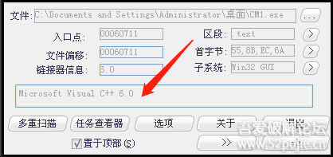

我们就看红色箭头指的地方，是VC编写的，实际上是易语言编写的，无壳。我们就不用考虑脱壳的事情了。而且我们还知道是VC编写的，那么老二就不需要上阵了。那么什么时候需要老二呢？就是当老大查出有壳，PEID只显示壳名称，不能显示出是什么语言编写的，就必须老二出场了。我把刚才的软件加个壳，你们来对比一下。老大出场，查一下。

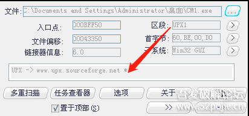

看到红色箭头指的地方了吧，原来是VC，现在变成了UPX，UPX是一种壳的名字，你现在无法知道这个软件是什么语言编写的了吧。怎么办？

老二必须上场了。

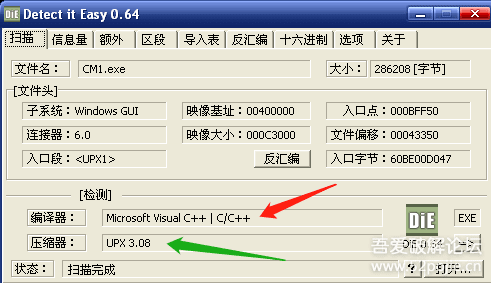

红色箭头指出来这个软件是VC编写的，绿色箭头指出壳的名字。呵呵，老二挺能干，把老大的活都抢了。不过还是建议先用PEID来查壳，毕竟是专门查壳的工具，有它的优势，另外也别让老大失业。现在该老三OD上场了。直接把程序拖到OD里就可以了。然后，我们干什么呢？当然是去找关键验证代码的位置。我们前三课说了，最常用的方法是根据验证后的结果找线索。今天我们要破解的这个软件，当账号和密码不正确时有失败提示，正确时有成功提示，这就是线索，也是我们破解的下手之处。

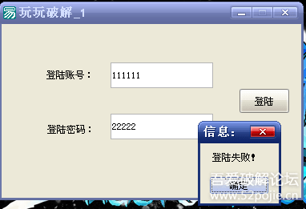

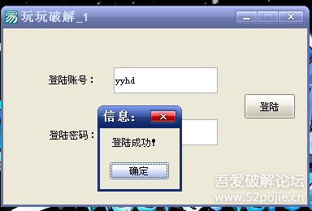

我们现在要做的就是用OD定位到程序中输出失败或者成功的字符串代码那里。怎么做呢？当然用OD里面的“中文搜索引擎”就可以查找到对应的位置。见下图：

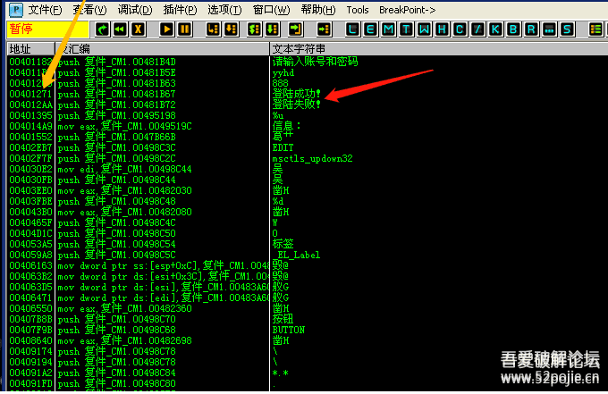

红色箭头指的是我们要找的字符串，黄色箭头对应的那一行就是关键代码所在的地址编号。我们在登陆成功这一行双击鼠标左键，就到了关键程序代码处。

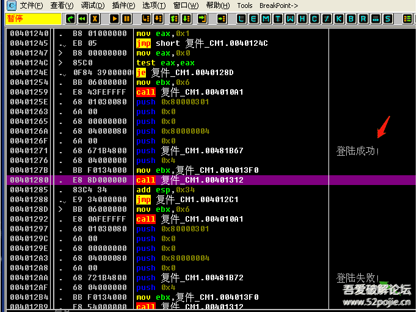

我们现在已经找到了关键代码的位置，接下来我们该干什么呢？我们要清楚，我们现在找到的关键代码的位置是验证后的结果的位置，我们的目标是找到验证中的关键代码位置，肯定是先验证才有结果，所以我们必须要往上找。问题是往上多少行才是验证中的位置呢？神仙也不知道，但是我们知道一点就是，验证就是真假码的比较，比较后如果正确就会执行提示成功的那段代码，如果不正确就会提示失败的那段代码。（没有编程基础的朋友注意下，每个程序中的代码的执行不是完全一行一行按顺序执行的，也就是说OD里你看到的程序代码不是从最上面一行一行执行的，在代码中会有很多跳转指令，导致程序代码是跳来跳去执行的。你可以这样理解，编好的程序就像一个有思维的人一样，他会根据一些条件来选择执行不同的代码）。

那么，我们就可以根据跳转指令来反查到验证的关键位置。简单来说，我们就在刚才找到的“登陆成功”字符串代码上面找跳转，看看有没有能够跳过去的指令，在上面很近的位置就找到了。

到这一步，你就已经基本破解成功了。JE是一个条件跳转指令，我们把这条指令修改为NOP，NOP是空指令，就是当代码执行到这里的时候无论如何都不会跳走，都会继续往下执行登陆成功这段代码。

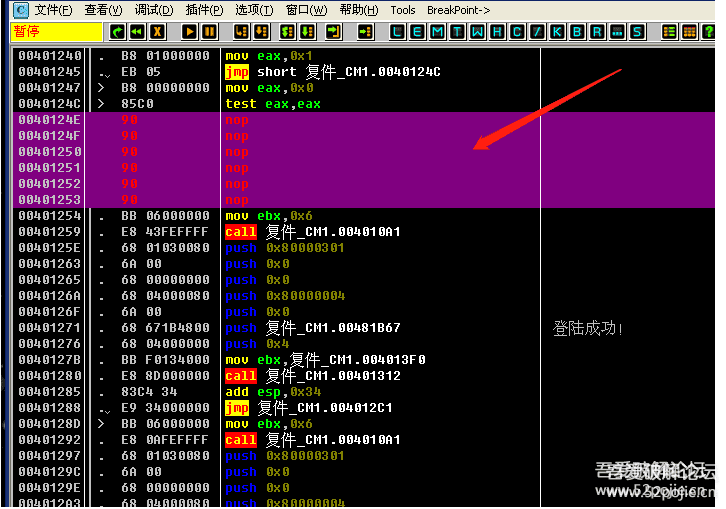

然后在修改的代码处鼠标右键，选择红色箭头指的“复制到可执行文件”，把修改后的程序保存即可。

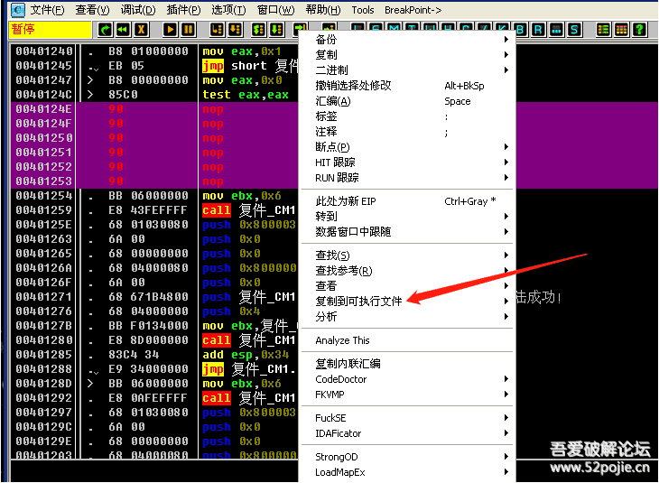

总结一下：

1. 破解软件的第一步就是要找出突破口，验证后的结果是最常用的。拿到一个软件后要先试着登陆一下，看看登陆验证后出现什么结果，是出现了字符串，还是信息框，还是其他，这些就是突破口。
2. 通过突破口找到验证后结果的代码位置后，找位置上面的跳转，然后修改跳转，目标就是“无论如何跳向成功，无论如何跳过失败”。
3. 关键跳转上面不远处就是验证中的关键代码位置，如果你要分析验证机制或者要找正确的账号密码就在那里。

## course-05 一起打倒阻碍新手的“拦路虎”

展开查看

在讲课之前，首先要感谢朋友们对我的前两集教程的支持和鼓励，如果说你看了我讲的内容以后真的弄明白了一些在破解学习中的困惑，真的感觉对您有所帮助，我会感到非常欣慰，因为这就是我的初衷。我经历了和你们一样的彷徨、困惑、无助和烦恼，虽然网上可以查阅很多知识和教程，但是总是听不明白、学不下去，还是这样的一句话，不是您的问题，是老师的问题，他们肚里有货，但是不擅于表达，不知道该如何解决新人的真正困惑。我再次声明，我不是什么大神，水平很有限，但是我对自己讲课还是有一定信心的，因为我的长处就是能够把事情说明白，有条理，让朋友们一听就懂，一学就会。回顾前两集共四课的内容，就是讲了三件事情，一是破解的工具，就是所谓的三兄弟，PEID、DIE64、OD；二是破解的常用步骤，步骤就是三兄弟轮流上，查壳、查编写语言、OD分析代码；三是破解的思路，就是从验证后的结果做为突破口，反查验证中的关键代码位置。好了，我们开始进入第五课。今天要解决的是大家在学习过程中容易困惑的问题，这些问题不解决掉，会严重影响你学习兴趣和快乐心情。在此，我列出了五只老虎，今天我们一起玩玩打第一只老虎，HAPPY一下。

第一只老虎：OD有什么用处？

我们之前说过，OD是老三，作用就是分析程序的代码。分析程序的什么代码呢？分析的是程序的汇编代码。那么汇编是什么呢？汇编是编程的一种语言。即使您没有学过编程，我相信你也听说过C语言、易语言等等，这两个也是编程语言。我们编程序让计算机执行，当然要把代码写出来，就像你和他人交流，你可以说汉语，说英文，说法文，这些都是语言。计算机能够听懂的语言有很多，常用的有汇编、C、VC、VB、DELPHI、JAVA、PHTHON、易语言等等。我们遇到的需要破解的软件大多是VC、VB、DELPHI、易语言编写的，其中外挂主要是易语言编写的。你可能会问，那我们破解是不是分析的就是软件的源代码，换句话就是，我们分析的就是别人写软件的代码，是不是这样？呵呵，如果真的能够看到别人的编写源代码，那破解就太容易了。遗憾的是，在当前的现实下，我们没有什么工具能够直接看到一个软件的源代码，那怎么办？有一个办法，就是我们有一个工具可以看到任何语言编写的软件的汇编代码，这个工具就是OD。明白了吗？OD中显示的是程序的汇编代码，不是源代码。因为汇编代码和源代码都能显示出程序的编写流程，所以我们退而求其次就通过分析汇编代码来模拟分析源代码。我们用OD打开一个程序，截图如下：

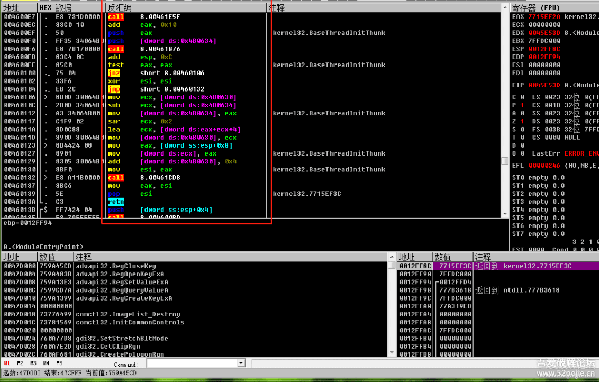

红色方框内显示的就是程序的一段汇编代码，每一行是一个语句。你刚开始肯定看不懂，然后有人告诉你，你必须先去学习汇编，然后再来学破解，结果你一去学汇编，发现枯燥难懂，你就放弃了破解，非常可惜。其实不用刻意去学汇编，我们新手刚入门，只要明白三个汇编的指令就可以了。

第一个是CALL指令。你看红色方框内有三个“CALL”指令，当你看到CALL语句，你只要明白CALL是子程序的入口，虽然在OD里目前看着是一条语句，如果你进入CALL的大门，里面有很多语句，我们可以把OD里看到的汇编语句看成是你的家，每个CALL就是你家里卧室、卫生间、厨房等小房间的大门，现在是关着的，你要想看卧室，你就必须打开门，进入CALL，怎么能进去呢，就是在OD里当指令执行到这个CALL的这一行语句时，用键盘上的F7就进去了。如果现在指令没有执行到CALL语句，你只是想看看CALL里面有什么？你可以把鼠标点到这一行，然后按回车键就可以进去浏览了。

第二个是JNZ、JMP指令，他们叫做跳转指令，我们以前说过，程序不是按顺序一行一行往下执行的，会根据条件跳到不同的代码位置，跳转指令就是让代码能够跳来跳去的指令。跳转指令分为两种，一种是JMP，是无条件跳转，意思就是当代码执行到JMP语句，是无条件执行跳转的，跳到哪？就是跳到JMP后面的代码地址。另外一种是JZ、JNZ等，是有条件跳转，意思就是当代码执行到JZ、JNZ时，跳还是不跳要根据上面代码得到的结果来判断，我们可以联系一下以前的知识，我们先定位验证后的结果代码位置，然后反查看上面代码是否有一个跳转可以跳过关键字符串，然后就可以向上定位关键验证位置，所以，JZ、JNZ这些条件跳转指令是我们破解的关键点，所以我们在破解时最需要留意的就是看这些条件跳转，一般而言，如果在关键代码处附近出现一个大的有条件跳转指令就很可疑。最常见的就是这样的，JE是一个条件跳转，它跳到了一个JMP下面一行，这是典型的条件判断编程语法。

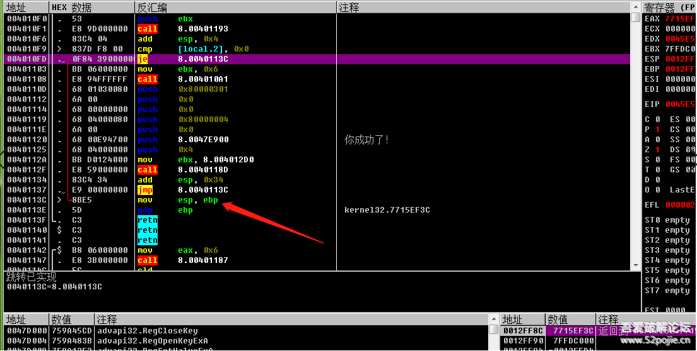

第三个是EAX，它叫做EAX寄存器，为什么要关注它呢？看下图：

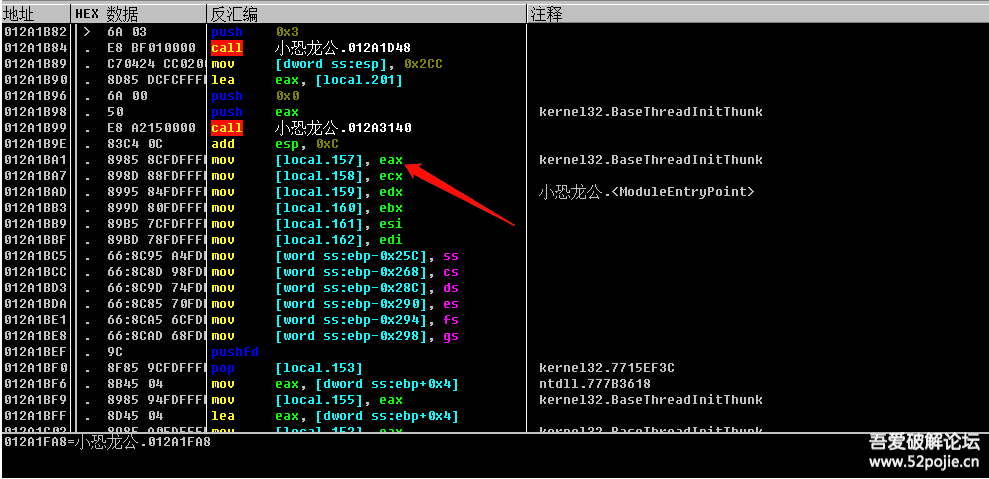

红色箭头指的位置有一个EAX，上面有一个CALL，我们已经知道了CALL是一个子程序，里面有多行语句，子程序的作用就是实现一个功能，你可以这样理解，执行一个CALL就相当于执行一个任务，任务完成以后的结果就放在EAX里面，所以在CALL下面很近的EAX里面存放的就是CALL执行的结果。那么这个结果对于破解有什么意义呢？如果我们编程人员把某个CALL做为验证的子程序，这个CALL的作用就是进行真假码的比较，如果比较的结果是真，那么就返回数值1，如果结果是假，就返回数值0，那么返回值1或者0就放在EAX里面，然后下面的条件跳转命令JZ、JNZ就根据是1还是0这个结果来决定跳还是不跳，明白了吗？EAX的意义就在于此，它里面存放的数值会决定程序以后的执行流程。那我们知道了EAX的意义又有什么用呢？你可以修改EAX的值，比如把0改成1就行了，在哪改呢？在CALL里面的代码的开头改成MOV EAX,1 ，下一句改成RETN。这样改的好处是什么呢？因为很多程序在验证的时候会在程序执行过程中多次进行验证，每次验证后都会有条件跳转指令，与其你改多个条件跳转指令，不如改一个验证CALL的返回值更省事。

一些朋友想练手，我在附件里上传三个练习软件，你用我讲的方法练练手，玩一玩，你的信心来自于你的成功：

- [course-05-01.exe](PEs/course-05-01.exe)： 没加壳
- [course-05-02.exe](PEs/course-05-02.exe)： 加了壳
- [course-05-03.exe](PEs/course-05-03.exe)： 多次调用同一个验证CALL（你可以在破解时进入验证CALL，找到正确的密码）

------

前面我们打了第一只虎，就是OD，我们知道了OD这个工具是用来分析软件的汇编代码的，我们也知道了最基本的汇编指令，CALL、JZ、JMP和EAX，了解这三个指令可以让你很快上手破解。当然，汇编还有一些其他的指令，这些其他的指令主要分为三类，第一类是传送数据的指令，比如MOV、LEA、PUSH、POP等，它们的作用就是把数据从一个地址转移到另外一个地址，为什么要转移呢，目的是在程序执行中便于使用。那么对于我们破解来说，了解它们有什么用呢？用处就是你能够知道你感兴趣的数据存放在什么地方，你可以跟踪它的使用流程。你可能要问了，我怎么才能看到程序里面的数据呢？OD里面有一个窗口就叫做数据窗口，里面放的就是程序的数据。

红色方框里面就是OD的数据窗口，有些敏感信息在这里会显示。第二类汇编指令是比较判断指令，就是对两个数值进行比较，它往往放在验证CALL的下面，用于判断，比如CMP、TEST 指令，看下图。

红色箭头指的位置是CMP EAX,0,这句代码的意思就是比较EAX和零是否相等？比较的结果会影响下一行JNZ这个条件跳转是跳还是不跳？绿色箭头指的位置是TEST EBX,EBX，这句代码的意思是判断EBX的值是否为零？结果会影响下一行JZ这个条件跳转是跳还是不跳？第三类指令是运算指令，比如ADD就是两个数值相加，SUB就是两个数值相减，还有乘法、除法等等，了解运算指令的用处是能够分析出程序编写者的真码是怎么运算得来的，换句话说就是能够弄清楚这个软件进行验证的“算法”。你可能会问，真码不是作者在编程的时候就写好的吗？比如真码为5211314。呵呵，现在的软件很少用一个固定的真码了，你想想看，如果这个程序有一个固定的真码，那么有一个人知道了，那么所有人不都可以无偿使用了吗？因此，为了更好的保护软件，编写者在编写软件的时候是不会有固定的不变的真码的，最普通的方式是根据不同的登录账号，程序里面有一个算法的子程序，或者叫做算法CALL,作用就是负责根据登录账号计算出真码，所以真码不是作者写在程序里的，而是在程序执行时根据账号算出来的，所谓验证就是假码和计算出的真码进行比较。现在你的脑子里应该有这样的一个程序执行的流程，先调用一个算法CALL,根据登录账号计算出真码；然后调用一个验证CALL，对真假码进行比较；根据比较的结果通过条件跳转指令跳转到不同的代码（成功或者失败的结果）。现在清楚了吧，我们破解，也叫做逆向，所谓逆向就是从结果往前分析，找到关键跳转，然后你改一下流程，这就叫做“爆破”。如果继续往前找到验证CALL和算法CALL，就叫做“追码”和“追算法”。

我们进一步思考一下，通过登录账号计算出真码这种方式是不是对软件真正起到了保护作用？非也，因为有一个人知道了登录账号和真码这两个数据，那么其他人用这个账号和密码不就可以正常使用了吗？所以，现在很多的软件在编写时，不再用所有人都可以使用的同一个登录账号了，用什么呢？很简单，就是让每个计算机只能使用自己的登录账号，就是机器码、硬盘编号等等，那么就实现了对软件使用更安全的保护。看下图，一个商业软件的登录界面：

对于这种验证，怎么破解呢？道理还是一样，可以不去管算法CALL，我们只关注验证CALL，就是修改计算出的假码和真码比较的结果，也就是在验证CALL里面修改EAX的返回值，或者是修改验证CALL下面的关键跳转。你当然也可以去追真码，但是这个真码只是适合你的这台机器，别人不能使用，因为机器码不一样。

现在还流行网络验证。什么意思，就是算法CALL和验证CALL的代码在服务器上，我们本地程序传给服务器我们登陆的账号和密码，验证的过程在服务器上，我们看不到。那怎么破？还是这个道理，我们只关注验证CALL的返回值，服务器会把验证后的结果再传给我们的程序，只要我们能够找到返回值这句代码的位置，然后修改返回值就可以破解。当然，网络验证现在很复杂，对于新手而言，最简单的方法还是通过验证后的结果来反查关键跳转位置，这个是通用的。

最后一点补充就是“重启验证”。重启验证不是一种算法，而是一种登录账号和密码的方式。一般的软件都是每次登录时要输入账号和密码，点击登录后进行验证，这些动作都是人工的，挺费事的。有些编程人员就想出了一个便捷的方法，就是“重启验证”，你第一次打开软件时需要手工输入账号和密码，然后点击登录，这个时候软件除了执行验证流程以外，还会执行一个操作，就是把你输入的账号和密码自动保存在你的电脑里的一个位置，这样一来，等你下次再打开时，软件会自动读取上次保存的账号和密码，然后自动执行判断，如果正确，就提示“已注册”，如果错误，就提示“未注册”，这就是重启验证，你也可以把这样的软件叫做“自动验证”。我们在深入一下，软件会把我们输入的账号和密码保存在哪里呢？基本上就两个地方可以藏身，一个是注册表里面，一个是新创建的一个文件里，这个文件有可能是TXT格式 ，也有可能是INI格式的，还有可能是其他类型的。知道账号和密码存在哪里对于破解有什么用处呢？非常重要，及其关键，因为对于不同的存放位置，程序在读取账号和密码时会使用不同的命令，比如注册表，会用RegOpenKeyA等；比如TXT，会用ReadFile；比如INI，会用GetPrivateProfileString；

这样，我们在OD里面下函数断点时就会有所选择了。这就给我们提供了第二种找破解突破口的线索，就是这些专门的命令，注意一点的是，我们现在的突破口是在验证之前，所以通过这些命令找到代码位置后，要往下去找验证的关键位置，这个和以前说的通过结果往上反查是不同的。到这里，你更清楚一些了吗，通过验证前的函数和验证后的结果都可以做为破解的突破口，最终的目标当然是一致的，就是找到验证的关键位置。

至此，我们可以总结为一句话“两头找线索，中间去破解”。

本次给大家提供两个练手软件：

- [course-05-04.exe](PEs/course-05-04.exe)： 机器码验证登录
- [course-05-05.exe](PEs/course-05-05.exe)： 注册表重启验证

## course-06 顺路打倒几只“病猫”

展开查看

发现一些新手对于工具的使用还不熟悉，那么我们就暂且把老虎放一放，先顺路打倒几只“病猫”。这三只猫，就是我们前几节课说的破解工具——三兄弟，还记得吗？老大叫PEID，老二叫DIE64，老三叫OD。这三个工具都可以在吾爱论坛的精品软件区里面下载。我们先看看三兄弟的相貌如何？

一、老大PEID来，笑一笑，“茄子”！

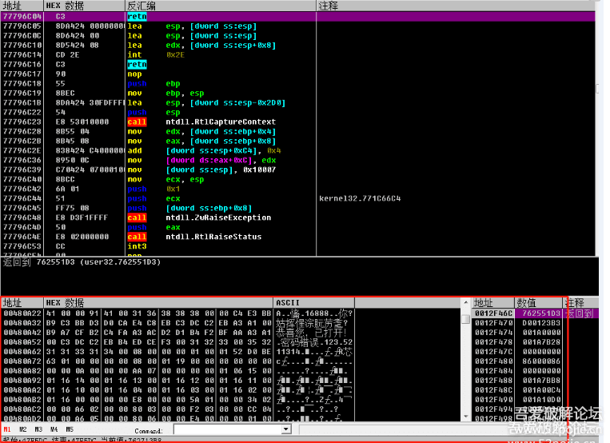

这个就是老大的样子，怎么使用呢？很简单，你把要破解的软件用鼠标直接拖到这个界面上就可以查这个软件是否有壳了，也会直接告诉你可能是什么类型的壳。现在我把一个加了壳的程序拖到PEID里面，会出现以下的情况。

第一种情况：

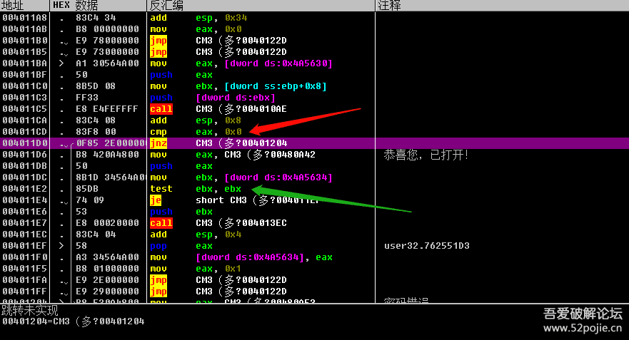

我们主要就看红色箭头的位置。是不是写了“UPX”,老大告诉我们查的结果是该软件加了UPX这种类型的壳。

第二种情况：

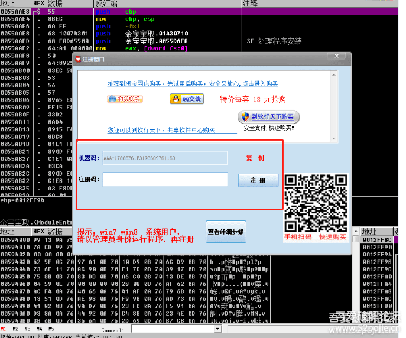

我们还是看的就是红色箭头的位置。提示是“什么都没找到”，这句话的意思是指没有找到是什么程序编写的，说明是有壳，但是没有告诉我们是什么类型的壳，怎么办呢？你再看一下绿色箭头指的位置，写了一个“UPX1”，你就知道了是UPX壳。

现在明白了吧，PEID这个工具最主要的操作就是“一拖一看再看”，我们只要知道有没有壳，是什么类型的壳就达到目的了，至于其他的功能可以先忽略，不影响破解。

提醒一下：如果红色箭头显示的是“VC++”、“VB”、“DELPHI”这样的文字，你别把它当成壳了，它是指的一种编程语言。

第二、老二DIE64走两步，摆个POSE。

看起来挺复杂，我们不管这么多。我们和对付老大一样，直接把要破解的软件拖到这个界面上就可以了。

我们先看红色箭头指的地方，显示就是壳的名字和版本号（UPX 3.08），我们再看绿色箭头指的地方，显示的是这个软件是用VC编写的，其实我们这个软件是易语言编写的，但是易语言程序在老大和老二眼里都会识别是VC++，那我们还有什么办法识别易语言程序吗？有，最简单的一个办法就是在OD里面查看00401000这个位置的汇编代码，看下图：

红色箭头指的就是00401000这行代码，显示的是XOR EAX,EAX ,没错，只要是00401000这行代码是这样的，就是易语言写的程序。

看到吗？老大和老二的使用方法都是“一拖一看再看”，你还不会吗？

第三、老三OD闪亮登场，好帅呀！

OD分为五个区。我们使用OD的方法还是和对付老大、老二的方法一样，就是把要破解的软件拖进OD就可以，看下图。

第一个是代码区，就是显示汇编代码的地方，我们查看程序执行代码就看这个区，还记得我们改跳转进行爆破都是在这个区实现的吗？

第二个是信息区，显示我们程序运行每句代码的相关信息，比如跳转的地址和一些数据，很多时候当我们在真假码比较的代码执行的时候，在信息区会出现真码。

第三个区是数据区，就是显示程序的数据的地方，我们想看某个地址里面的值，就在这个区域里查看。查看某个地址的数据和在代码区查看某个地址的代码的方法是一样的，就是在所在的区的任意位置按CTRL+G，然后输入地址，点确定。分别是这样：

第四个区是寄存器区，里面会显示寄存器，你看的EAX,ECX,EBX,EDX等八个首字母是E的都叫做寄存器。寄存器的作用和程序的其他内存地址一样，都是用来存放数据的，区别就是寄存器在CPU里面，读取数据的速度比从内存地址里要快，所以我们程序里面的很多运算都是把数据从内存地址里面复制到寄存器里面，然后进行运算，运算结束后，再把运算结果复制到内存地址里面，寄存器就等待着下一次的运算任务。所以你会在程序的汇编代码区看到有很多的数据转移命令，比如MOV ，PUSH等等。其实在汇编代码里面把这些数据转移和数据计算的代码去掉，剩下的代码就很有限了，主要剩的就是跳转指令、判断指令和CALL了，到现在你还看不懂汇编代码吗？另外，在这些寄存器里面，我们特别需要关注的就是EAX，我们以前说过，所有子程序也就是CALL的返回值都存放在EAX里面。

最后一个区是堆栈区。堆栈也是内存的一部分，它的特殊之处就在于它总是和子程序（CALL）相关联，堆栈里面的地址存放的数据有三种类型，一是存放调用某个CALL下面一行代码的地址。二是存放CALL的参数。三是CALL在运行过程中的变量值。我们如果想“追码”和了解验证的“算法”，那么我们就需要进入验证CALL，这个时候堆栈就起了关键的提示作用了，堆栈里面会先显示出假码，因为假码是验证CALL的参数，接着出现验证CALL下面一行语句的地址，最后会显示出验证CALL里面计算出的数值，就是变量值，如果没有加密的话，就会显示出计算出来的真码。

本节课关于OD的使用还未讲完，因为担心文章太长会影响大家浏览和学习，所以放到下一集再讲。

总结一下：

1. PEID、DIE64、OD的使用方法一样，就是把要破解的软件拖进界面就可以。
2. PEID和DIE64都是采用“一拖一看再看”的方法。
3. OD分为五个区。分析代码在代码区，查看数据在数据区，了解每句代码执行的相关信息看信息区，查看寄存器的数值在寄存器区，查看子程序（CALL）的参数、返回地址、CALL里面计算的结果在堆栈区。

