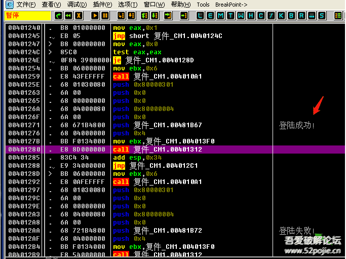

# course-04 可以实战一下了

> [>> 原文](https://www.52pojie.cn/thread-1358819-1-1.html)

------

本节我们来破解一个小软件 [course-04-01.exe](PEs/course-04-01.exe) ，用前三课的知识就足够了。换句话说，就是本节课看完了，你就不再是“破盲了”。

第一步：我们先准备好破解工具。还记得吧，破解三兄弟。老大是PEID，老二是DIE64，老三是OD。你在吾爱破解发布的破解工具包自己下载吧。首先老大先上，查一下是否有壳？

我们就看红色箭头指的地方，是VC编写的，实际上是易语言编写的，无壳。我们就不用考虑脱壳的事情了。而且我们还知道是VC编写的，那么老二就不需要上阵了。那么什么时候需要老二呢？就是当老大查出有壳，PEID只显示壳名称，不能显示出是什么语言编写的，就必须老二出场了。我把刚才的软件加个壳，你们来对比一下。老大出场，查一下。

看到红色箭头指的地方了吧，原来是VC，现在变成了UPX，UPX是一种壳的名字，你现在无法知道这个软件是什么语言编写的了吧。怎么办？

老二必须上场了。

红色箭头指出来这个软件是VC编写的，绿色箭头指出壳的名字。呵呵，老二挺能干，把老大的活都抢了。不过还是建议先用PEID来查壳，毕竟是专门查壳的工具，有它的优势，另外也别让老大失业。现在该老三OD上场了。直接把程序拖到OD里就可以了。然后，我们干什么呢？当然是去找关键验证代码的位置。我们前三课说了，最常用的方法是根据验证后的结果找线索。今天我们要破解的这个软件，当账号和密码不正确时有失败提示，正确时有成功提示，这就是线索，也是我们破解的下手之处。

我们现在要做的就是用OD定位到程序中输出失败或者成功的字符串代码那里。怎么做呢？当然用OD里面的“中文搜索引擎”就可以查找到对应的位置。见下图：

红色箭头指的是我们要找的字符串，黄色箭头对应的那一行就是关键代码所在的地址编号。我们在登陆成功这一行双击鼠标左键，就到了关键程序代码处。

我们现在已经找到了关键代码的位置，接下来我们该干什么呢？我们要清楚，我们现在找到的关键代码的位置是验证后的结果的位置，我们的目标是找到验证中的关键代码位置，肯定是先验证才有结果，所以我们必须要往上找。问题是往上多少行才是验证中的位置呢？神仙也不知道，但是我们知道一点就是，验证就是真假码的比较，比较后如果正确就会执行提示成功的那段代码，如果不正确就会提示失败的那段代码。（没有编程基础的朋友注意下，每个程序中的代码的执行不是完全一行一行按顺序执行的，也就是说OD里你看到的程序代码不是从最上面一行一行执行的，在代码中会有很多跳转指令，导致程序代码是跳来跳去执行的。你可以这样理解，编好的程序就像一个有思维的人一样，他会根据一些条件来选择执行不同的代码）。

那么，我们就可以根据跳转指令来反查到验证的关键位置。简单来说，我们就在刚才找到的“登陆成功”字符串代码上面找跳转，看看有没有能够跳过去的指令，在上面很近的位置就找到了。

到这一步，你就已经基本破解成功了。JE是一个条件跳转指令，我们把这条指令修改为NOP，NOP是空指令，就是当代码执行到这里的时候无论如何都不会跳走，都会继续往下执行登陆成功这段代码。

然后在修改的代码处鼠标右键，选择红色箭头指的“复制到可执行文件”，把修改后的程序保存即可。

## 总结

1. 破解软件的第一步就是要找出突破口，验证后的结果是最常用的。拿到一个软件后要先试着登陆一下，看看登陆验证后出现什么结果，是出现了字符串，还是信息框，还是其他，这些就是突破口。
2. 通过突破口找到验证后结果的代码位置后，找位置上面的跳转，然后修改跳转，目标就是“无论如何跳向成功，无论如何跳过失败”。
3. 关键跳转上面不远处就是验证中的关键代码位置，如果你要分析验证机制或者要找正确的账号密码就在那里。

------

> [>> 回到目录](README.md)
