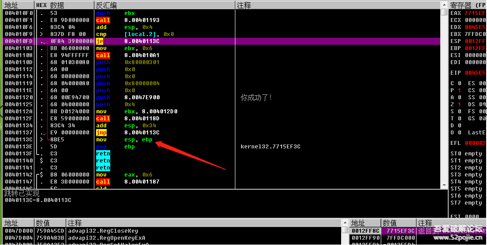
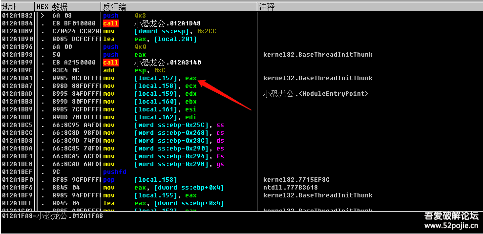

# course-05 一起打倒阻碍新手的“拦路虎”

> [>> 原文](https://www.52pojie.cn/thread-1359142-1-1.html)

------

今天要解决的是大家在学习过程中容易困惑的问题，这些问题不解决掉，会严重影响你学习兴趣和快乐心情。在此，我列出了五只老虎，今天我们一起玩玩打第一只老虎：OD有什么用处？

我们之前说过，OD是老三，作用就是分析程序的代码。分析程序的什么代码呢？分析的是程序的汇编代码。那么汇编是什么呢？汇编是编程的一种语言。即使您没有学过编程，我相信你也听说过C语言、易语言等等，这两个也是编程语言。我们编程序让计算机执行，当然要把代码写出来，就像你和他人交流，你可以说汉语，说英文，说法文，这些都是语言。计算机能够听懂的语言有很多，常用的有汇编、C、VC、VB、DELPHI、JAVA、PHTHON、易语言等等。我们遇到的需要破解的软件大多是VC、VB、DELPHI、易语言编写的，其中外挂主要是易语言编写的。你可能会问，那我们破解是不是分析的就是软件的源代码，换句话就是，我们分析的就是别人写软件的代码，是不是这样？呵呵，如果真的能够看到别人的编写源代码，那破解就太容易了。遗憾的是，在当前的现实下，我们没有什么工具能够直接看到一个软件的源代码，那怎么办？有一个办法，就是我们有一个工具可以看到任何语言编写的软件的汇编代码，这个工具就是OD。明白了吗？OD中显示的是程序的汇编代码，不是源代码。因为汇编代码和源代码都能显示出程序的编写流程，所以我们退而求其次就通过分析汇编代码来模拟分析源代码。我们用OD打开一个程序，截图如下：

红色方框内显示的就是程序的一段汇编代码，每一行是一个语句。你刚开始肯定看不懂，然后有人告诉你，你必须先去学习汇编，然后再来学破解，结果你一去学汇编，发现枯燥难懂，你就放弃了破解，非常可惜。其实不用刻意去学汇编，我们新手刚入门，只要明白三个汇编的指令就可以了。

第一个是CALL指令。你看红色方框内有三个“CALL”指令，当你看到CALL语句，你只要明白CALL是子程序的入口，虽然在OD里目前看着是一条语句，如果你进入CALL的大门，里面有很多语句，我们可以把OD里看到的汇编语句看成是你的家，每个CALL就是你家里卧室、卫生间、厨房等小房间的大门，现在是关着的，你要想看卧室，你就必须打开门，进入CALL，怎么能进去呢，就是在OD里当指令执行到这个CALL的这一行语句时，用键盘上的F7就进去了。如果现在指令没有执行到CALL语句，你只是想看看CALL里面有什么？你可以把鼠标点到这一行，然后按回车键就可以进去浏览了。

第二个是JNZ、JMP指令，他们叫做跳转指令，我们以前说过，程序不是按顺序一行一行往下执行的，会根据条件跳到不同的代码位置，跳转指令就是让代码能够跳来跳去的指令。跳转指令分为两种，一种是JMP，是无条件跳转，意思就是当代码执行到JMP语句，是无条件执行跳转的，跳到哪？就是跳到JMP后面的代码地址。另外一种是JZ、JNZ等，是有条件跳转，意思就是当代码执行到JZ、JNZ时，跳还是不跳要根据上面代码得到的结果来判断，我们可以联系一下以前的知识，我们先定位验证后的结果代码位置，然后反查看上面代码是否有一个跳转可以跳过关键字符串，然后就可以向上定位关键验证位置，所以，JZ、JNZ这些条件跳转指令是我们破解的关键点，所以我们在破解时最需要留意的就是看这些条件跳转，一般而言，如果在关键代码处附近出现一个大的有条件跳转指令就很可疑。最常见的就是这样的，JE是一个条件跳转，它跳到了一个JMP下面一行，这是典型的条件判断编程语法。

第三个是EAX，它叫做EAX寄存器，为什么要关注它呢？看下图：

红色箭头指的位置有一个EAX，上面有一个CALL，我们已经知道了CALL是一个子程序，里面有多行语句，子程序的作用就是实现一个功能，你可以这样理解，执行一个CALL就相当于执行一个任务，任务完成以后的结果就放在EAX里面，所以在CALL下面很近的EAX里面存放的就是CALL执行的结果。那么这个结果对于破解有什么意义呢？如果我们编程人员把某个CALL做为验证的子程序，这个CALL的作用就是进行真假码的比较，如果比较的结果是真，那么就返回数值1，如果结果是假，就返回数值0，那么返回值1或者0就放在EAX里面，然后下面的条件跳转命令JZ、JNZ就根据是1还是0这个结果来决定跳还是不跳，明白了吗？EAX的意义就在于此，它里面存放的数值会决定程序以后的执行流程。那我们知道了EAX的意义又有什么用呢？你可以修改EAX的值，比如把0改成1就行了，在哪改呢？在CALL里面的代码的开头改成MOV EAX,1 ，下一句改成RETN。这样改的好处是什么呢？因为很多程序在验证的时候会在程序执行过程中多次进行验证，每次验证后都会有条件跳转指令，与其你改多个条件跳转指令，不如改一个验证CALL的返回值更省事。

## 练习软件

- [course-05-01.exe](PEs/course-05-01.exe)： 没加壳
- [course-05-02.exe](PEs/course-05-02.exe)： 加了壳
- [course-05-03.exe](PEs/course-05-03.exe)： 多次调用同一个验证CALL（你可以在破解时进入验证CALL，找到正确的密码）

------

> [>> 回到目录](README.md)
