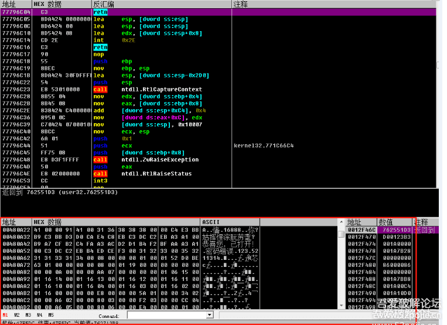
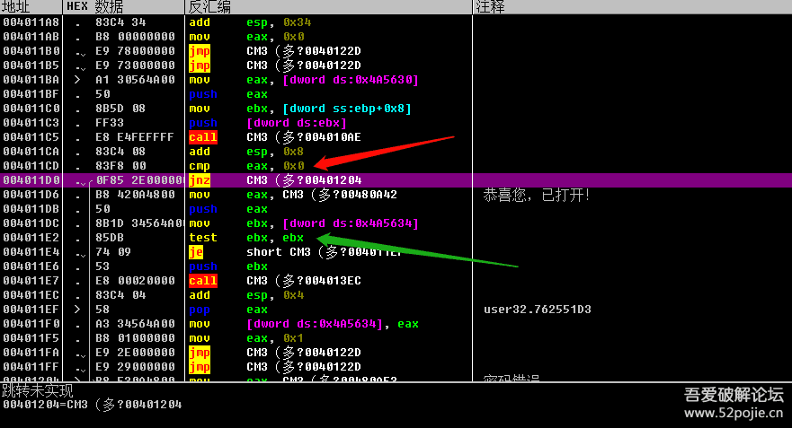
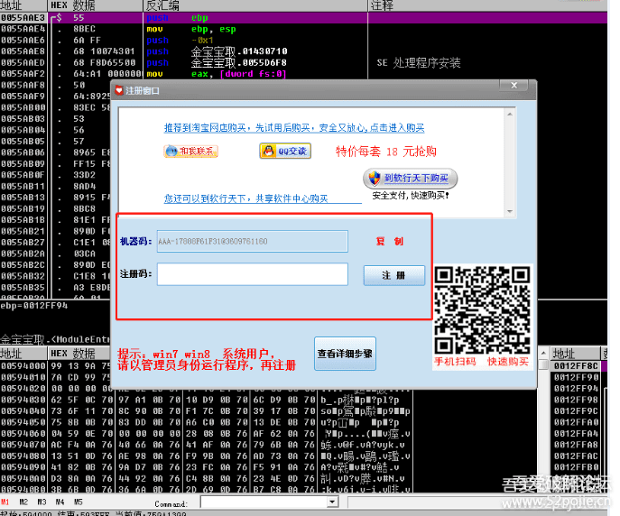

# course-06 继续打第一只老虎

------

前面我们打了第一只虎，就是OD，我们知道了OD这个工具是用来分析软件的汇编代码的，我们也知道了最基本的汇编指令，CALL、JZ、JMP和EAX，了解这三个指令可以让你很快上手破解。当然，汇编还有一些其他的指令，这些其他的指令主要分为三类，第一类是传送数据的指令，比如MOV、LEA、PUSH、POP等，它们的作用就是把数据从一个地址转移到另外一个地址，为什么要转移呢，目的是在程序执行中便于使用。那么对于我们破解来说，了解它们有什么用呢？用处就是你能够知道你感兴趣的数据存放在什么地方，你可以跟踪它的使用流程。你可能要问了，我怎么才能看到程序里面的数据呢？OD里面有一个窗口就叫做数据窗口，里面放的就是程序的数据。

红色方框里面就是OD的数据窗口，有些敏感信息在这里会显示。第二类汇编指令是比较判断指令，就是对两个数值进行比较，它往往放在验证CALL的下面，用于判断，比如CMP、TEST 指令，看下图。

红色箭头指的位置是CMP EAX,0,这句代码的意思就是比较EAX和零是否相等？比较的结果会影响下一行JNZ这个条件跳转是跳还是不跳？绿色箭头指的位置是TEST EBX,EBX，这句代码的意思是判断EBX的值是否为零？结果会影响下一行JZ这个条件跳转是跳还是不跳？第三类指令是运算指令，比如ADD就是两个数值相加，SUB就是两个数值相减，还有乘法、除法等等，了解运算指令的用处是能够分析出程序编写者的真码是怎么运算得来的，换句话说就是能够弄清楚这个软件进行验证的“算法”。你可能会问，真码不是作者在编程的时候就写好的吗？比如真码为5211314。呵呵，现在的软件很少用一个固定的真码了，你想想看，如果这个程序有一个固定的真码，那么有一个人知道了，那么所有人不都可以无偿使用了吗？因此，为了更好的保护软件，编写者在编写软件的时候是不会有固定的不变的真码的，最普通的方式是根据不同的登录账号，程序里面有一个算法的子程序，或者叫做算法CALL,作用就是负责根据登录账号计算出真码，所以真码不是作者写在程序里的，而是在程序执行时根据账号算出来的，所谓验证就是假码和计算出的真码进行比较。现在你的脑子里应该有这样的一个程序执行的流程，先调用一个算法CALL,根据登录账号计算出真码；然后调用一个验证CALL，对真假码进行比较；根据比较的结果通过条件跳转指令跳转到不同的代码（成功或者失败的结果）。现在清楚了吧，我们破解，也叫做逆向，所谓逆向就是从结果往前分析，找到关键跳转，然后你改一下流程，这就叫做“爆破”。如果继续往前找到验证CALL和算法CALL，就叫做“追码”和“追算法”。

我们进一步思考一下，通过登录账号计算出真码这种方式是不是对软件真正起到了保护作用？非也，因为有一个人知道了登录账号和真码这两个数据，那么其他人用这个账号和密码不就可以正常使用了吗？所以，现在很多的软件在编写时，不再用所有人都可以使用的同一个登录账号了，用什么呢？很简单，就是让每个计算机只能使用自己的登录账号，就是机器码、硬盘编号等等，那么就实现了对软件使用更安全的保护。看下图，一个商业软件的登录界面：

对于这种验证，怎么破解呢？道理还是一样，可以不去管算法CALL，我们只关注验证CALL，就是修改计算出的假码和真码比较的结果，也就是在验证CALL里面修改EAX的返回值，或者是修改验证CALL下面的关键跳转。你当然也可以去追真码，但是这个真码只是适合你的这台机器，别人不能使用，因为机器码不一样。

现在还流行网络验证。什么意思，就是算法CALL和验证CALL的代码在服务器上，我们本地程序传给服务器我们登陆的账号和密码，验证的过程在服务器上，我们看不到。那怎么破？还是这个道理，我们只关注验证CALL的返回值，服务器会把验证后的结果再传给我们的程序，只要我们能够找到返回值这句代码的位置，然后修改返回值就可以破解。当然，网络验证现在很复杂，对于新手而言，最简单的方法还是通过验证后的结果来反查关键跳转位置，这个是通用的。

最后一点补充就是“重启验证”。重启验证不是一种算法，而是一种登录账号和密码的方式。一般的软件都是每次登录时要输入账号和密码，点击登录后进行验证，这些动作都是人工的，挺费事的。有些编程人员就想出了一个便捷的方法，就是“重启验证”，你第一次打开软件时需要手工输入账号和密码，然后点击登录，这个时候软件除了执行验证流程以外，还会执行一个操作，就是把你输入的账号和密码自动保存在你的电脑里的一个位置，这样一来，等你下次再打开时，软件会自动读取上次保存的账号和密码，然后自动执行判断，如果正确，就提示“已注册”，如果错误，就提示“未注册”，这就是重启验证，你也可以把这样的软件叫做“自动验证”。我们在深入一下，软件会把我们输入的账号和密码保存在哪里呢？基本上就两个地方可以藏身，一个是注册表里面，一个是新创建的一个文件里，这个文件有可能是TXT格式 ，也有可能是INI格式的，还有可能是其他类型的。知道账号和密码存在哪里对于破解有什么用处呢？非常重要，及其关键，因为对于不同的存放位置，程序在读取账号和密码时会使用不同的命令，比如注册表，会用RegOpenKeyA等；比如TXT，会用ReadFile；比如INI，会用GetPrivateProfileString；

这样，我们在OD里面下函数断点时就会有所选择了。这就给我们提供了第二种找破解突破口的线索，就是这些专门的命令，注意一点的是，我们现在的突破口是在验证之前，所以通过这些命令找到代码位置后，要往下去找验证的关键位置，这个和以前说的通过结果往上反查是不同的。到这里，你更清楚一些了吗，通过验证前的函数和验证后的结果都可以做为破解的突破口，最终的目标当然是一致的，就是找到验证的关键位置。

至此，我们可以总结为一句话“两头找线索，中间去破解”。

## 练手软件

- [course-06-01.exe](PEs/course-06-01.exe)： 机器码验证登录
- [course-06-02.exe](PEs/course-06-02.exe)： 注册表重启验证
