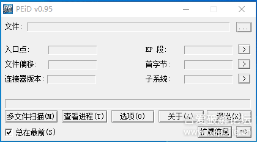

# course-07 顺路打倒几只“病猫”

> [>> 原文](https://www.52pojie.cn/thread-1359616-1-1.html)

------

发现一些新手对于工具的使用还不熟悉，那么我们就暂且把老虎放一放，先顺路打倒几只“病猫”。这三只猫，就是我们前几节课说的破解工具——三兄弟，还记得吗？老大叫PEID，老二叫DIE64，老三叫OD。这三个工具都可以在吾爱论坛的精品软件区里面下载。我们先看看三兄弟的相貌如何？

## 老大 PEID

这个就是老大的样子，怎么使用呢？很简单，你把要破解的软件用鼠标直接拖到这个界面上就可以查这个软件是否有壳了，也会直接告诉你可能是什么类型的壳。现在我把一个加了壳的程序拖到PEID里面，会出现以下的情况。

第一种情况：

我们主要就看红色箭头的位置。是不是写了“UPX”,老大告诉我们查的结果是该软件加了UPX这种类型的壳。

第二种情况：

我们还是看的就是红色箭头的位置。提示是“什么都没找到”，这句话的意思是指没有找到是什么程序编写的，说明是有壳，但是没有告诉我们是什么类型的壳，怎么办呢？你再看一下绿色箭头指的位置，写了一个“UPX1”，你就知道了是UPX壳。

现在明白了吧，PEID这个工具最主要的操作就是“一拖一看再看”，我们只要知道有没有壳，是什么类型的壳就达到目的了，至于其他的功能可以先忽略，不影响破解。

提醒一下：如果红色箭头显示的是“VC++”、“VB”、“DELPHI”这样的文字，你别把它当成壳了，它是指的一种编程语言。

## 老二 DIE64

看起来挺复杂，我们不管这么多。我们和对付老大一样，直接把要破解的软件拖到这个界面上就可以了。

我们先看红色箭头指的地方，显示就是壳的名字和版本号（UPX 3.08），我们再看绿色箭头指的地方，显示的是这个软件是用VC编写的，其实我们这个软件是易语言编写的，但是易语言程序在老大和老二眼里都会识别是VC++，那我们还有什么办法识别易语言程序吗？有，最简单的一个办法就是在OD里面查看00401000这个位置的汇编代码，看下图：

红色箭头指的就是00401000这行代码，显示的是XOR EAX,EAX ,没错，只要是00401000这行代码是这样的，就是易语言写的程序。

看到吗？老大和老二的使用方法都是“一拖一看再看”，你还不会吗？

## 老三 OD

OD分为五个区。我们使用OD的方法还是和对付老大、老二的方法一样，就是把要破解的软件拖进OD就可以，看下图。

第一个是代码区，就是显示汇编代码的地方，我们查看程序执行代码就看这个区，还记得我们改跳转进行爆破都是在这个区实现的吗？

第二个是信息区，显示我们程序运行每句代码的相关信息，比如跳转的地址和一些数据，很多时候当我们在真假码比较的代码执行的时候，在信息区会出现真码。

第三个区是数据区，就是显示程序的数据的地方，我们想看某个地址里面的值，就在这个区域里查看。查看某个地址的数据和在代码区查看某个地址的代码的方法是一样的，就是在所在的区的任意位置按CTRL+G，然后输入地址，点确定。分别是这样：

第四个区是寄存器区，里面会显示寄存器，你看的EAX,ECX,EBX,EDX等八个首字母是E的都叫做寄存器。寄存器的作用和程序的其他内存地址一样，都是用来存放数据的，区别就是寄存器在CPU里面，读取数据的速度比从内存地址里要快，所以我们程序里面的很多运算都是把数据从内存地址里面复制到寄存器里面，然后进行运算，运算结束后，再把运算结果复制到内存地址里面，寄存器就等待着下一次的运算任务。所以你会在程序的汇编代码区看到有很多的数据转移命令，比如MOV ，PUSH等等。其实在汇编代码里面把这些数据转移和数据计算的代码去掉，剩下的代码就很有限了，主要剩的就是跳转指令、判断指令和CALL了，到现在你还看不懂汇编代码吗？另外，在这些寄存器里面，我们特别需要关注的就是EAX，我们以前说过，所有子程序也就是CALL的返回值都存放在EAX里面。

最后一个区是堆栈区。堆栈也是内存的一部分，它的特殊之处就在于它总是和子程序（CALL）相关联，堆栈里面的地址存放的数据有三种类型，一是存放调用某个CALL下面一行代码的地址。二是存放CALL的参数。三是CALL在运行过程中的变量值。我们如果想“追码”和了解验证的“算法”，那么我们就需要进入验证CALL，这个时候堆栈就起了关键的提示作用了，堆栈里面会先显示出假码，因为假码是验证CALL的参数，接着出现验证CALL下面一行语句的地址，最后会显示出验证CALL里面计算出的数值，就是变量值，如果没有加密的话，就会显示出计算出来的真码。

本节课关于OD的使用还未讲完，因为担心文章太长会影响大家浏览和学习，所以放到下一集再讲。

## 总结

1. PEID、DIE64、OD的使用方法一样，就是把要破解的软件拖进界面就可以。
2. PEID和DIE64都是采用“一拖一看再看”的方法。
3. OD分为五个区。分析代码在代码区，查看数据在数据区，了解每句代码执行的相关信息看信息区，查看寄存器的数值在寄存器区，查看子程序（CALL）的参数、返回地址、CALL里面计算的结果在堆栈区。

------

> [>> 回到目录](README.md)
