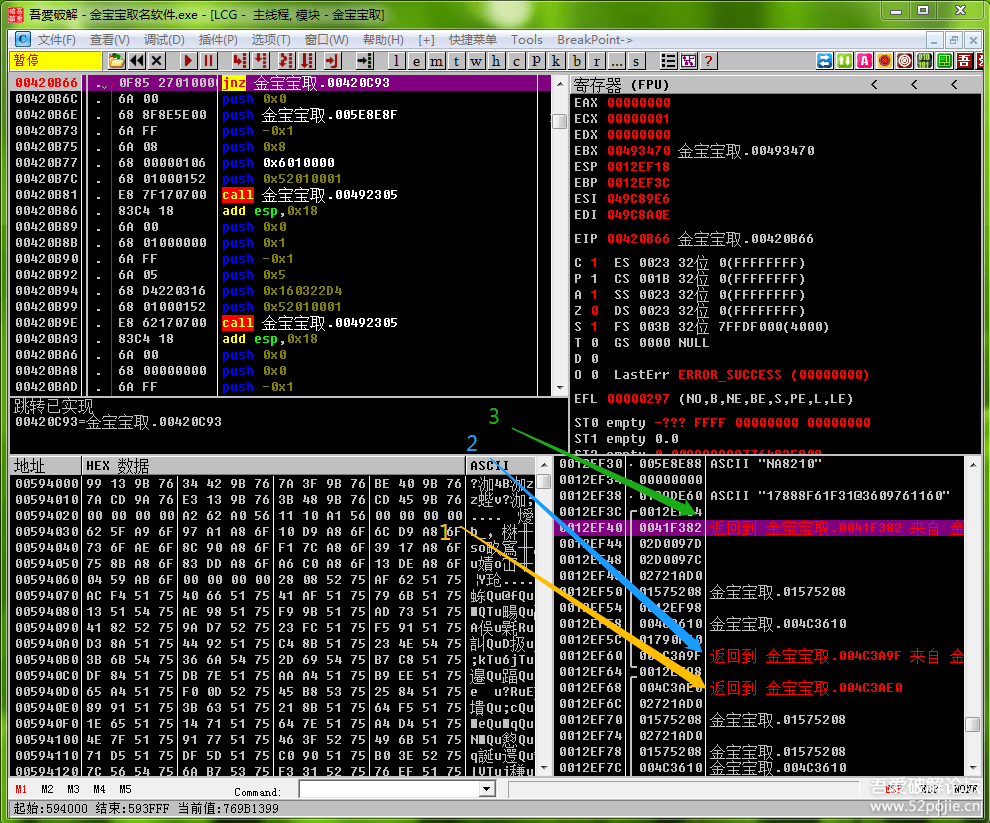
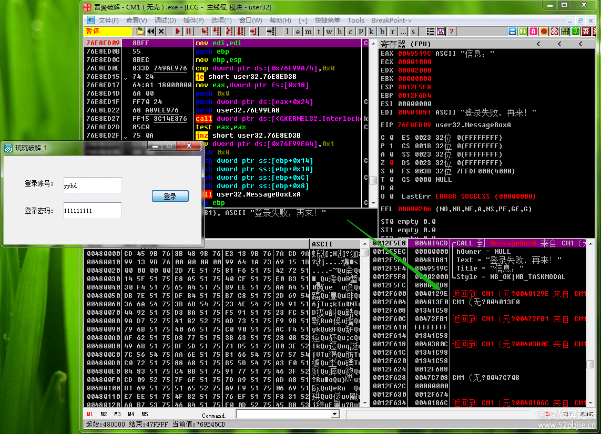
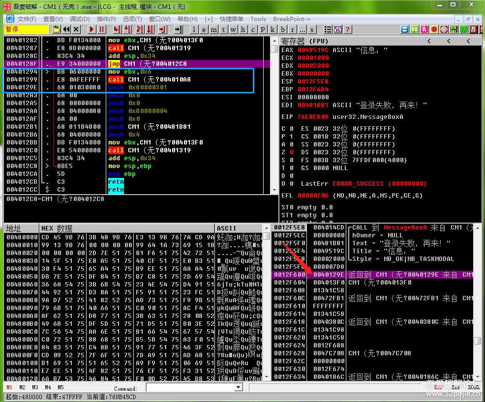
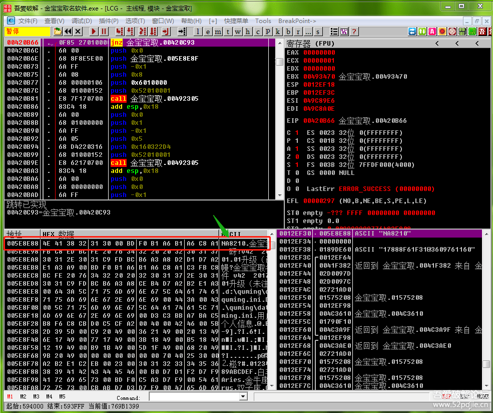
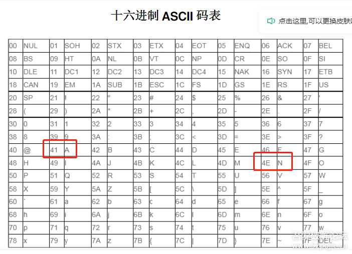

# course-08 快速学会使用 OD 工具

> [>> 原文](https://www.52pojie.cn/thread-1359848-1-1.html)

------

讲课之前，回答朋友们两件事，一件事是有些朋友需要提供PEID、DIE64、OD这三个工具，这三个工具在吾爱论坛里就有，另外百度一下也有各种版本。我之所以没有提供，一是很容易找到，二是每个人的使用习惯不同，所以使用的版本也有区别。另外一件事是每个人的基础都不同，起点不同，困惑点也不同，相应的关注点也不同，比如有些人使用工具没有问题，有些人还不会使用工具。有些人的关注点在如何脱壳，有些人还困惑当字符串搜不到怎么办。所以我不能面面俱到，解决每个人当下的问题，我还是要按照本课程的教学目标，就是新手扫盲，就是以轻松快乐的心态去玩破解进行课程安排，所以请一些朋友体谅。今天我们的目标就是学会使用OD。

上集我们给大家看了一下OD的样子，还记得吗？“OD分为5个区”，分别是代码区、信息区、数据区、寄存器区、堆栈区。代码区的用处——分析代码；信息区的用处——了解信息；数据区的用处——查看数据；寄存器区的用处——查看寄存器的值，尤其是EAX；堆栈区的用处——查看CALL的参数、变量和返回值，以及程序调用不同的CALL的先后顺序关系。

当程序在执行过程中暂停的时候，大家看一下OD右下角的“堆栈区”，里面会有三个返回到，这个很重要，我分别用黄色、蓝色、绿色的箭头进行标记。为什么说它重要呢？我们前面说过，在堆栈区存放的数据是和子程序（CALL）相关的数据，还记得吗？会存放CALL的参数、调用CALL的下一行语句的地址、CALL里面的变量值。这三个返回到表示调用了三个子程序（CALL）,调用的先后顺序是我标记的从下往上的1、2、3，也就是说当一个当程序暂停的时候，我们观察堆栈区，每个返回到都表示执行了一个子程序（CALL），最下面的是先执行的CALL，这样你就明白CALL的调用顺序了吧。知道调用顺序有什么用呢？当然有用，因为我们玩破解，方法不就是根据验证结果进行反查吗？既然是反查，当然要找上一次执行了哪个CALL，就是要在堆栈区往下找“返回到”。这样解释你明白了吗？我再举个例子说明，看下图：

因为这个软件点登陆后，如果账号和密码不对，会提示“登录失败，再来”，你可以搜索字符串，也可以用弹出信息框的命令MessageBoxA来下断点，当你输入账号密码，点登陆，等程序断下来后，你看右下角的堆栈区，用刚才我们讲的知识来看看，第一行是CALL到MessageBoxA,意思是马上要执行的就是弹出对话框，再看绿色箭头指的“返回到”，最下面的是最早执行的CALL，最上面的返回到是刚执行过的CALL，那么我们进行反查，就要先从最上方那个刚执行过的CALL来进行。我们怎么做呢？就是在第一个返回到那一行点鼠标右键，在提示菜单里选择“反汇编窗口跟随”，就会出现下面的图示：

红色箭头指的是第一个返回到，左上方的代码区里面的蓝色方框内的CALL就是我们最新执行过的子程序，它下面的一行地址看到了吗？就是0040129E，就是我们堆栈区返回到的地址，也就是我们以前说的堆栈区会存放CALL的下一句的代码地址，我们也称为返回地址。而我们堆栈区最上面的CALL到MessageBoxA弹出信息框命令的代码就在蓝色方框内的CALL里面，那么我们想一想，如果上面有跳转能够跳过蓝色方框内的CALL，是不是程序就不会执行MessageBoxA弹出信息框这个命令了，我们是不是就成功破解了?是的，就是如此。我们现在欣喜的发现上面正好有一个JMP可以跳过，但是别高兴，在JMP下面一行语句前有一个白色向右的小箭头，表示上面还有一个跳转会跳到这里，所以，我们只要往上找这个跳转，不让这个跳转实现就成功破解了。呵呵，会了吗？你可能还会提出，如果我没有发现有跳转能跳过蓝色方框里的CALL怎么办？很简单，那你就在堆栈区从上往下找“返回到”，看看哪个返回到的CALL上面有跳转能跳过，就可以了。

我们继续来分析一下堆栈区。

里面会有三列数据，最左边的一列是堆栈里的地址编号，比如最上面一行是0012EF30,这个数字就是一个地址，这个地址里存放的数据是什么呢？就是第二列显示的数据，是005E8E88，大家要记住，在OD里显示的数据是十六进制的。那么第三列的数据是什么呢？是对第二列数据的进一步解释。你可以把鼠标放在第一行的位置，然后右键，从弹出的菜单里选择“数据窗口跟随”，然后你看OD窗口左下角的数据区的第一行。看下图：

数据窗口的第一列就是刚才我们要查看的数据005E8E88，第三列ASCII里面显示的就是堆栈区的第三列显示的字符串“NA8210”。那么这是什么意思呢？就是说现在在堆栈区的0012EF30这个地址里面存放了一个数据是005E8E88，这个数据还是一个地址（地址是8个数字组成），这个地址里面存放的是一些十六进制的数字，这些数字就是第二列HEX里面的内容，转换成ASCII字符就是“NA8210”。看下图：

因为计算机只能识别0和1这两个数字，不认识我们键盘上的各种字符，所以我们输入的字符会先按照上面的表的规定转换为对应的十六进制数字，大家看第一个红色的方框里的“A”就被转换为十六进制的41，第二个红色方框里的“N”就被转换为十六进制的4E，“NA8210”里面的8210现在是看成字符，也会相应进行字符到数字的转换，“8”转换为十六进制的“38”，这下明白了吗？你可能会问，8不是数字吗？怎么是字符了？这要看编程的时候程序员是怎么定义的，他定义是字符就是字符，他定义为数字就是数字，计算机要听程序员，按照程序员的定义进行数据类型的显示。

顺便再讲8个常用的命令，会这8个命令你就可以正常使用OD了。

第一个是F9，就是当你把要破解的软件拖到OD里面，你按F9程序就会运行，F9就叫做运行命令。

第二个是F8，这个命令的作用就是你可以一句一句的执行代码，而不是让程序一下子就执行，我们定位到关键代码的时候，是不是需要通过一句一句的代码执行后看看程序有什么变化，会提示关键字符吗？会弹出对话框吗？会跳转吗？只有这样你才能知道破解的关键位置在哪里？

第三个是F7，这个命令的作用和F8类似，也是一句一句代码的执行，但是它有个特殊功能是F8不具备的，就是当你遇到CALL语句的时候，你只有按F7才能进入CALL里面，然后一步一步的执行分析CALL里面的代码，而如果你按F8,那么就不会进入CALL，而是一下子就执行完整个CALL，你只能看到CALL执行的结果。所以我们一般会常用F8单步执行看代码，遇到可疑的CALL就按F7进入执行和观察。

今天内容已经不少了，就先讲到这里，剩下的下次讲，谢谢朋友们的支持。

为了更方便大家学习实践，我在附件里新上传了两个CM软件，一个是一个返回到就可以破解，一个需要多次返回到，大家玩玩试试，祝您成功！

## 练手软件

- [course-08-01.exe](PEs/course-08-01.exe)： 无壳，只需一次返回
- [course-08-02.exe](PEs/course-08-02.exe)： 需要多次返回

------

> [>> 回到目录](README.md)
