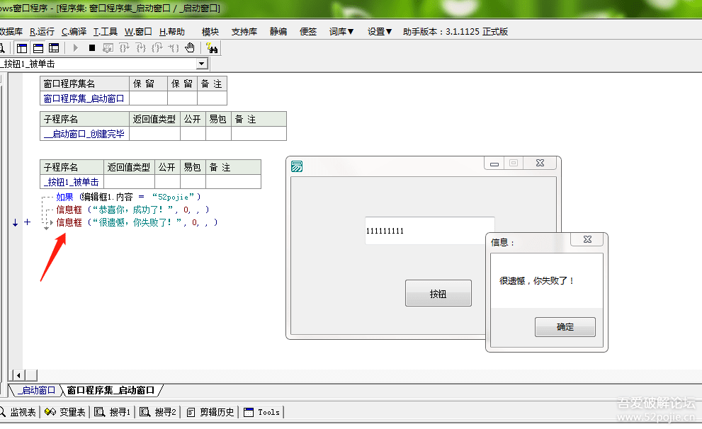
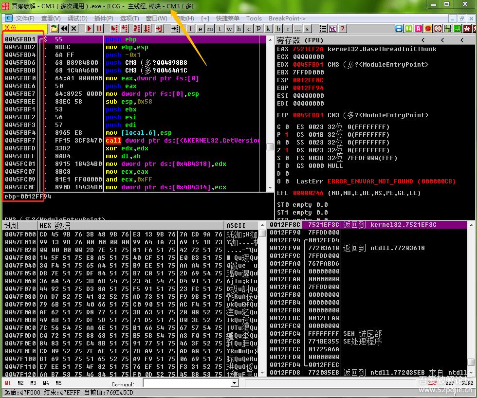
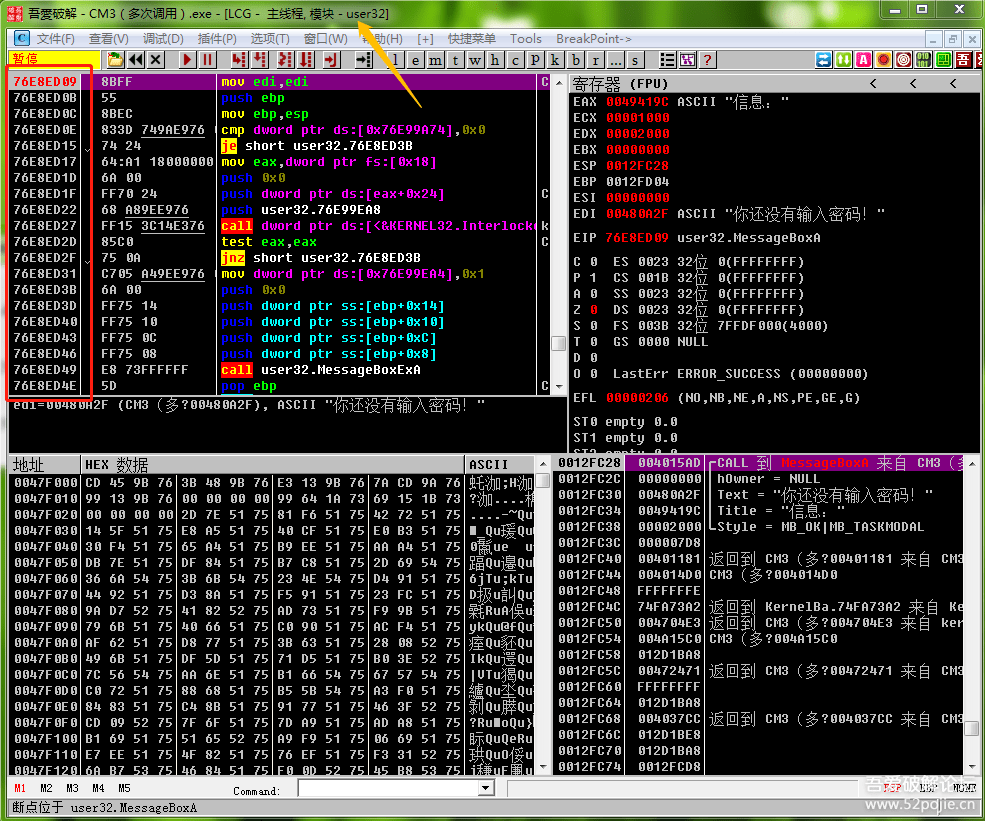

# course-09 OD学习的最后一课

> [>> 原文](https://www.52pojie.cn/thread-1360054-1-1.html)

------

回顾一下上一集的内容，最主要有两点。

一是了解堆栈区里面的“返回到”的重要作用，要清楚最下方的返回到是最先执行的CALL，我们断下程序，要从最上面的“返回到”一步步反查程序的执行流程。
二是OD里面的F9、F8、F7的功能，F9是运行程序，F8是一步步执行程序代码,F7是进入CALL的钥匙。

本集我们继续再讲几个OD使用的关键指令。

一、CTRL+F9

这个指令我们破解常用。它的作用是什么呢？就是当你断下程序以后，按一下CTRL+F9就可以让程序快速执行到你现在运行的子程序代码的结尾处。好处就是当你不想具体看这个子程序的每一句代码执行的情况了，你就可以按键盘上的CTRL+F9直接运行到子程序的结尾的位置停下来，如果再按一次F8，你就到了调用这个CALL的下一句代码。我举个例子，如果我们要破解的软件是有错误提示的信息框。那么我们常用的方法就是在MessageBoxA这个函数上下一个断点，那么当你运行程序，输入账号密码点登陆后，程序会停到什么代码的位置？会停在MessageBoxA这个函数的第一句代码，函数也是子程序，不过是计算机的操作系统提供的面向所有运行在操作系统之上的软件的固定的子程序，这个函数（子程序）的代码是微软事先就写好了的，我们程序员在编写软件的时候，不管是用C语言、VB还是易语言，我们都不需要重新来写一些系统已经写好的函数，我们只需要给操作系统一个调用这个函数的命令就可以了。如果是易语言编程，看下图：

红色箭头指的地方，就是我们用易语言编程写的代码，我们编程很简单，只需要打上信息框（）这几个字就可以了，我们程序在运行的时候，会自动调用操作系统为我们已经编好的弹出信息框的子程序，你想想看，弹出信息框如果要我们自己编写代码，是不是要写很多代码，你要画窗口，还有按钮等等。讲这些的意义在哪呢？你想想看，当我们把要破解的程序拖到OD里面运行，我们在代码区看到的这么多代码都是我们的软件作者写出来的吗？当然不是，有很多代码其实是类似于信息框这个函数一样，是操作系统已经写好的代码，我们调用什么函数，这些代码会出现在OD的代码区。那么，你可能要问，那我们怎么分辨是软件作者自写的代码还是操作系统提供的代码呢？简单说，软件作者自写的代码基本上都是小地址，操作系统的函数代码都是大地址。看下图：

看红色方框内的代码地址，都是004.....,这些就叫做小地址。我们再看黄色箭头指的位置，上面写着CM3，就是我们要破解的软件的名字，就更加证实我们目前程序暂停在作者自写的代码上，也可以形象的说“我们现在处在程序领空”。
我们再来看一张图，对比一下：

现在红色方框内的地址都是7开头的，这就是大地址。我们再看黄色箭头指的位置显示USER32,不再是我们要破解的软件的名字CM3，这就说明目前程序暂停的代码位置不是作者自写的代码内，而是在操作系统提供的函数（子程序）代码内，我们也可以形象的说“我们目前处在系统领空”。

我们知道程序此刻停在程序领空还是系统领空对于我们破解有什么用处呢？大家想想，我们要实现破解一个软件，如果是爆破就是修改一些跳转指令或者是EAX的值，如果是追码和研究算法，我们就要进入到验证CALL里面，那么我们要修改的代码或者是验证CALL，是作者自写的代码还是操作系统提供好的代码？答案只能是一个，就是一定是软件作者自写的代码，因为每个不同的软件的登录账号和密码都不同，说明验证算法是不同的，而验证算法是每个作者自己去写的，或者是复制了别人已经写好的算法代码，但绝不是操作系统提供的。

分析至此，我们可以得到一个非常重要的结论，就是“破解软件只需要关注软件作者自写的代码！”，换个词就是“我们要时常注意把自己停留在程序领空”。好了，说了这么多，和我们要讲的CTRL+F9有什么关系，关系就是当我们发现此刻程序停留在系统领空以后，我们就赶快按CTRL+F9执行到系统函数的结尾处，因为你花时间看系统函数内部的代码完全是浪费时间，明白了吗？

可能有些朋友会问，那我按一次CTRL+F9到函数结尾处，再按一次F8是不是就到了程序领空？未必，有可能你还是处在系统领空，你必须再按CTRL+F9，如果还没有到，再继续，你可能说，那不累死了吗？有什么好办法，能够一下子就从系统领空回到程序领空？有，必须有。就是下面要说的一个指令。

二、ALT+F9

这个指令就厉害了，作用就是当程序暂停在系统领空的时候，你按一下ALT+F9,程序就一下子就执行完当前系统领空的代码回到了程序领空。这样就省事了吧。所以我们破解的时候，经常用的手法就是在诸如MessageBoxA这样的操作系统提供的函数下断点，程序断下来后，就按一下ALT+F9从系统领空返回到程序领空，再分析代码。提醒一下，如果是MessageBoxA函数，你按完ALT+F9后你会发现并没有返回到程序领空，怎么回事？很简单，你需要把错误提示信息框关闭，然后程序就自动返回到程序领空了，因为错误信息框在等待用户操作，你不操作，程序就一直停留在等待操作的状态中。

三、F4

F4的作用，就是你需要程序代码停在哪里，你就在这行代码上按键盘上的F4，然后按F9运行，程序就停在这行代码上了，你可以把F4比做出租车，招手就行，随时随地都可，当然，现实中出租车司机都是守规矩的，不能乱停，呵呵。

四、F2

这个是我们在OD里最常用的。我们经常说给程序下断，怎么下断呢？就是在你要断的代码的位置上按一下F2就可以了，程序执行到这里就会停止待命，然后你就可以按F8一句一句代码往下运行，遇到可疑的CALL就按F7进去看看，不想看了就按CTRL+F9返回到CALL的结尾处，如果是系统领空，就直接按ALT+F9一步返回到程序领空。学会了以上的指令，你基本上就可以用OD破解软件了，还有一些其他的使用方法，我会放在以后的课程中穿插讲解。

------

> [>> 回到目录](README.md)
