# course-10 今天就让你尝到“成功”的味道

> [>> 原文](https://www.52pojie.cn/thread-1360369-1-1.html)

------

我们已经讲了七集了，相信新人们会有不同的感受，从朋友们发的帖子上能够感受到大家对我的课程的鼓励和支持，在此对大家表示深深的谢意！在第一集发出的时候，我是心里打鼓，虽然我做教程的初衷是好的，但是也特别担心讲的不好，不是大家需要的东西，现在总算有点小信心了，所以要谢谢大家，是你们给了我继续写下去的力量。当然，如果后续的课程讲的不好，还请大家多包涵，因为我在破解方面也是菜鸟，所以千万别对我有太高的要求，否则我会很有压力，这就违背了我们最初的“玩玩破解”的目的。

讲课之前，我把破解常用的三兄弟——PEID、DIE64、OD打包在附件里了，大家可以去下载使用，这三个软件是我从百度上下载的，我自己试了一下，应该没有问题，并且软件上也没有商业广告。
今天我们的课程标题是让你尝到“成功”的味道，什么意思呢？就是我有信心通过本集的讲解，让新人都能够实现初步破解软件的目标，品尝到初步“成功”的味道，这样你对自己就更有信心了，对后续的学习也会更有兴趣。

本周，我们的目标是成功破解四个软件。
我们要破解的四个软件有什么特点？
第一个软件有登录账号和密码，不正确的话就有错误提示。
第二个软件有登录账号和密码，不正确的话没有任何提示。
第三个软件是重启验证。
第四个软件是有灰色按钮。

呵呵，怕了吗？相信你自己，看完后你就动手破解，相信自己一定可以成功，成功的时候请发个截图，我们大家一起来分享这份喜悦。好了，我们开始工作了。

一、破解有错误信息提示的软件

软件名称：[course-10.exe](PEs/course-10.exe) （有错误提示）

当我们遇到有错误信息提示的软件，那么我们该如何破解呢？首先想到的方法就是搜索错误信息字符串。好，我们操作一下。

第一步：先用PEID查壳

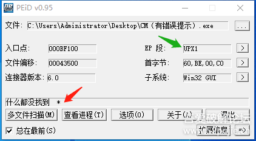

根据红绿两个箭头显示出这个软件有壳，是UPX壳。

第二步：用DIE64查一下编程语言。

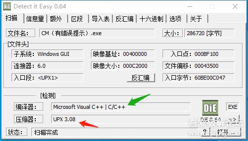

确定是UPX壳，是VC语言编写的。
这时我们有两种选择，一种是先脱壳再用OD分析，一种是不脱壳直接用OD分析。

（1）先脱壳再分析

这个软件加了UPX壳，这个壳有专门的脱壳工具 [UPX-Tool+](../../tools/04_unpacker/upxTool+)，就是这个样子的，见下图：

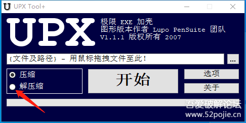

怎么使用呢？你把要脱壳的CM软件拖到这个界面上，然后在红色箭头指的“解压缩”前的白色圆圈内点一下，然后点开始。你的电脑桌面上会出现下图：

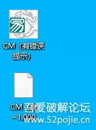

下面白色的是原来有壳文件的备份，上面的是脱壳后的CM，你可以再用PEID查一下，此时是不是已经没有壳吗？

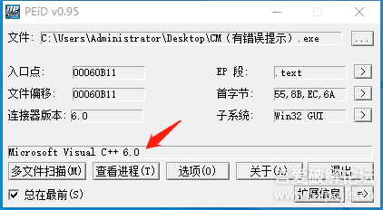

好，然后我们就把脱壳后的CM拖到OD里面进行分析。

OD会暂停在下面的图示：

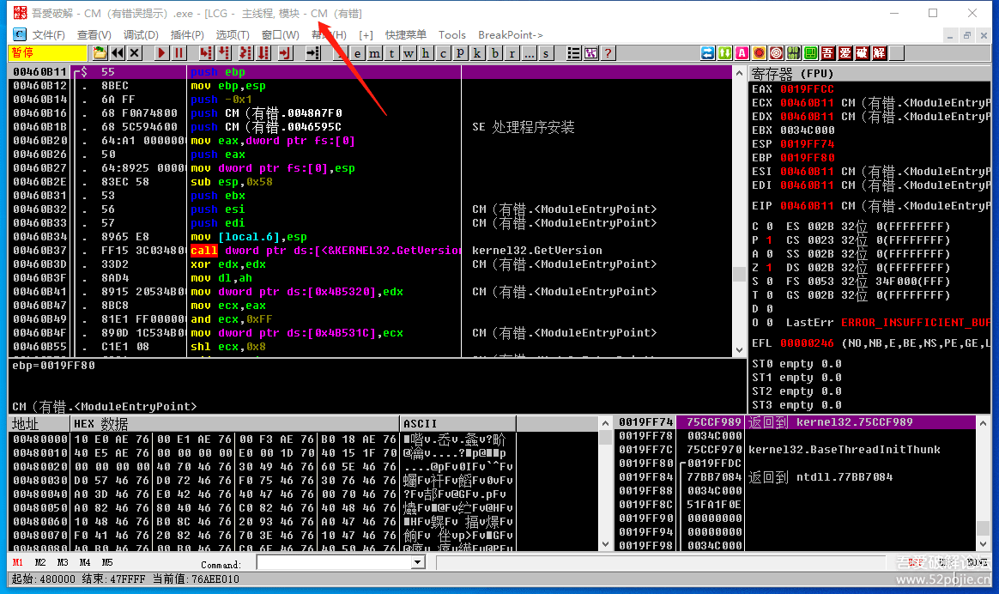

看一下红色箭头指的是CM，而且代码区是地址是小地址，所以证明我们的程序此刻停在“程序空间”，怎么判断程序是暂停状态呢？你看一下代码区的左上角是不是有一个红色的“暂停”，如果是运行状态，就会写“运行”。

接下来，我们干什么？我们在代码区右键，然后选择“中文搜索引擎”里面的“智能搜索”，见下图：

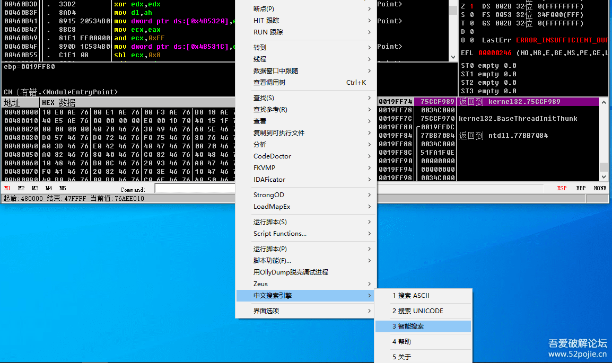

此时OD就会变成下图：

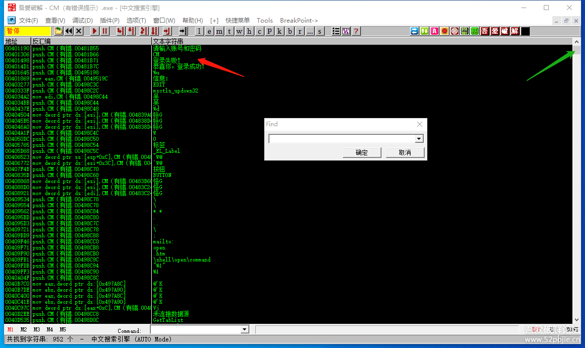

这个页面是OD显示字符串的页面，红色箭头指的是关键的提示字符串，如果你没有看到，你可以点绿色箭头指的“滑块”上下查看，如果字符串太多，通常使用的方法是在这个页面上按鼠标右键，选择FIND，就是搜索字符串的意思，快捷键是F2,然后你搜索“登陆失败”就会到这个位置。

然后在“登陆失败”这一句上鼠标双击，就会来到下图：

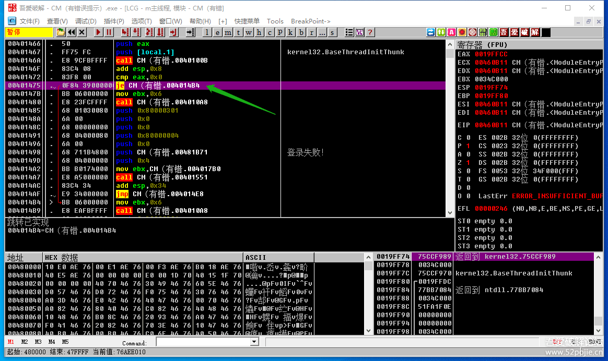

看到了吗？上面有一个JE跳转可以跳过“登录失败”这行代码。我们现在在JE这行代码上鼠标双击，就会出现下图：

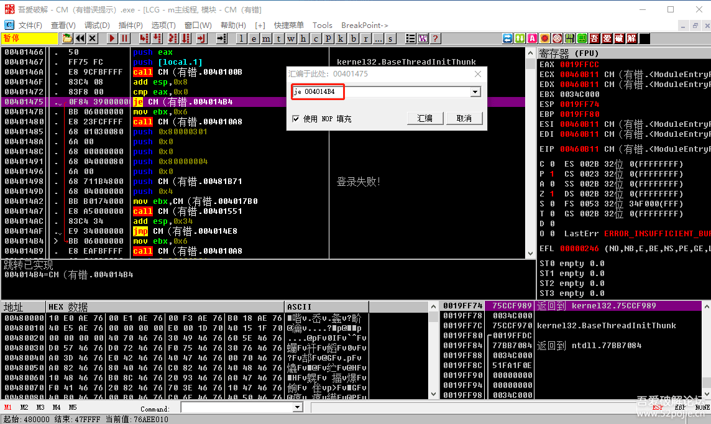

然后在红色方框内修改成JMP，就是无条件跳转，然后点一下汇编按钮，就会出现下图：

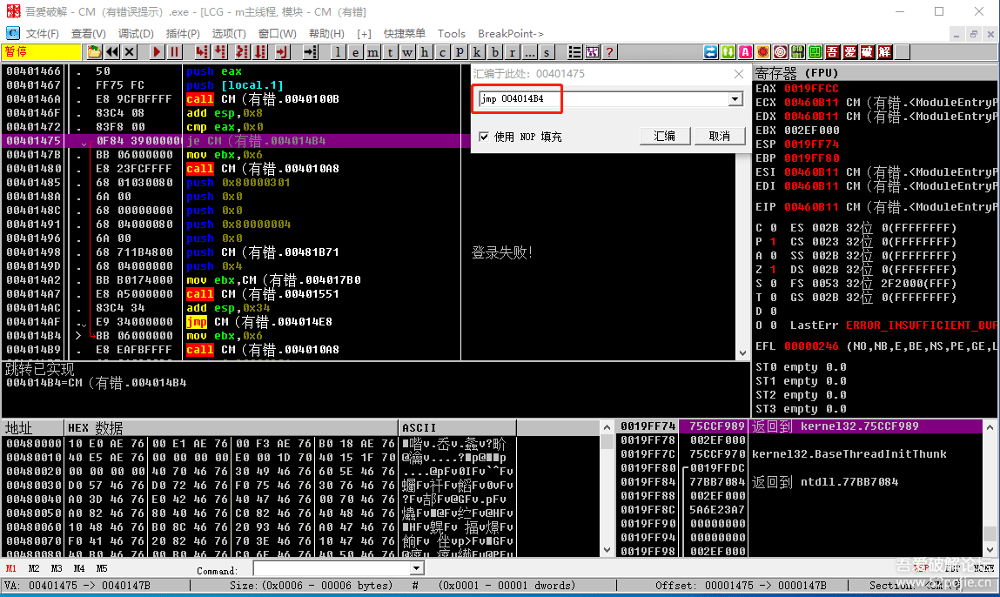

当然你也可以在要修改的那一行点鼠标右键，里面有更多的指令，包括可以撤回修改。
当我们修改好了代码以后，我们剩下的任务就是把修改的程序进行保存，怎么做呢？

你在代码区按鼠标右键，选择“复制到可执行文件”菜单中的“所有修改”。见下图：

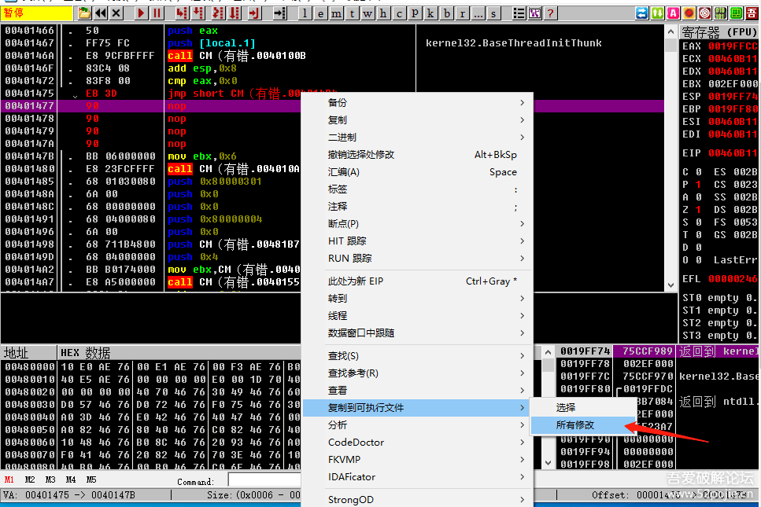

然后，OD就会变成这个样子，见下图：

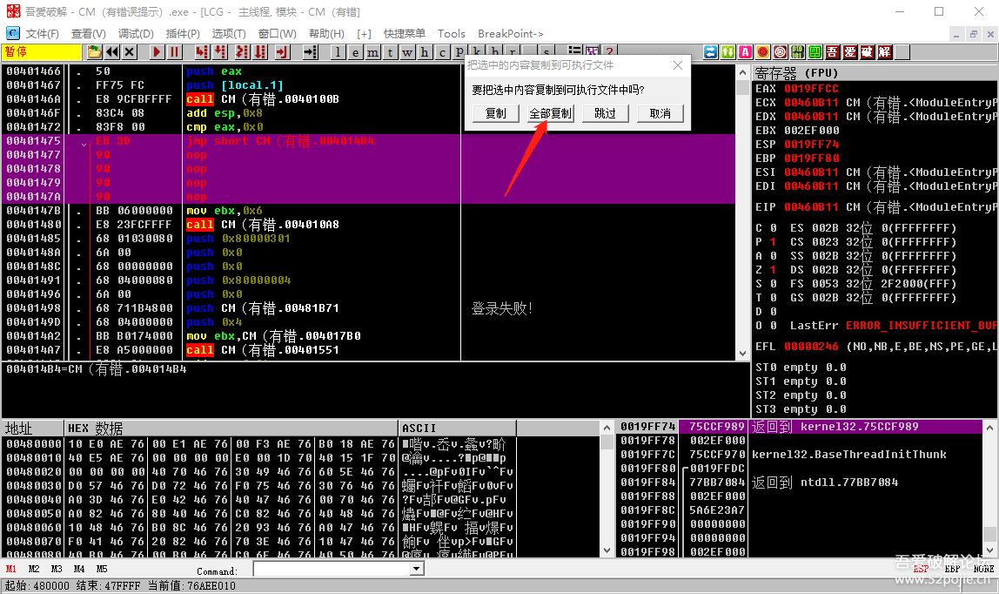

然后，你点一下红色箭头指的“全部复制”按钮，就会出现下图：

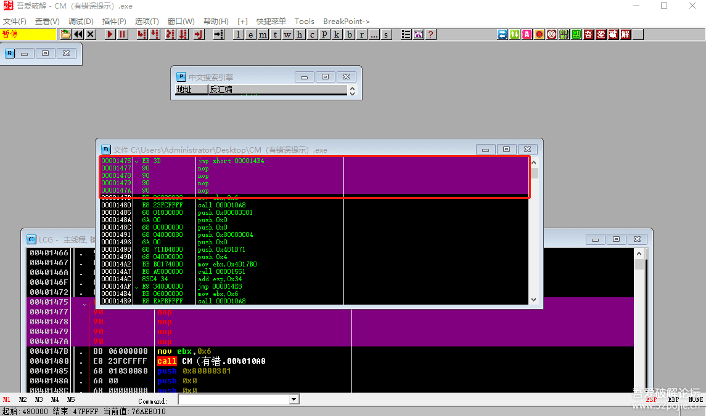

然后，你在红色方框内点鼠标右键，选择“保存文件”，就可以把修改好的文件保存到你指定的目录里了。

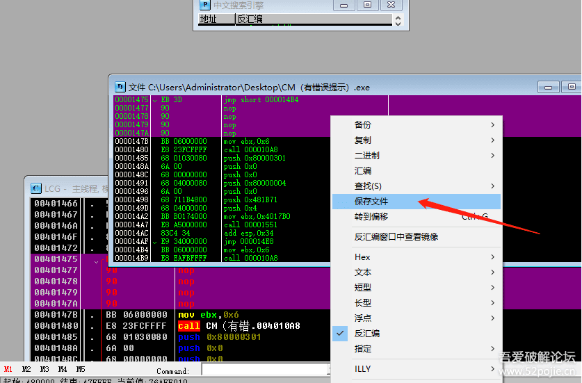

然后，你关掉OD，打开新保存的修改过的程序，你会看到你已经成功破解了，如果你做到了，给自己一个赞吧！

如果你已经对我上面讲的步骤都非常清楚，你可能会说我太罗嗦了，这么简单的东西还讲了这么久，这么细。我要对你说声抱歉，耽误你点宝贵时间了，另外也表明一点，你不是一个新人了，我的教程主要是写给新人看的，很多新人从来都没有真正完整的破解过一个软件，所以我就宁愿多花时间，也要带他们真正的完成一次破解过程。只要有了一次完整的破解过程，遇到其他的软件，破解的步骤也是大同小异。当然，如果你有了一些基础，你可以去“追码”玩玩，也算解解闷。

还没完，呵呵！

我们刚才说了先脱壳再分析。我们还可以不脱壳就分析。想想看，如果今天遇到的不是UPX这样的壳，没有现成的脱壳工具，我们也不会手工脱壳，怎么办？那我们就直接把软件拖到OD里再说。当我们把有壳的CM拖到OD里面时，会出现下图：

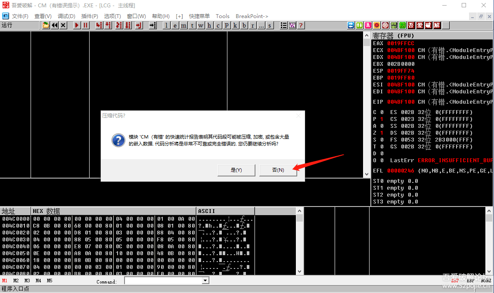

当有壳的程序拖到OD里，就会出现这样的提示。我们点红色箭头指的“否”。为什么？因为OD都说了，它分析的不可靠，那你还让它分析干什么，所以点“否”，不影响我们正常使用OD的功能。然后，请注意，这个时候，你直接进行“智能搜索”是搜不到关键字符串的。

那怎么办？重点来了，我们一般的做法是按F9把程序运行起来，然后在代码区按CTRL+G转到00401000这个位置，见下图：

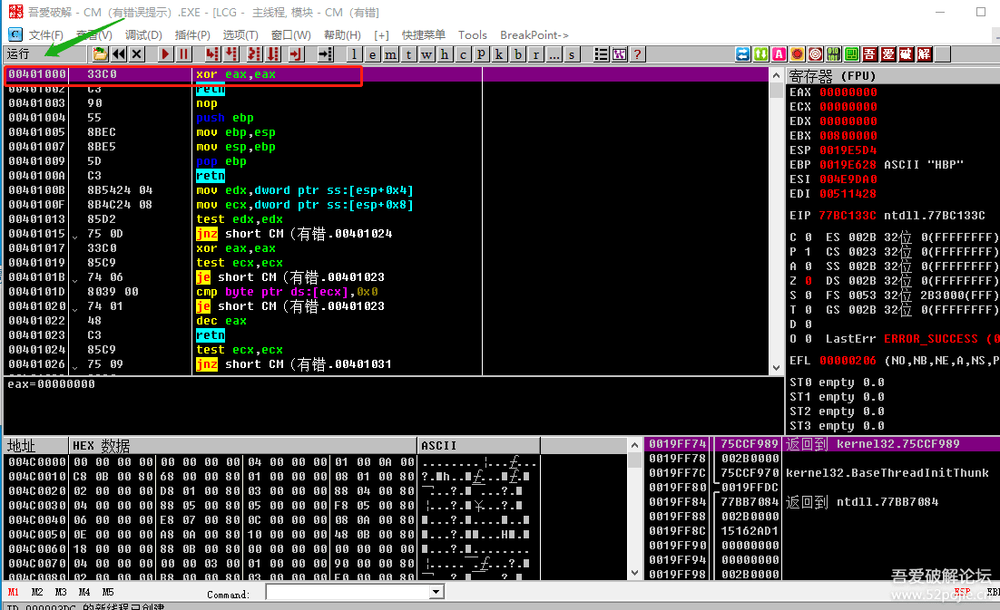

此时，你再搜索字符串就可以搜到关键字符串了，接下来的步骤就和前面讲的一样了，所以说，当我们遇到带壳的程序，而我们不会脱壳也不用怕，就直接拖到OD，运行程序，然后转到00401000处，再去搜索。

美中不足的是，有壳的程序虽然可以用这种方法来分析，找到关键位置，但是你修改代码以后无法保存，呵呵，无语了吧！别急，我们还是有办法的，用一个内存补丁工具就可以解决了。这个工具的名字叫 [InlinePatch生成器1.2](../../tools/05_patcher/InlinePatch)。见下图：

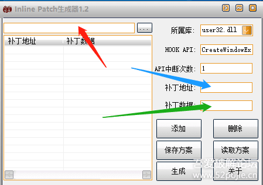

使用方法是三步：
第一步：在红色箭头指的地方选择要破解的软件的路径。
第二步：在蓝色箭头指的地方输入要修改的代码的地址。
第三步：在绿色箭头指的地方输入修改以后的代码，然后点添加按钮，修改的内容就显示在左边区域了。

结果就是这样：

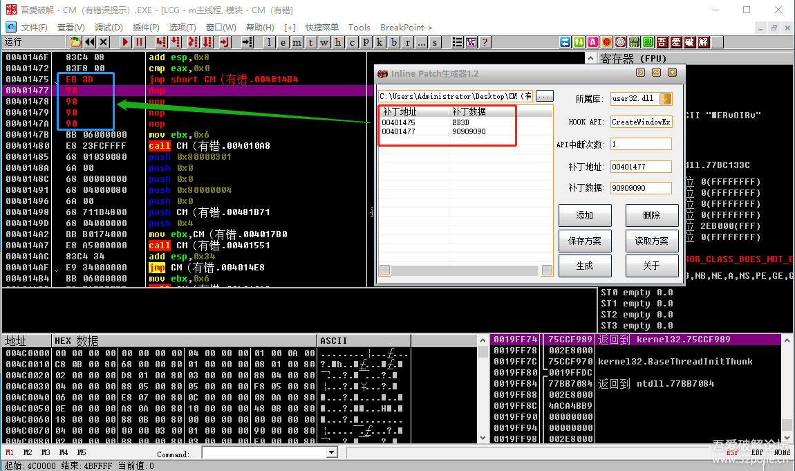

然后点“生成”按钮，就大功告成了！

至此，我把有错误提示的软件的破解基本讲完了，做为新手来说，可以运用了。当然，还有一些特殊的情况我在这里没有深入说，比如有些程序一运行就退出，那怎么办？还有就是有些程序不是转到00401000处的，等等。不着急，既然是新人，先学基础的，普遍的，开心就好，难的放在以后再说！

------

> [>> 回到目录](README.md)
