# course-11 继续让你尝到“成功”的味道

> [>> 原文](https://www.52pojie.cn/thread-1360574-1-1.html)

------

大家好，上集是完整的讲解了一次爆破的过程，相信绝大多数的朋友跟着做一遍会尝到初步“成功”的喜悦，如果说您还没有成功，别着急，您再仔细看一遍，应该就可以了，很可能是你忽略了一点小细节。
今天我们的敌人是第二种类型的软件。

有登录账号和密码，登录后找不到错误提示。

软件的名称：[course-11.exe](PEs/course-11.exe)（有错误提示，OD搜索不到）

假定你现在是软件的作者，你听完了我前几节课，你就会知道如果你写的软件被破解者用OD分析，很轻松的查到“失败”或者“成功”这样的验证后结果的字符串，你的软件会非常不安全。所以，你的一个基本做法就是让别人用OD的字符串搜索引擎找不到关键字符串。于是，你用了一些不可告人的办法，结果，破解者在OD里真的找不到关键字符串了，破解的新手对于这样的软件就一脸懵逼了，没有办法只能放弃。

真的就放弃了吗？当然不，我们的兴趣就是要玩破解，看谁能玩过谁？

下面我们来具体分析一下，我们可以把找不到错误提示信息的软件分为两大类。

第一类是当我们点登陆后，我们明明看到错误提示，但是在OD里就是搜不到。
第二类是当我们点登陆后，没有任何提示，所谓“这里的黎明静悄悄”。

相比之下，第二类应该比第一类更难。

我们先分析第一类。首先思考一下，为什么软件在运行时明明有错误提示，但是我们的OD会看不到。我们刚才说了，这是因为编写软件者在编写读取关键字符串的代码上做了手脚，导致我们用OD搜不到。至于做了手脚，我们不用管它，现在摆在我们面前的就是一个现实——搜不到字符串，我们找不到破解的突破口。

现在我们用OD打开这个软件，然后你登录后，用搜索引擎进行搜索，找不到错误提示的字符串，见下图：

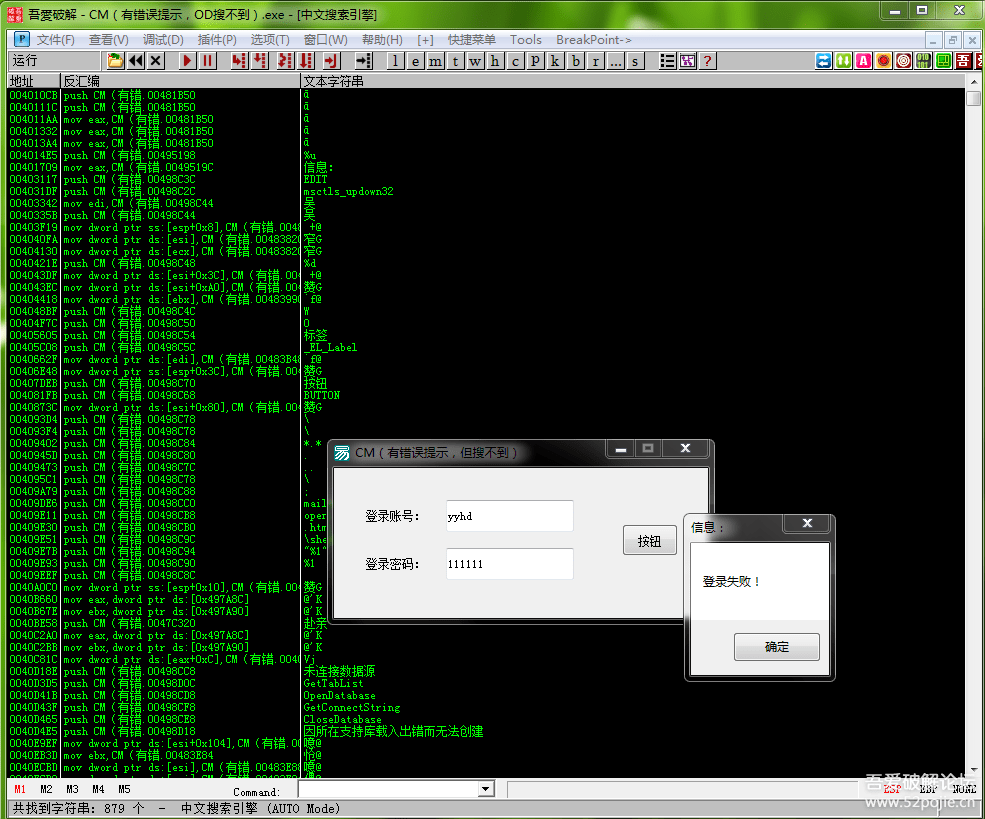

即使F9运行程序，转到00401000处，再搜，还是搜不到。
怎么办呢？

一种办法就是既然有提示字符串，我们就继续换方法搜。

我们现在用鼠标按一下下图中蓝色方框内的“M”按钮，M代表程序的内存空间。

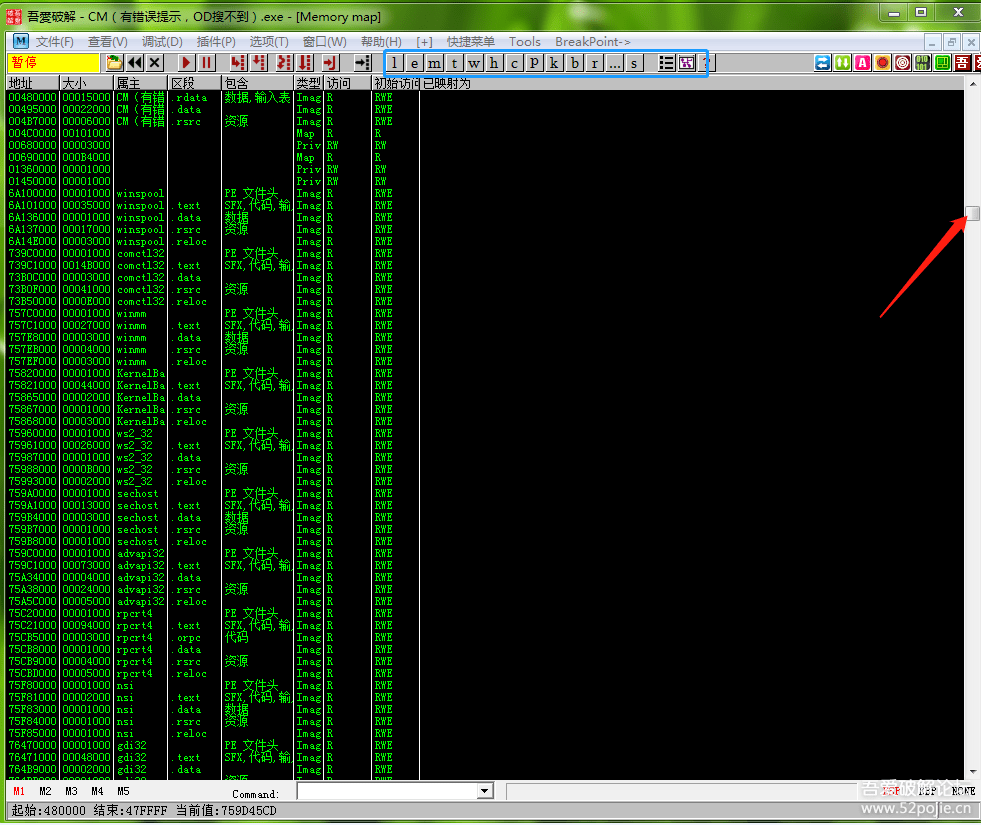

然后我们按住红色箭头指的滑块拉到最上面。然后我们在这个页面鼠标右键选择“搜索”菜单，会出现下图：

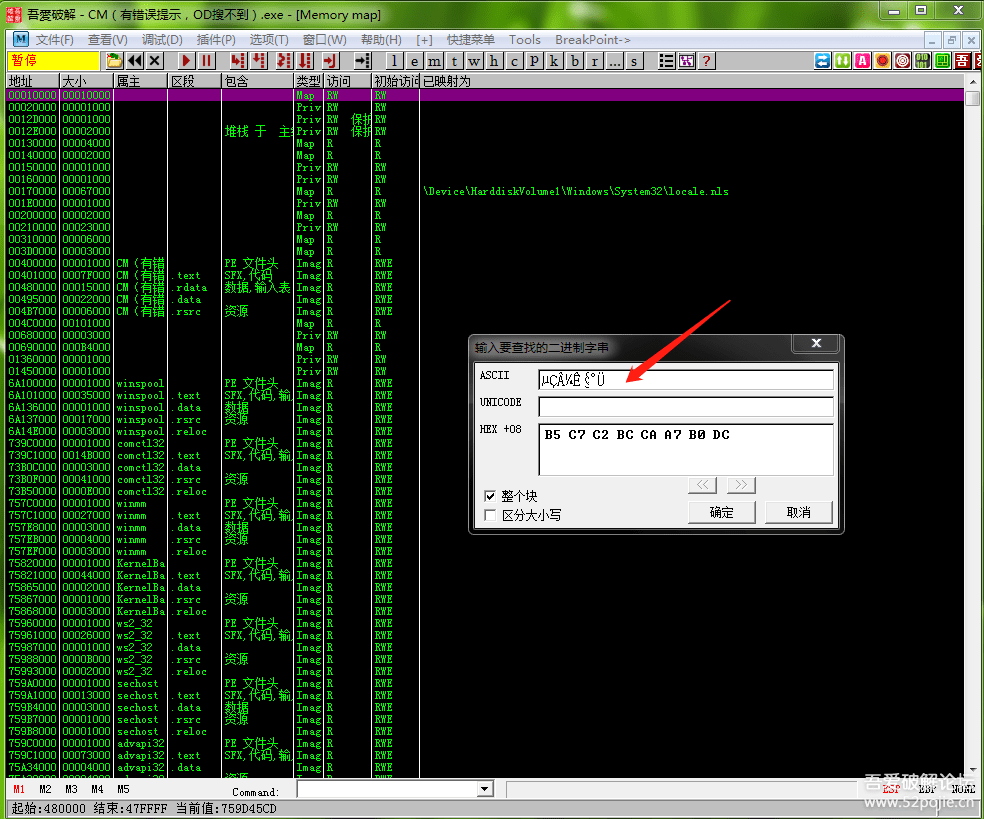

然后在红色箭头指的位置，就是ASCII后面的方框内输入“登录失败”，点确定按钮，就会出现下图：

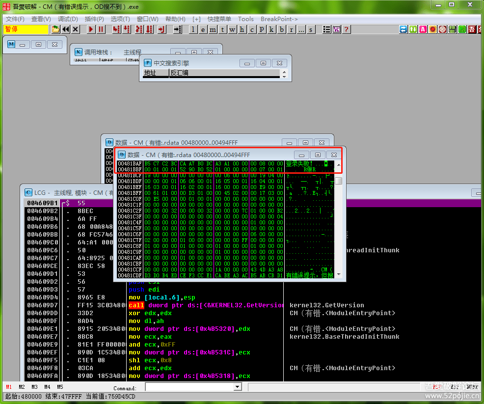

呵呵，在红色方框内，我们终于看到了梦中的情人“登录失败”。我们用记事本记一下“登录失败”这一行的地址00481DAF。

然后我们按一下OD页面上方的“C”按钮，见下图：

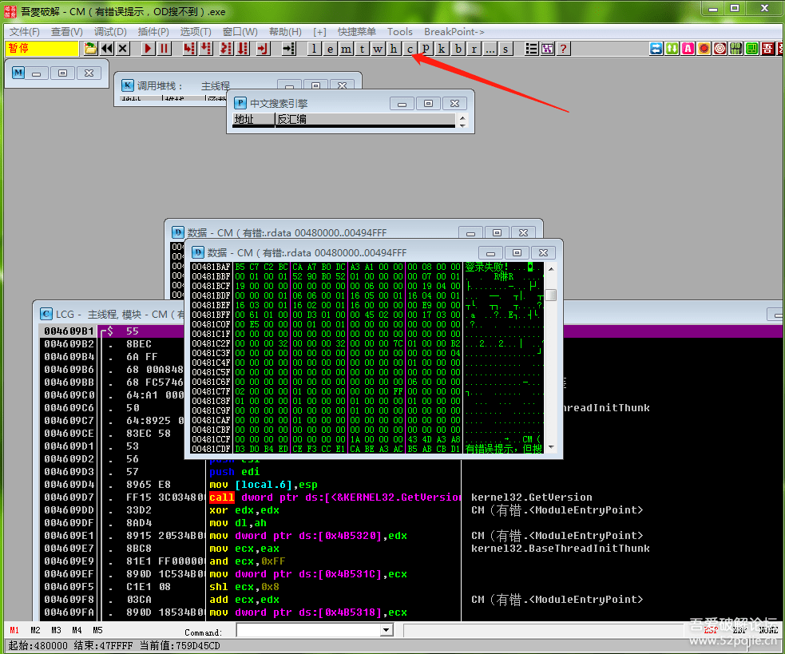

按完以后，我们就回到了最初的OD显示的代码窗口页面，“C”按钮代表CPU，因为我们的代码窗口也叫做CPU窗口。你再看看，在“C”旁边还有几个英文字符的按钮，这是OD给我们提供的快速在不同页面转换的按钮，比如你按一下“B”按钮，就会出现我们已经下过的所有断点，B就叫做断点窗口。

我们继续，按完“C”以后，你的OD可能会变成这样，见下图：

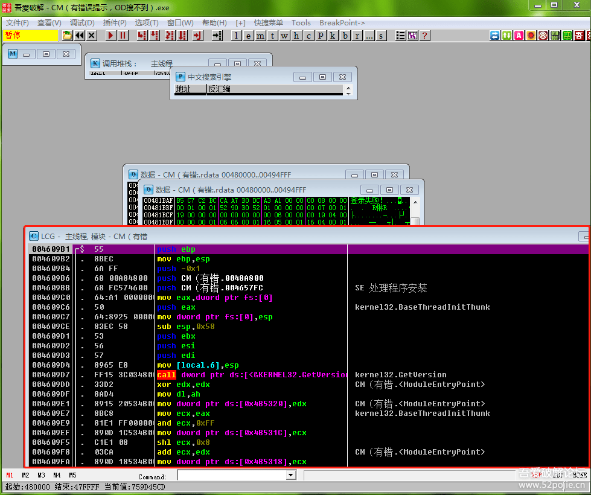

不是你刚打开OD的样子，你现在只需要在红色方框内也就是代码窗口内鼠标双击一下，就正常了。

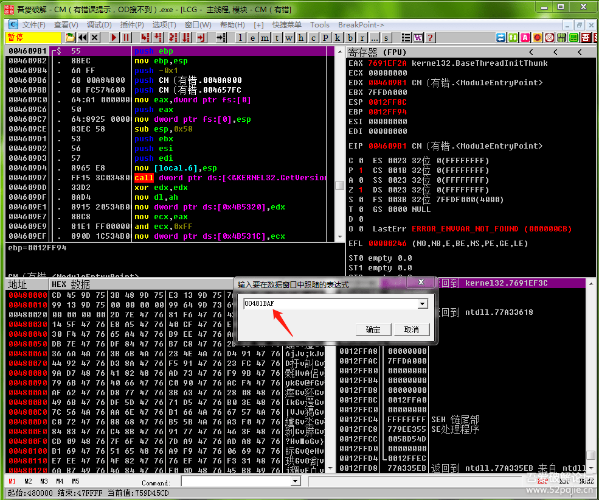

然后你就在数据窗口用CTRL+G，然后在红色箭头位置输入我们刚才记下的地址00481BAF，点确定。来到下图：

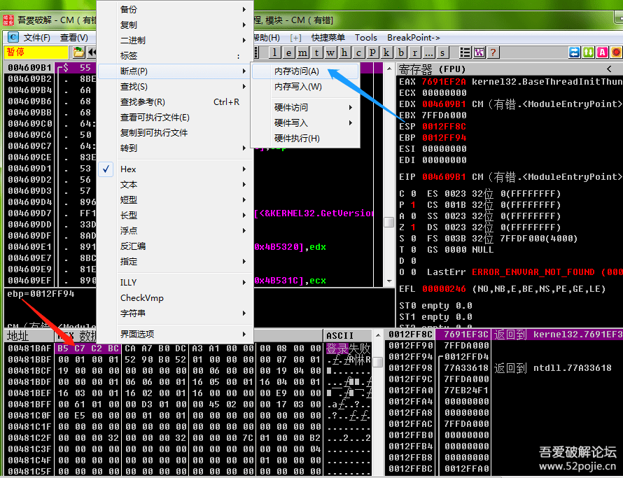

然后你在红色箭头指的位置，也就是00481BAF右边的数据上用鼠标左键选中第一行，就是紫色部分，然后点鼠标右键选择“断点”菜单中的“内存访问”，这样我们就在00481BAF这个地址下了一个“内存断点”，这个断点的意思就是当我们的程序在执行过程中读取这个地址中的数据，程序就会暂停。我们想一想，00481BAF这个地址里存放的数据不就是“登录失败”字符串吗？我们的目的就是当程序执行中只要读取“登录失败”字符串就会暂停下来，此刻程序停留的位置就接近关键代码了。

好，我们继续，下完“内存断点”后，我们按F9让程序运行起来，然后输入登录账号和密码，点登陆，OD会立刻停下来，见下图：

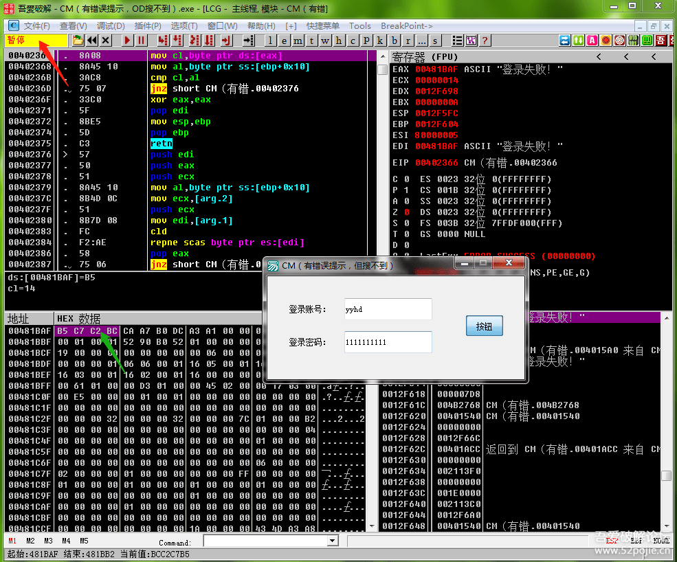

红色箭头显示“暂停”，错误提示的信息框也没有出现，说明我们在程序读取存放“登录失败”的地址00481BAF的那一刻暂停了，因为读取以后才会把“登录失败”字符串显示在信息框里，所以此时信息框无法显示，换句话说，我们现在代码停留的位置应该是在验证CALL执行完和验证结果（错误信息框出现）之间。

接下来，我们首先要干的事情，就是在绿色箭头指的位置（也就是我们刚才下内存断点的位置）鼠标右键，选择里面的“删除内存断点”菜单，因为我们已经断下来了，不需要了。

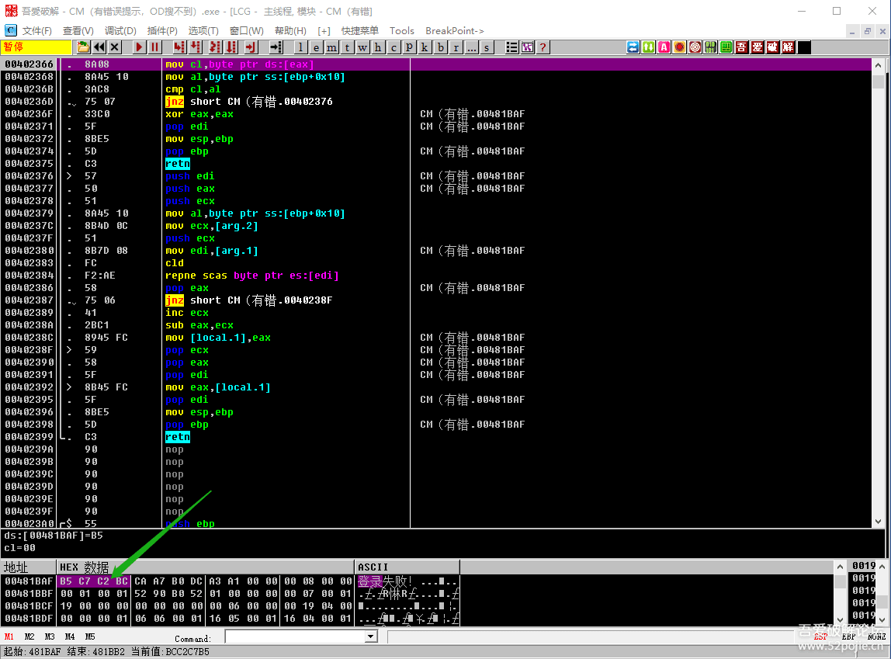

然后按F8一句一句代码往下跟，不用做任何修改，返回上一层CALL，不同的编写语言以及作者编写代码的不同会导致返回的次数不同，我们这个软件返回了三层，所谓返回三层就是遇到了三次RETN，RETN后就会返回到上一级调用处。见下图：

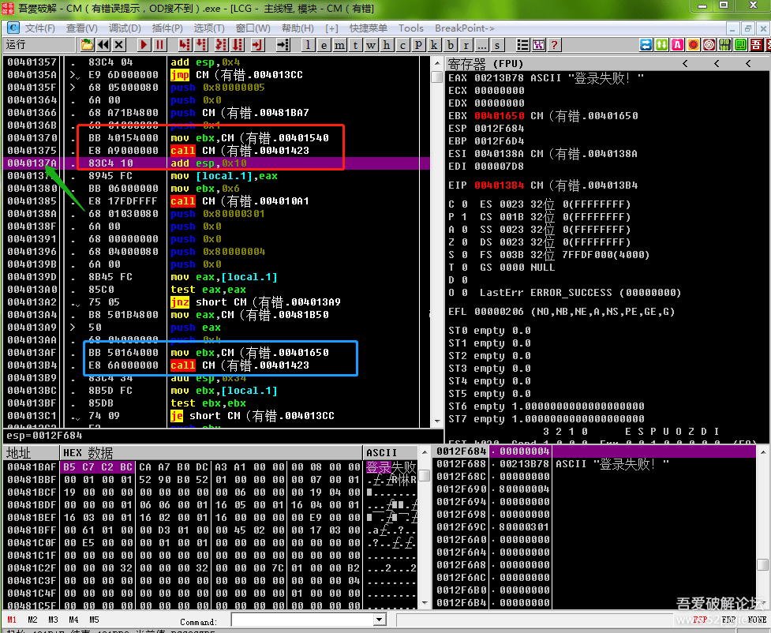

返回三次后，我们的代码会执行到0040137A，这个时候就是关键位置了，你看上面有一个大跳转JMP可以跳过我们的停留位置，这就非常可疑了，在JMP下面还有一个跳转能够跳过来，我们可以猜测一下，如果JMP下面的跳转不实现，那么JMP就可以跳过我们现在的代码，而我们此刻的代码就是根据“登录失败”这个错误信息跟过来的，那么也就是说JMP很可能就会跳过“登录失败”这个错误信息，我们不就成功破解了吗？

我们先别着急，再看一下红色方框里的CALL，也就是我们代码停留的位置的上一句，这个CALL的作用是什么呢？呵呵，这个CALL的作用就是读取出我们的“登录失败”字符串。

我们再往下看绿色方框里的CALL，这个CALL的作用是什么呢？这个CALL的作用就是弹出登录失败这个信息框。

我们继续看，在红色方框内的CALL下面是不是有一个EAX，EAX的作用还记得吗？对，它里面存放的是上面CALL的返回值，也就是说此时的EAX里面存放着“登录失败”这个字符串，然后通过语句 `MOV [LOCAL.1],EAX` ,把EAX的值转移到一个内存地址里以后使用。

现在你的脑子里对整个破解流程是不是变的更清晰些了？

下面的工作，就是把能够跳到JMP下面的那个跳转改成NOP，你就成功了，快试试看吧！

除了这个用内存断点搜字符串的方法，我们还可以怎么做呢？

我们这个软件，虽然常用的方法搜不到字符串，但是会有错误的提示框，那么我们就可以对MessageBoxA函数下断点进行破解。

再如果，我们的软件没有弹出错误信息框，我们又该怎么办？

鉴于本节课内容已经不少了，为了方便大家阅读和学习，我放到下一集来讲，谢谢大家的继续支持！

------

> [>> 回到目录](README.md)
