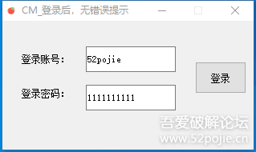
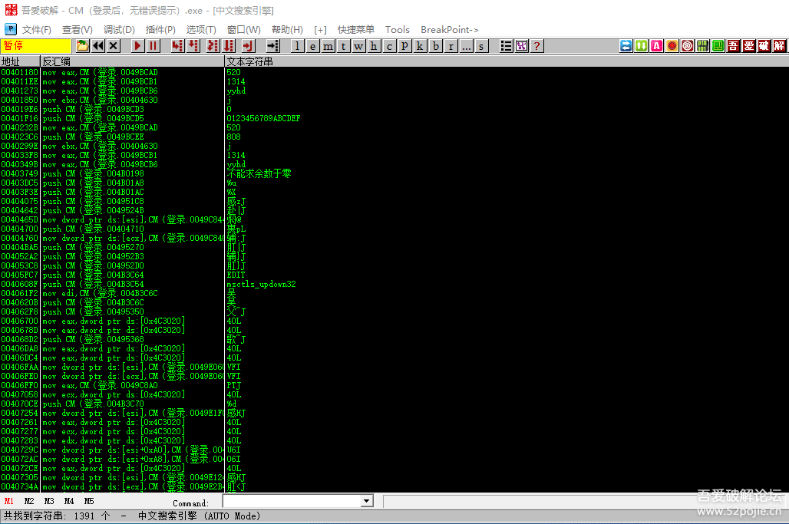
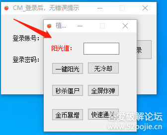
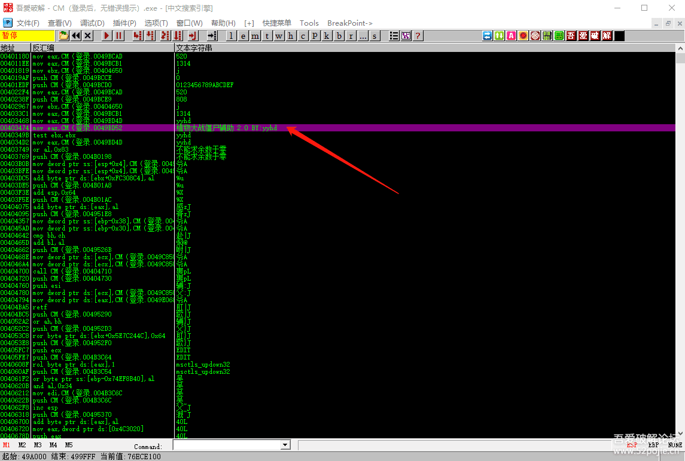
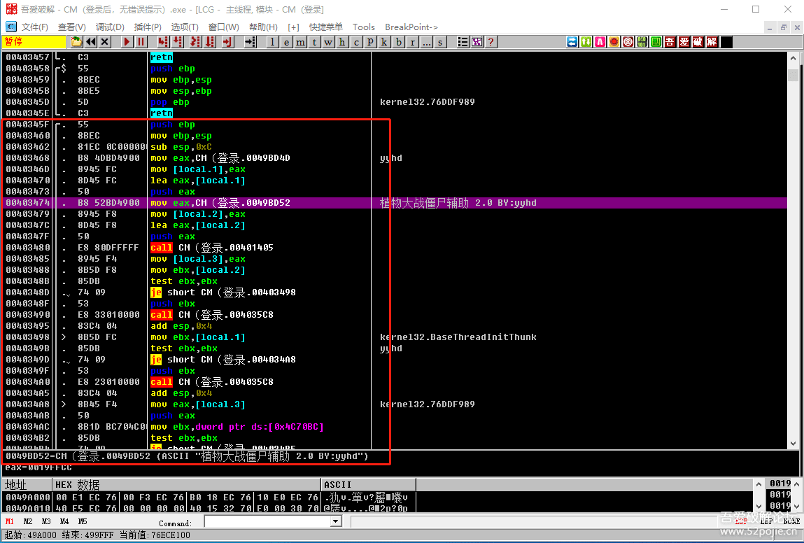
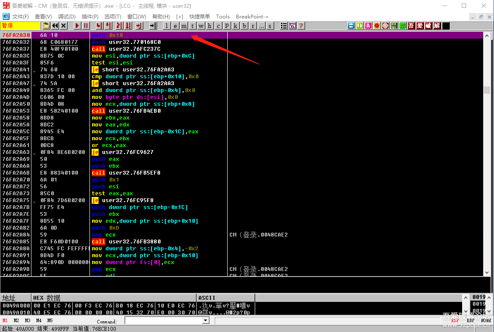
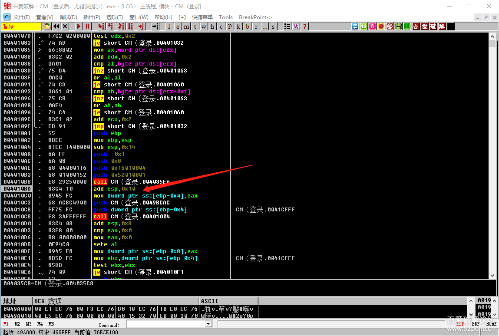
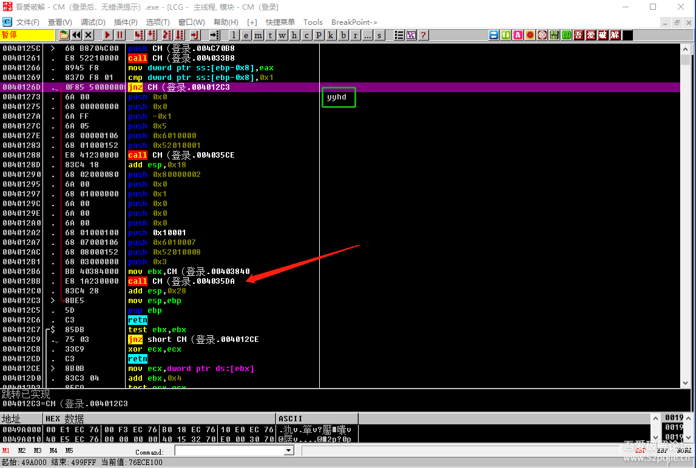

# course-12 进一步品尝“成功”的味道

> [>> 原文](https://www.52pojie.cn/thread-1361115-1-1.html)

------

回顾上一集的内容，我们学习了如何对付“明明有错误提示，但是OD搜不到”这样的软件的方法，您学会了吗？当然，这种方法并不是可以“通杀”的，因为软件作者对敏感的字符串会采取多种加密的方法进行保护，其目的是路人皆知的，就是增加我们查找这些字符串的难度，所谓“魔高一尺 道高一丈”，软件的安全保护和破解这两类技术是在一直进行激烈的斗争。

所以，当你用教程中的方法无法破解现实中的软件的时候，你不要气馁，不要觉得现在学的东西太基础，不实用。你之所以破解不了，只能说明软件作者的防破解技术比你现有的破解技术要高，你再想想，我们还只是破解的新手，很多人连编程都不会，你凭什么就能破解人家写好的软件，毕竟人家对于程序的认识和理解要高于你，所以，我们要在学习中放平心态，始终以“玩破解”的目的去学破解，别给自己压力，把破解当成是自己的业余爱好，只是玩玩而已。

下面，我们继续本集的课程。

今天，我们要对付的软件的类型是什么呢？

就是输入账号和密码登录后，没有出现错误提示信息，就像没有发生任何事情一样。

我们今天使用的软件的名称是：[course-12.exe](PEs/course-12.exe)（登录后，无错误提示）

打开这个软件以后，你输入账号和密码，点登录按钮后无任何提示。

然后，你直接把CM拖到OD里用搜索引擎查查字符串，结果还是没有敏感字符串。

最后，你不死心，用我们上节课的内存断点的方法在内存里搜，晕了，该搜什么关键词呢？ 你暂时处在彷徨无助之中。

放弃吗？不，既然要玩，就玩到底！

怎么玩呢？

我们先冷静思考一下，这个软件的验证机制是什么？

我们现在看到的就是，当我们的账号和密码不正确的时候，无任何反应。那么，如果我们的账号和密码正确的时候，程序总该有反应了吧。当然，如果我们的账号和密码都正确，程序如果还没有反应，那不是玩人吗？

呵呵，我们一向喜欢玩人，不喜欢被玩的感觉。

于是，我们总结出一个规律，就是“当一个人软件摆在我们的面前，如果我们用错误的账号和密码登录以后无任何提示和反应，那么当我们用正确的账号和密码登录时就一定会有所反应，否则这个软件就是垃圾”。

呵呵，这还算是总结出的规律吗？所有正常的软件都会如此。

既然我们知道这条规律，那么我们就再想想看，既然没有搜索到“失败”或者“成功”之类的字符串，也没有弹出信息框，那还能是什么反应？

有一种反应，就是如果账号和密码正确会弹出新的窗口。

我们有些朋友想使用外挂，当你打开外挂软件的时候，你能看到那些外挂功能吗？看不到吧，只有当你的账号和密码都正确了，然后登录窗口消失，外挂功能窗口才会显示出来。

提前剧透一下，我们如果输入了正确的账号和密码，我们这个软件就会出现下图：

红色箭头指的就是弹出了一个新的功能窗口，呵呵，植物大战僵尸的辅助，这只是演示窗口，我没有添加具体的功能，因为我们的目标在玩破解，不在于玩这个外挂。

我们分析到这，你对这个软件的验证机制清楚了吧，归纳为一句话，就是“账号密码错误，程序不做反应；账号密码正确，弹出新窗口”。

问题现在还摆在眼前，我们怎么破解呢？

我们在第一集就给大家说过软件的验证流程，还记的吗？就是分为验证前、验证中、验证后，我们最常用的破解方法是根据验证后的结果来反查逆向到验证中的关键代码位置。

还讲了一条破解法则就是“两头突破，中间破解”，意思就是说破解的突破口要么是验证后，如果验证后不好找，就到验证前找突破口，最终的目标是一致的，就是要到中间的验证关键代码处。

那好，根据我们的破解法则，我们现在遇到的这个软件在验证后有突破口吗？没有任何提示，不好找线索吧。

有朋友可能会说，不是还有成功后会弹出新窗口吗？这是不是可以当线索？

呵呵，这个想法不错，这就是逆向思维，既然失败时没有线索，那么我们就找成功后的线索。

怎么找呢？我们最熟悉的当然是字符串，我们假定看到过成功后弹出的功能窗口，我们是不是可以搜上面的字符串，比如窗口标题，窗口内的文字。

好，我们就这么办。我们把软件拖进OD，没有壳，直接搜索字符串，我们欣喜的发现了下图：

红色箭头指的字符串就是新功能窗口的标题，呵呵，一阵狂喜。我们双击这一行代码，就到了下图：

看红色方框里，第一行代码的地址是0040345F ，代码是 PUSH  EBP，在代码的左边还能看到一个白色线条的括号，好像是把这一部分给括起来了，没错，括号上面的语句是RETN，就说明0040345F是当前子程序的首地址，就是这个子程序的第一句代码。

但是令人遗憾的是，从这个首地址往下看，并没有能够跳过“植物大战僵尸”这行字符串的跳转，那么，我们就只能往上一层调用这个子程序的代码段去看是否有跳转。

思路是对的，但是问题也来了，我们怎么才能到上一层代码的位置呢？

我们以前的做法是程序断在字符串这个位置，然后F8一步步跟就能到上一层，对吧。

但是现在我们只是知道字符串的代码在这个位置，但是我们的程序并没有断在这里，所以我们也就无法F8去回溯了。那怎么办呢？

我们还可以这样试一下，把鼠标点一下首地址0040345F，看看信息框里有没有“本次调用来自某某地址”这样的信息，可惜，还是没有，结果这种方法也让我们空欢喜一场。

别郁闷，对于这个软件，这种从成功的结果进行破解不可行，但是，这种破解思路对于其他的软件可能是个好方法，比如我们如果遇到一些软件带有“已注册”这样的关键词的重启验证的软件，你就可以尝试用这种方法破解。

我带着大家一起分析这种思路，目的是希望大家通过这个软件的破解学到更多的知识。

到现在为止，我们只能放弃从验证后的结果做为破解的突破口了。

那么，按照我们的破解大法，我们就从验证前入手。

晕了，验证前的代码这么多，我们把代码暂停在哪个位置呢？

呵呵，别着急，我们再分析一下软件验证流程。

我们输入登录账号和密码以后，然后我们点登录按钮，结果没有任何反应，是这样的吧。

那么，我们再深入思考一下，我们点了登录按钮以后到没有任何反应之间还会发生些什么？难道在这个时间段里程序没有执行任何代码吗？

当然不是，这个时间段里发生了很多事情，我们程序整个验证过程都在这里发生。我们猜想一下，是不是发生了这样一些事情。

我们点了登录按钮，然后程序会通过一个系统提供的函数读取我们输入的账号和密码，然后会调用一个软件作者自写的算法CALL根据我们输入的账号计算出真码，然后会调用一个验证CALL对真码和假码进行对比，如果对比的结果是假，就什么都不做，如果对比的结果是真，就弹出新窗口。

好了，我们脑子里有这样的验证流程以后，我们就思考一下在验证CALL前有什么位置很接近，而且我们也有办法找到让程序暂停。

有三个位置，第一个位置是点击登录按钮的时刻，第二个位置是读取输入的账号和密码的时刻，第三个位置是算法CALL。

我们今天不讲其他的位置，我们找最常用的断点位置，就是读取输入的账号和密码的代码位置。

程序在运行时怎么才能读取我们输入的账号和密码呢？通常会用操作系统提供的函数，最常用是一个函数是GetwindowsTextA，这个函数和以前我们说的弹出信息框的函数MessageBoxA一样，都是系统提供的功能函数，一个功能是取窗口内的输入文本，一个是弹出信息框。

我们在OD里下GetwindowsTextA函数断点。然后就到了这个图：

我们一直按F8,经历了几次返回到上一层，然后我们就来到了这里。

红色箭头就是我们当前代码走到的位置，然后我们往下找可疑的跳转。

有些朋友可能要问了，这次怎么和以前不一样了，以前不是往上找跳转吗？

我们往上找跳转的目的是想找能够跳过结果字符串的代码位置，因为我们的结果在后，所以要在结果发生前找跳转。

现在不一样了，我们这次是在读取输入的账号和密码的位置停下来的，我们的代码位置是在验证CALL执行前，我们往上找跳转有意义吗？难道我们想找有什么跳转可以跳过读取输入的账号和密码吗？

呵呵，真跳过了，那更是破解不了，等于没有输入账号和密码。所以，我们现在按照软件执行的验证流程继续一步步往下找，你F8往下走走，见下图：

这个跳转就是关键的跳转，红色箭头指的位置就是弹出新窗口的CALL，呵呵，我怎么知道的呢？

这个需要一点经验，因为我看到这个CALL上面的参数我就知道是一个窗口的特征代码，看到004012AC这句代码 PUSH  5201008了吗？

5201008就是易语言编写的程序的窗口ID，就是一个窗口的身份标号。当然如果是其他语言，就不是这样的特征了。

分析至此，我们就把0040126D处的代码改成NOP,呵呵，快试试看，成功了！

所以，我们通过这个软件的分析来对比看，为什么我说从验证后的结果做为破解的突破口最常用，也最方便，因为从验证前入手往下追代码会比较难，往往需要一些经验。

所以，我们在迫不得已的情况下才会选择在验证前入手。

呵呵，这节课的破解是不容易的，也让我们通过分析对软件的验证流程有了更为清晰的认识，这就达到我们学习的目的了。

当然，对于这个程序，其实还有非常简单的破解方法，下一节课再讲。

------

> [>> 回到目录](README.md)
