# course-13 集中解答新人们的几个困惑问题

> [>> 原文](https://www.52pojie.cn/thread-1361642-1-1.html)

------

我浏览了朋友们的回复，对于朋友们目前在学习中多数遇到的困惑问题在此进行解答，希望能够帮助新人们快速扫除影响学习的障碍。

问题一：关于OD的选择使用
现在网络上有很多OD的版本，在使用的方法上是一样的。区别在哪？主要就在于插件和脚本的不同。

插件是什么？是为了更好的辅助OD对程序进行分析的工具，这些工具有些是OD原版自带的，更多是使用OD的人在使用过程中为了让OD的功能更强大，自己编写的。

如果你玩过CF游戏，你可以这样理解，原版的OD就是最经典的AK47,现在大家使用的不同OD就如同黄金AK、无影AK、麒麟AK，本质没有区别，但是稳定性、伤害值、外观会有差别。

插件有什么用呢？刚才说了，插件就是为OD增加了另外的功能，比如有些插件可以让OD在调试程序时不被程序发现。

呵呵，现在有很多软件作者在程序的代码中加上了反调试的功能，最基本的做法就是程序中插入了一段检测代码，这段检测代码的作用就是能够发现有人在用OD运行程序分析。

这样的结果就是，当我们用OD加载要破解的程序，F9一运行程序，程序就立刻检测到我们正在使用OD这个工具，然后就给我们破解者一点教训和打击，轻则程序自动退出，不让你分析，“别动我”。重则会自动启动格盘、黑屏等命令，让你欲哭无泪。

基于此，我们有些破解高手就开发了能够绕过对OD进行检测的工具，这就是插件的一种。

当然插件有很多种，有刚才说的过检测插件，还有断点专用插件，可以方便大家下各种断点，我们最经常使用的“中文搜索引擎”也是一种插件。

所以说，不同的OD的插件会有不同，当然我们要选择插件比较新、功能实用的OD，很多破解高手会使用他们专用的OD，因为里面有一些特殊的插件方便他们分析。

但是，对于新人来说，就没有必要纠结在到底该使用什么OD了，因为毕竟是新手，破解技术还是初级，所以你能够破解的软件也必然是安全保护是很LOW的。

举个例子来说，你现在的能力只能去打一些土族人，你手里拿一把手枪就可以了，不需要必须获得AK你才能去战斗。

总而言之，对于新人来说，吾爱的专版OD的插件就挺全的了，完全够大家在破解中使用，下图就是OD里的插件菜单位置，你可以随便看看。

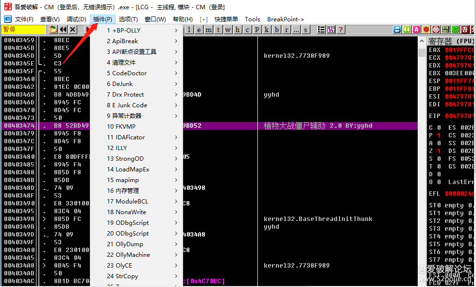

红色箭头指的就是“插件”菜单，你鼠标左键点一下就能看到你现在使用的OD里都有哪些插件。

这些插件你暂时不用去管，因为你安装完OD后，这些插件的功能基本就设置好了，你的OD就有这些插件提供的功能了，除非你有特殊的需要再去设置。

至于脚本，主要可以用来下按钮事件断点和自动脱壳使用，以后再介绍。

第二、关于如何下断点？

我们都知道，要想破解一个软件，我们通常会采用破解大法“两头找线索，中间去破解”，两头就是验证前和验证后，中间就是真假码的验证比较。

当然你首先要先能够让程序停在两头，然后再一句一句代码的运行、分析。

所以，用OD分析软件的基本思路就是：让程序在两头暂停，然后F8或者F7一句一句代码的跟踪分析。

现在问题来了，怎么才能够让程序暂停呢？而且是暂停在我们想要的位置？

这就是OD这个工具的主要功能，它就有这个本事实现我们的目的。

OD这个工具有两大主要功能，一是能够把已经编好的软件进行反汇编，让软件暴露原型。

当然不能还原出编程的源代码，所谓源代码就是作者编写这个软件时所写的每一句代码，比如他用的是C语言，OD就不能把编好的软件再次还原为C语言，而只能还原为这个软件的汇编语言。
那么汇编语言和作者编程使用的C语言有什么关系呢？

简单来说，现在程序员在编程时使用的主要属于计算机的高级语言，所谓高级就是更智能、更人性化、更方便编程。

大家经常说的C、C++、VC、VB、Delphi、易语言、JAVA、python都属于高级语言。

我们编程人员用这些高级语言编写程序代码，写完以后，在代码生成最后被称为可执行的EXE文件的过程中，会有一个把高级语言先变成汇编语言，汇编语言再变成计算机可以识别的机器语言的过程，明白了吗？

我们的OD能做的工作就是把EXE文件还原到汇编语言这一步，无法继续还原到高级语言（就是源代码）这里了，虽然汇编语言比高级语言难懂一些，但是同一个软件的高级语言和被OD还原的汇编语言在程序执行的流程上是一致的，所以我们要感谢OD，至少OD能够让我们看到美女的“身体”，只是还穿着“比基尼”。

说了OD中的汇编代码和软件源程序的关系，我们接着回到如何下断点，让程序暂停在我们需要它停留的地方。

所谓下断点，就是通过一些方法，让程序在我们下断点的地方能够暂停下来，等着我们慢慢欣赏分析。

你也可以这么理解，所谓下断点就是给当前运行的程序安装了一个警报器，这个警报器的作用就是当程序代码执行到放置警报器的位置的时候，就会发出报警，程序暂停等待我们去处理异常。

对于大家来说，在代码区下断点应该都会了，这个容易，你想停在哪一行代码，就在这一行按一下F2。

比如，我现在在00403474这句代码上下了一个断点，见下图：

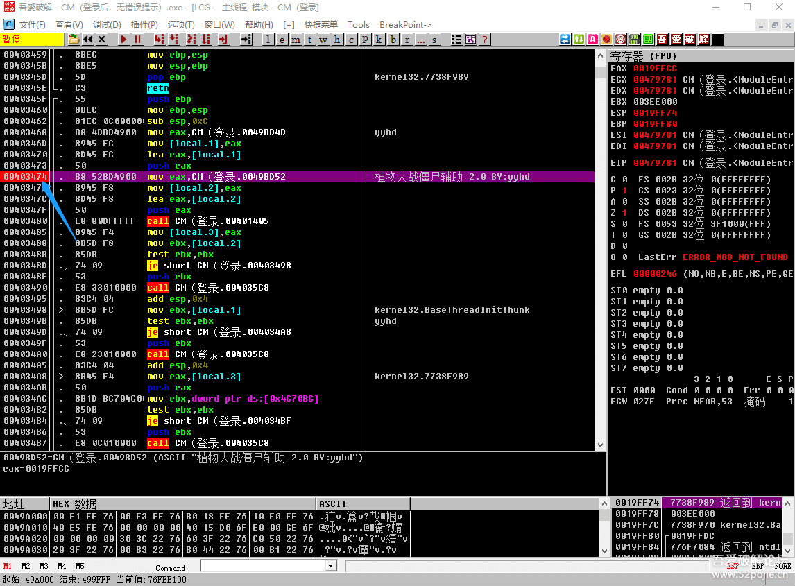

蓝色箭头指的位置就是我们下断点的位置，下断点成功的标志就是地址变成了红色，我们可以理解为此时此刻“报警器”已经在工作状态了。

除了在代码区直接用F2下断点，根据验证前和验证后的线索，我们还会经常在OD里下函数断点。

比如我们前面提过的弹出信息框的函数是MessageBoxA，获取我们输入的账号和密码的函数是GetWindowsTextA，打开文件的函数OpenFile,等等，这些函数都是操作系统早已写好了代码，当我们开发的软件需要使用某种功能就可以直接调用这些函数，这样就使得我们的编程更便捷高效了。

凡事有利就有弊，调用操作系统提供的这些现成的函数对于软件编写者确实是太方便了，但是对于我们破解软件的人来说也同样方便，因为这些功能函数就是我们破解软件的突破口。

想想看，我们最初讲的第一个软件是当登陆时，弹出有错误信息提示的一个信息框，我们说了可以对MessageBoxA这个函数下断点，然后再回溯找跳过弹出信息框代码的那个跳转，修改一下就破解成功了。

现在明白我们为什么可以这么做了吧。

理由就是一个，因为软件编写者会调用操作系统提供的MessageBoxA这个函数。

再思考一下，如果编写者不去调用操作系统提供的这个函数，而是自己写一个类似可以弹出信息框的函数（子程序），当然他会写的很辛苦，但是我们就不能再通过下MessageBoxA函数断点来让程序暂停了。

所以说，即使你看到软件有弹窗出现，你用MessageBoxA函数下断点，结果没有断下来，也很正常，因为软件作者没有使用这个函数，或者他通过更高明的手段让你用OD无法断到这个函数。

所以，我们一直说，软件破解是一场敌我双方的较量，你有矛，他就有盾，谁更了解对方的思路谁就能获胜。

我们已经知道了作者编写程序时为了效率，会调用很多操作系统提供的函数，可能一个软件中就会调用成百上千个系统函数，我们是不是要全部弄清楚呢？

当然不是，我们只关心软件中与验证相关的函数，换句话说就是在关键验证代码附近的函数，因为断在那里是最接近我们的破解目标的。

那么，附近的函数会有哪些呢？或者说哪些函数是我们破解者真正需要关注的呢？

要回答这个问题，我们还是要从程序验证的流程去思考。

比如，大多的软件都是让你先输入账号和密码，再点登陆，再出结果。

这样的软件的验证流程就是：鼠标左键单击登陆按钮→获取用户输入的账号和假码→真假码进行验证比较→结果为真，就提示成功；结果为为假，提示失败。

那么我们可以下的函数断点就有：发送鼠标左键单击消息的消息函数SendMessage()，消息函数的结果会产生“按钮事件”；

获取用户输入的账号和密码的函数GetWindowsTextA；

如果编程人员不仅要获取的用户输入账号和密码文本，并且转换为整数，那就会调用GetDlgItemInt这个函数；

真假码比较可能会使用lstrcmp这个字符串比较函数；

弹出信息框会使用MessageBoxA函数；

在窗口的标题栏或者窗口里的某个组件上显示出“已注册”或者“未注册”这样的文字，可能会调用SetWindowsTextA。

看到吗？可以说一个程序在运行过程中几乎是步步调用系统提供的函数，这样的函数其实有一个共同的名字叫做“API函数”。

API是英文简称，意思就是应用程序的编程接口。

我举个例子你就非常容易理解了，我们把电脑上的操作系统比作是一家餐馆，我们编程人员就是餐馆的客人。

请问我们是不是要和前台的那位“叫小芳的”服务员打交道，或者换个词，叫做“亲密接触”，那么对于餐馆和客人而言，小芳妹妹就是彼此双方进行互动的“接口”。

对于我们这些“正人君子”而言，其实我们根本不关心小芳妹妹的容貌，我们只关心她手上的菜单，我告诉你，这家餐馆的菜单上分为三类，分别是：凉菜、烧菜、炒菜。每一类下面是具体的菜名。

好，那我现在再告诉你，WINDOWS操作系统里为我们提供的可供我们选择使用的也主要有三类，分别是：kernel32.dll、user32.dll、gdi32.dll，我们可以称他们为“库”，这三个库里面存放的全是各种可供我们使用的函数。

呵呵，明白了吗？小芳妹妹就是“接口”，菜单就是“库”，菜名就是“函数”。
我们接下来看，如何在OD里对相关的函数下断呢？

最简单暴力下断点的方法就是见下图：以吾爱破解的这个OD为例

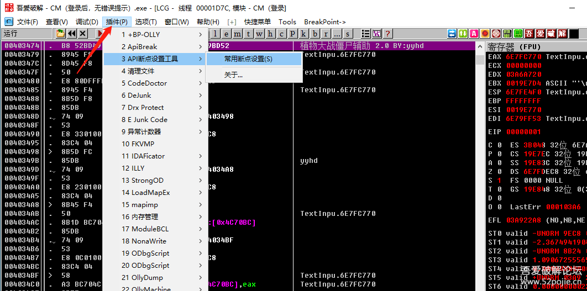

在OD里点插件菜单，选择里面的API断点设置工具，再选择“常用断点设置”，点一下。

然后就到了下图：

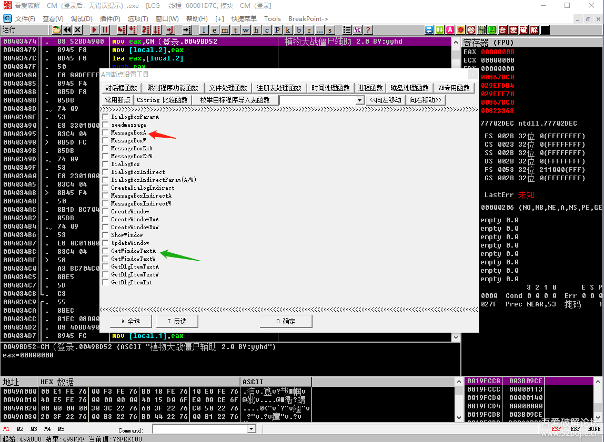

在你需要下断的函数名前的白色小方框内点一下，然后点确定，这样就下好了你需要的这个函数的断点。

呵呵，下函数断点是不是很简单。

你可以多看看这个里面的每一个菜单，前人已经把我们破解常用的函数都给写上了，你需要做的只是在函数名前打上钩，“批准使用”而已。

除了这个最简单暴力的方法以外，还有其他的下断点的方法吗？

当然有，在此我略讲一下。

一种方法是在命令行处输入函数下断点，见下图：

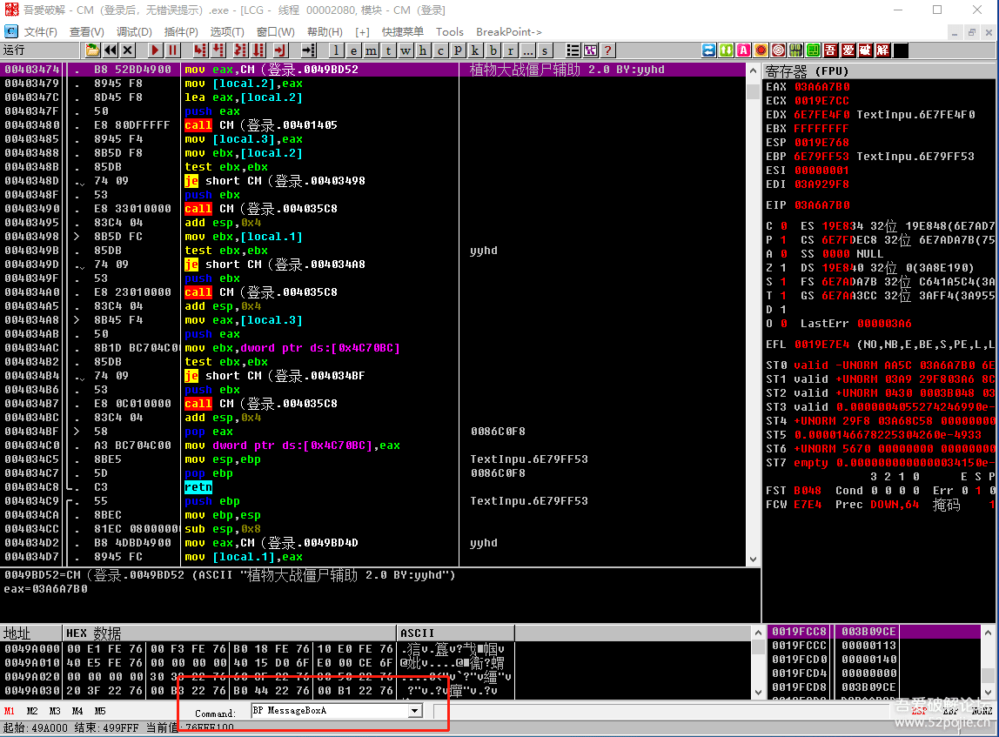

看红色箭头指的位置，格式就是BP 函数名，这个需要你手工输入，注意函数名的大小写，输入完成后，按回车就下好断点了。

还有一种方法是，见下图：

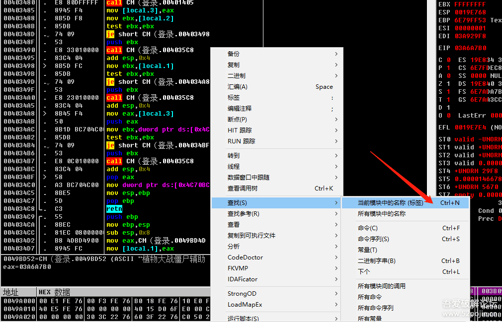

注意在OD的代码区，并且是“程序空间”，然后点鼠标右键，在菜单里选择红色箭头指的“当前模块中的名称”，点一下。快捷键是CTRL+N。然后就会出现下图：

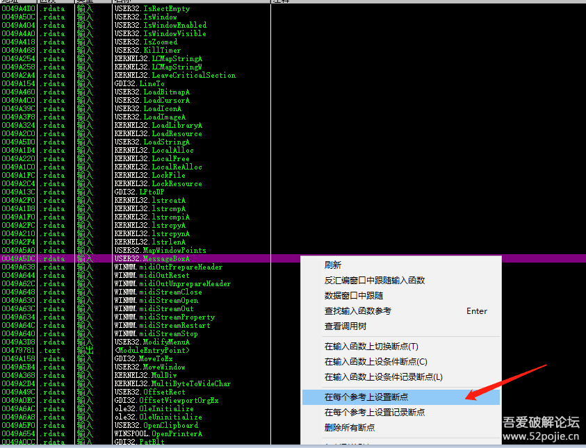

这里显示了当前程序使用的所有的API函数和调用的地址。

如果你想在MessageBoxA函数下断，你直接在当前页面上打“Mess”就自动调到这个函数的位置了，然后在这个函数调用的这一行选中点右键，然后按红色箭头指的“在每个参考上设置断点”，这样我们就在程序里所有调用这个函数的地方下上了断点。

你按照以上几种方法下好了断点，然后你想看看断点是否成功？有几个断点？见下图所示：

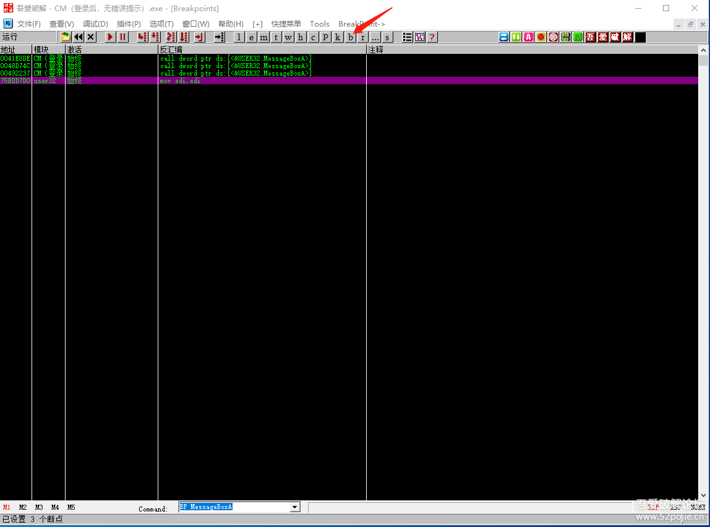

你点红色箭头指的“B”，然后就转到断点窗口。

你看里面有我们刚才下的断点，前三个是我们通过CTRL+N下的断点，最后一个是我们在命令行下的断点，这两种方法的断点的位置是不一样的，一个是在程序代码调用系统函数的位置下断，所以前三个都是小地址，是程序代码。另外一个是在系统函数内的第一句代码位置下断，因为是系统函数，所以是大地址。

好了，今天的内容已经很多了，尤其是重点讲了下断点的问题。

当然还有其他的下断点的方法，在以后的学习中再介绍，我们先学会必须要掌握的基础。

对了，上一集的CM（登录后，无错误提示）你破解成功了吗？

其实，还有一个非常简便的方法。

方法是：

把CM软件拖进OD，然后在代码区右键，见下图：

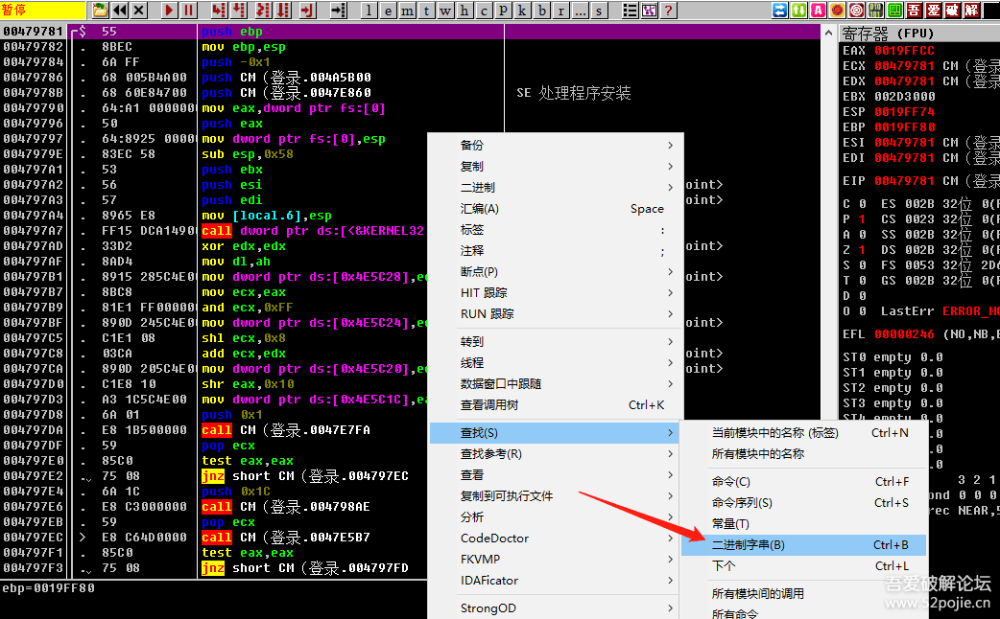

然后选择红色箭头指的“查找”菜单里的“二进制代码”，点一下。然后到下图：

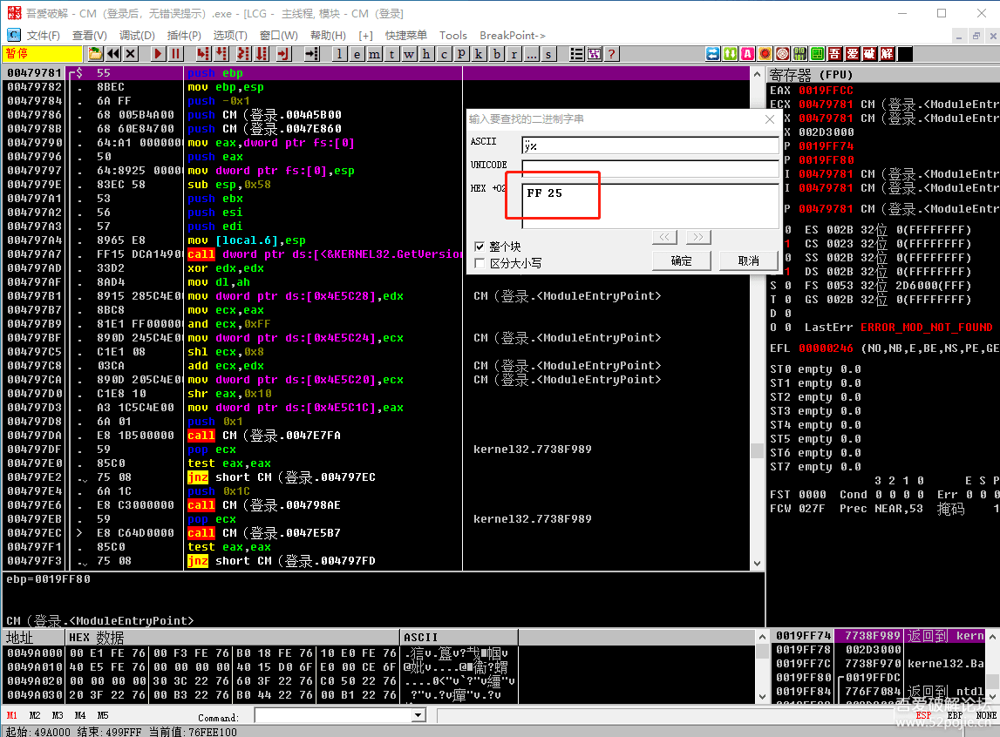

在红色方框内输入“FF 25”,点确定。就到了下图：

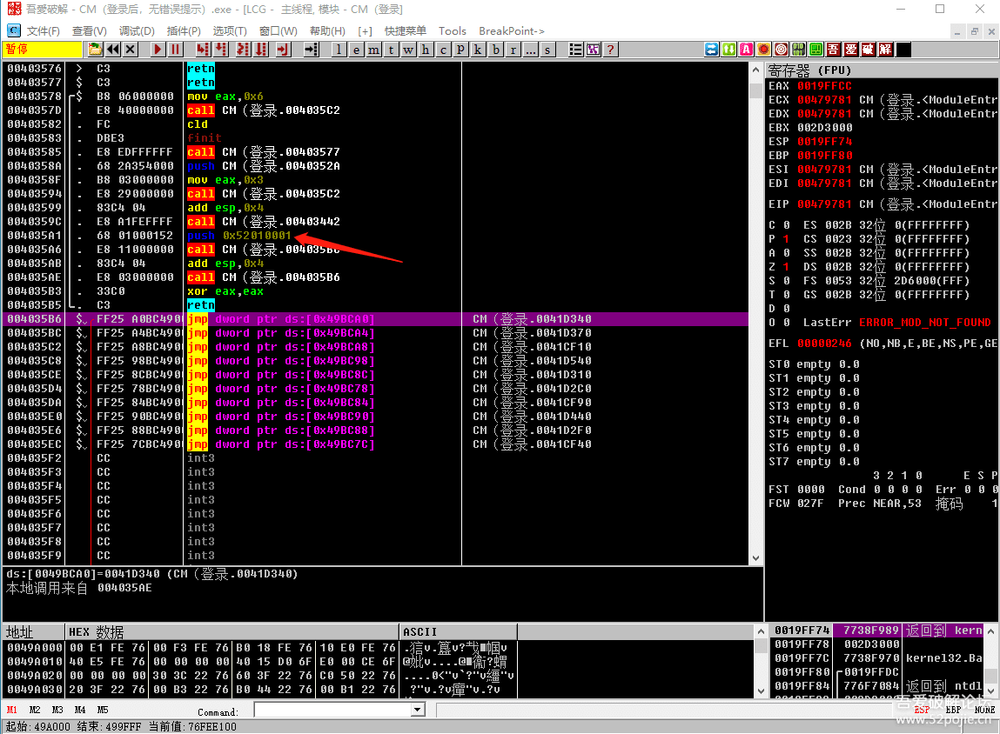

我们会发现有一堆JMP，在JMP上面红色箭头的位置，我们看到在004035A1的代码为PUSH  52010001。

还记得上一集我说我为什么能够知道关键代码的位置吗？

我说是因为在弹出新窗口的CALL上面有一个“PUSH 52010008”,这个52010008是新窗口的窗口ID。

那么，我们接下来就做一件事，把当前004035A1 里的PUSH 5210001改成 PUSH 5210008，见证奇迹的时刻就要到了！

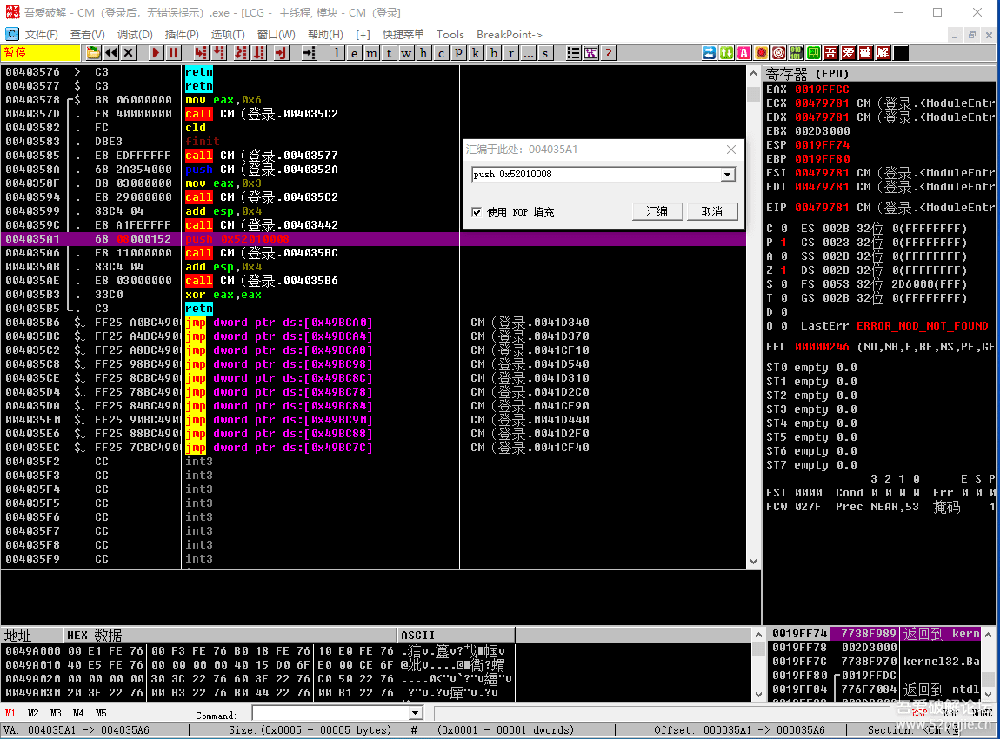

改好后，我们F9运行程序。我们发现已经成功弹出新窗口了！

这是什么原理呢？

简单说明一下，首先这种方法只适合易语言编写的程序，现在很多外挂都是易语言的，所以这种方法还是有一定的用武之处的。

另外，这种方法就是把两个窗口的ID进行了替换。

因为易语言程序有一个特点，就是每个窗口都有一个窗口ID，就是窗口的身份证，你替换窗口的ID就会变成另外的窗口。

我们想一下，当程序启动后，会打开第一个窗口，我们这个软件的登录界面就是第一个窗口。

那么第一个窗口的ID怎么才能找到呢？

就是通过二进制搜索“FF 25”来到这一群JMP的位置（也叫做易语言体），JMP上面的PUSH 5201***** 就是打开的第一个窗口的ID。

那么其他窗口的ID怎么找到呢？不然怎么替换到第一个窗口上。见下图：

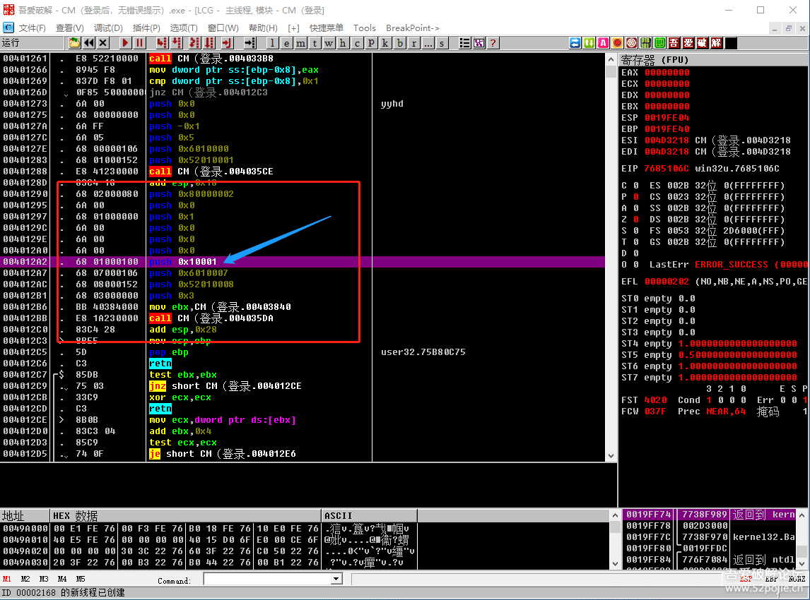

这个图就是弹出新窗口的位置，你看蓝色箭头指的地方，写着PUSH 10001,在这个语句下面有PUSH 52010008。

这个图能说明什么呢？就是子窗口ID的代码上面会有一个PUSH 10001，告诉你，这个是易语言通用的，每个窗口ID语句上面都会有一个PUSH 10001。

所以，我们要找其他窗口，最好的方法就是找PUSH 10001这句代码，然后往下就看到窗口ID了。

怎么做呢？见下图：

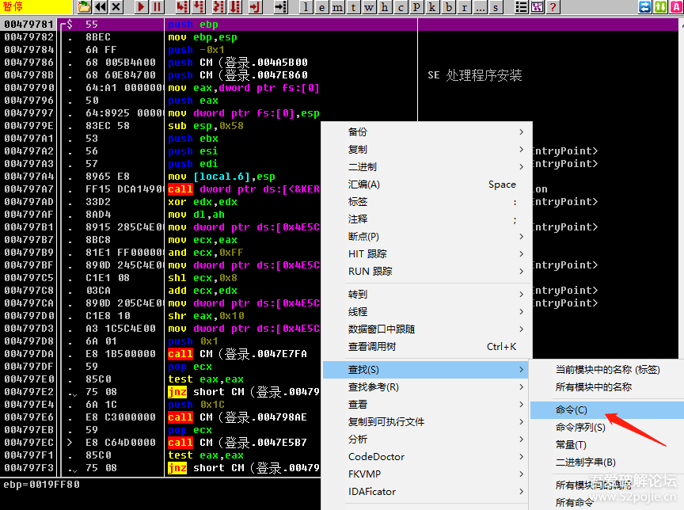

在代码区点鼠标右键，选择“查找”菜单里的“命令”，点一下，快捷键是CTRL+F2，然后输入PUSH 10001。见下图：

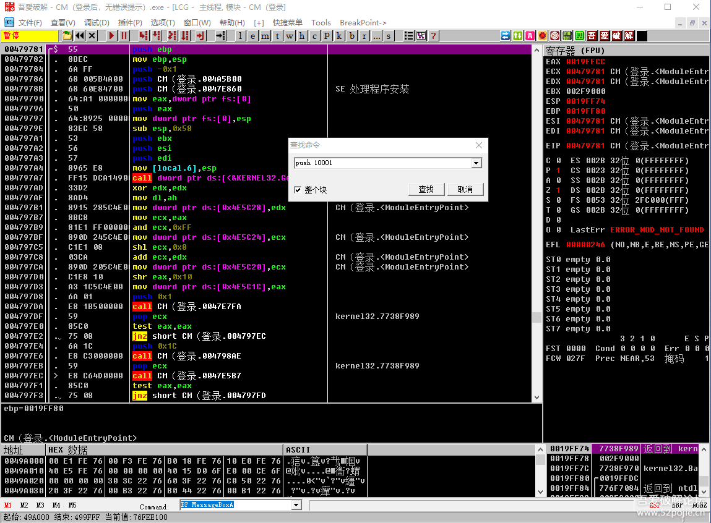

点确定就可以找到了，如果软件有好几个窗口，你就找到一个以后继续查找。

假定你现在破解一个外挂，通过这个方法找到三个不同的窗口ID，你也不知道哪个是功能窗口ID，那你就在我们通过“FF 25”找到的第一个窗口ID那里逐个进行替换尝试。

我之所以介绍这个方法，主要想告诉大家为什么我们需要用DIE64来查一下是什么语言编写的软件，因为不同语言编写的软件，有更为便捷的破解方法。

好了，今天的内容已经很多了，其他的以后在讲，谢谢大家的支持！

------

> [>> 回到目录](README.md)
