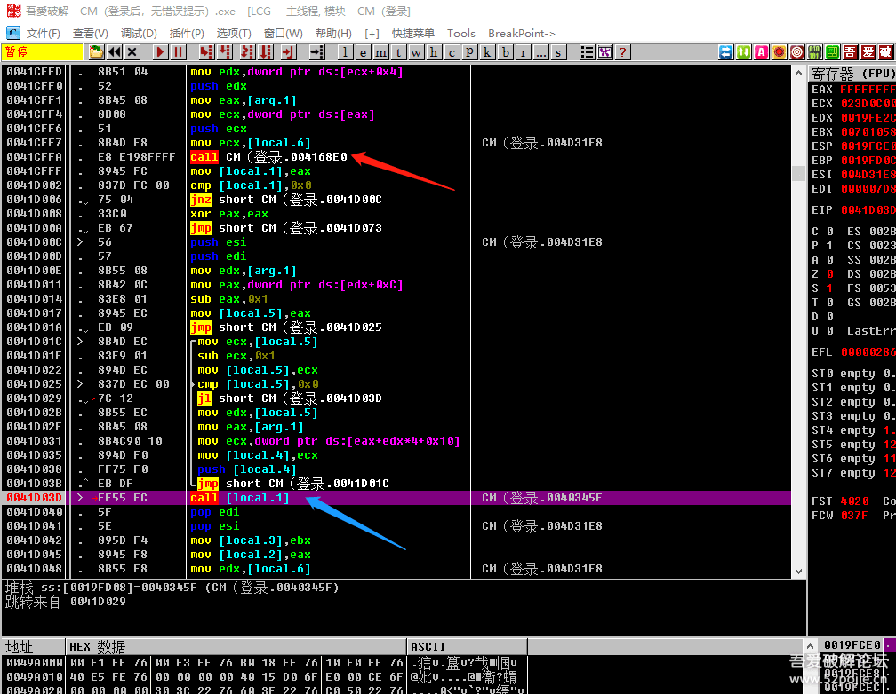
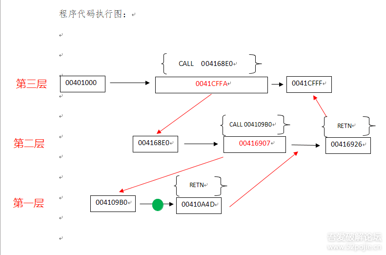
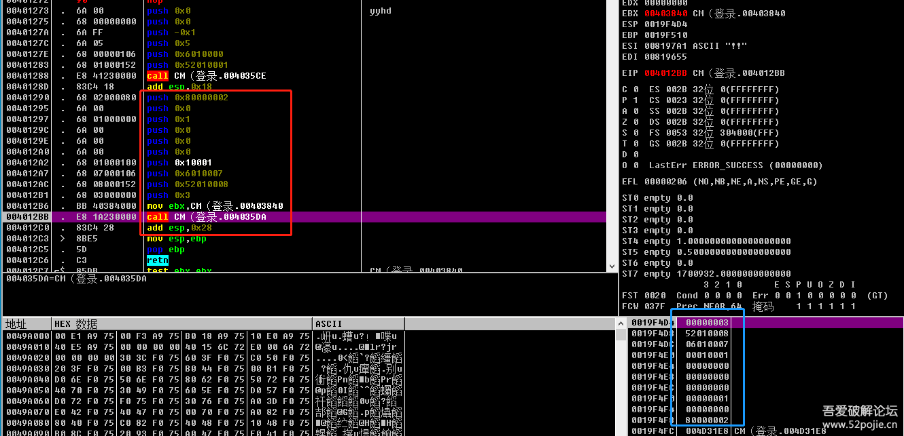
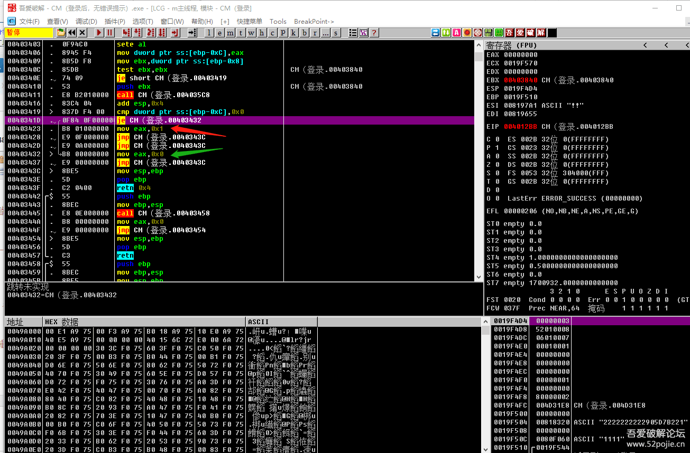

# course-14 集中解答新人们的几个困惑问题（二）

> [>> 原文](https://www.52pojie.cn/thread-1361926-1-1.html)

------

上一集主要给大家讲解了如何下断点。

本节课我们继续解答新人们容易困惑的一个问题。

就是CALL。

CALL 是什么？

大家都知道，CALL是一个汇编指令，在OD里面，CALL语句表示调用一个子程序。见下图：

红色箭头指的地方就是一个CALL语句。

绿色箭头指的地方也是一个CALL语句。

大家想一下，当程序执行到这句代码CALL 004168EO，会发生什么？

程序会单步顺序执行到CALL这个语句的下一行代码0041CFFF  `MOV[Local.1],EAX` 吗？

如果会，那CALL语句就不叫调用子程序语句了。

那它会怎么执行，既然叫调用子程序，当然要执行子程序，那将要执行的子程序的第一句地址在哪？

呵呵，你看到CALL后面有个地址吗？这个地址就是将要执行的子程序的首地址。

所以程序遇到CALL指令后，执行的代码流程是先跳到CALL后面的地址，也就是子程序的首地址，这个代码地址可能距离我们程序目前的代码位置很远，然后执行完子程序的代码后，再跳回到我们CALL语句的下一行语句。

简单说，CALL语句就是先跳到也许很远的一个地址，然后执行一段代码，完成任务后，再跳回到我们CALL语句下面一行的代码，这是一个“有去有回”的过程。

呵呵，再举个例子，我们从家去学校上学，我们沿着大马路一直走，突然我们想上厕所，那么我们就走下马路，到厕所去转了一圈，然后再回到大马路上继续上学校，CALL就是带着我们绕了一圈，不过不是上厕所，是去执行了一段代码。

你可能会问，不就是跳转到子程序的首地址吗？那么CALL 004168E0 不就和 JMP  004168E0 一样吗？为何汇编语言中调用子程序用CALL而不直接用JMP。

之所以要用CALL指令而不用JMP的原因就是如果我们在这里改成JMP 004168E0，确实我们也实现了调用首地址是004168E0的子程序，但是问题是执行完子程序代码后我们的程序就回不来了。

呵呵，JMP语句的特点是“有去无回”。

那么你可能会说，不就是需要执行完子程序的代码，然后返回吗？那我就在子程序的代码的最后面加上一个JMP，JMP后面的地址就是CALL语句的下一行地址。

呵呵，恭喜你，你的思路完全正确。

但是你再深入想一下，如果在程序里有几个不同的位置都调用同一个子程序，就比如验证CALL，我记得有一个取名软件，在程序窗口刚创建的时候会调用一次进行验证，在软件的使用过程中，比如你要搜索名字，又会调用一次进行验证，那么，你告诉我，按照你的思路，那么在验证CALL的子程序代码的最后那个JMP 后面该写哪个位置的地址？

不好办了吧。

聪明的汇编语言设计专家也思考过同样的问题，当然也找到了最佳的解决方法，这个方法就是引进了CALL这个指令。

这个指令在JMP语句的基础上又增加了其他功能，增加了什么呢？

增加了在跳转之前先把CALL语句的下一行语句进行自动存储的功能。然后同时约定每个子程序的结尾增加一个指令，叫做RETN，中文就是返回。

当子程序执行完所有代码，RETN指令就从我们存储的地方找到我们保存的CALL 语句的下一行语句的地址，然后JMP 这个地址就回来了。

我们总结一下。

CALL 子程序首地址 == 储存CALL语句的下一行代码地址 +  JMP 子程序首地址。

RETN 指令 == 取出存储的CALL语句的下一行代码地址 + JMP  CALL语句的下一行代码地址

听到现在你应该可以明白CALL语句的执行流程了吧。

弄清楚CALL语句的流程后，我们再来说说什么叫做一层层的返回？

为了更加形象的说明，便于你的理解，我画个图：

假定我们现在下了一个断点，断点的位置是004109BA，就是绿色圆圈表示的位置。

我们目前处在一个子程序代码段之中，这个子程序的首地址是004109BO,尾地址是00410A4D,是一个RETN。我们可以形象的说此刻我们处在第一层。

我们按F8单步执行，当我们到达尾部00410A4D的时候，我们通过RETN命令，就像坐电梯一样，我们直升到当初调用我们首地址004109B0的那个地址是00416907 的下一句代码的地址，我们可以形象的说此刻我们已经返回到第二层。

然后我们继续F8,当我们到达尾部00416926的时候，我们通过RETN命令，就像坐电梯一样，我们直升到当初调用我们首地址004168E0的那个地址是0041CFFA 的下一句代码的地址0041CFFF，我们可以形象的说此刻我们已经返回到第三层。

看明白了吗？这就是所谓的F8层层调用返回。

第三层里面的代码才是我们破解的关键跳转位置。

但是因为我们下断点的时候实际停留的位置是在第一层，所以我们必须要不断的按F8，遇到RETN就返回上一层，直到返回到关键跳转代码附近。

关于CALL还需要再多说一点的就是参数和返回值。

比如验证CALL，它的作用是真假码比较，那么我们编程的时候就要在调用验证CALL的时候把我们的假码和真码都告诉给它，否则我们的验证CALL即使具有孙悟空的“火眼金睛”，你都没有告诉它要识别的对象，它什么也做不了。

我们给验证子程序提供的真码和假码就叫做这个子程序的参数。

我们也可以这样理解，所谓参数就是子程序要开展工作的对象或者说是“干活时要用到的材料”。

举个例子，假定我们有一个子程序，叫做“炒辣子鸡”，这个子程序的功能就是能够炒出可口的辣子鸡，辣子鸡就是这个子程序的结果，这个结果就放在一个叫做“EAX”的盘子里。

我们在炒辣子鸡之前，是不是必须要有辣椒、鸡、葱姜蒜等等材料，这些材料就是参数。

那么，在汇编语言里参数如何传送给子程序供它使用呢？看下图：

目前，我们的程序执行到004012BB 这个CALL语句的位置，在这个CALL的上面的红色方框内，是不是有一串PUSH ，PUSH 后面是一些数值，汇编中主要是通过PUSH 把参数传递给子程序。

你再看一下上图右下角的堆栈窗口中的蓝色方框内，是不是在这个位置存储了PUSH 后面的数值，也就是参数。还记得我们以前说的吗？堆栈是和子程序发生联系的。

堆栈里存储的数据有三类：CALL的参数、CALL语句下一行代码的地址、CALL在执行过程中产生的变量值。

知道CALL的参数对于我们破解有什么用呢？

作用大大的，能够辅助我们判断当前的CALL是不是关键CALL？

当我们看到在一个CALL的上面出现了我们的假码，如果再有一个可疑的字符串，呵呵，那么，你懂得！

还记得我们上一集破解的软件的方法，可以用窗口ID进行替换，对吧。

我们为什么会选择这么做，那是因为易语言编写的软件有一个共性，就是它的载入窗口的CALL都必须有窗口ID这个参数，所以我们反过来分析，当我们看到有窗口ID出现，那么下面的那个CALL就是一个窗口CALL。

另外再提醒一下，CALL语句的返回值会存放在EAX这个寄存器里。

再补充一点。CALL的返回和返回值是两个概念。

返回是RETN命令，通过RETN这个指令，是让子程序能够跳转回去。

返回值是子程序的计算结果，这个结果储存在EAX这个寄存器里。当然，有些子程序没有返回值。我们说的意思是如果这个子程序有返回值，返回值就储存在EAX里，看下图：

这是我们这个程序的验证CALL的尾部位置。RETN上面的红色箭头指的是不是有个`MOV EAX,1`，绿色箭头指的是不是有个MOV EAX，0，上面的0040341D处有一个JE跳转。

这个跳转如果不跳，那么就会执行`MOV EAX,1`，就让`EAX=1`；如果实现跳转，就执行`MOV EAX,0`这个语句，让`EAX=0`,然后代码执行到RETN处就返回了。

看懂了吗？有返回值的子程序会在RETN前给EAX进行赋值。

再联系一下我们以前说的，我们可以在关键CALL里面第一句代码处改成`MOV EAX,1` ,然后再写上RETN就可以了。补充一点，不是所有的子程序的尾部都是RETN，有可能是RETN后面再加上一个数字。

为什么要加数字？牵扯到堆栈平衡，暂时不用管。你现在只要知道，如果你是在关键CALL里进行`MOV EAX,1`这样修改的，下一句写RETN的时候，你必须先看一下这个子程序的尾部的RETN后面有没有数字，有什么数字，你就写什么数字。

我们现在这个子程序 ，必须改成第一句是`MOV EAX,1` 第二句是RETN 4才可以。

我们这么改是很暴力的，因为我们知道执行这个验证子程序中的几十行代码，最终的结果就是给EAX赋值，然后返回到调用处。

既然是这样，干脆在子程序的第一句我们就直接给EAX赋值，然后返回，就不需要让子程序继续执行后面的代码了。

这一集，我们重点解决了CALL的问题，内容不少了，洗洗睡吧，祝好梦！

------

> [>> 回到目录](README.md)
