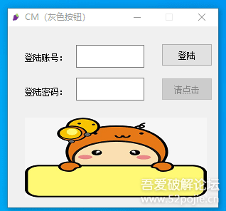
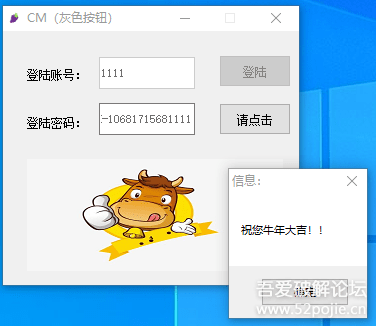
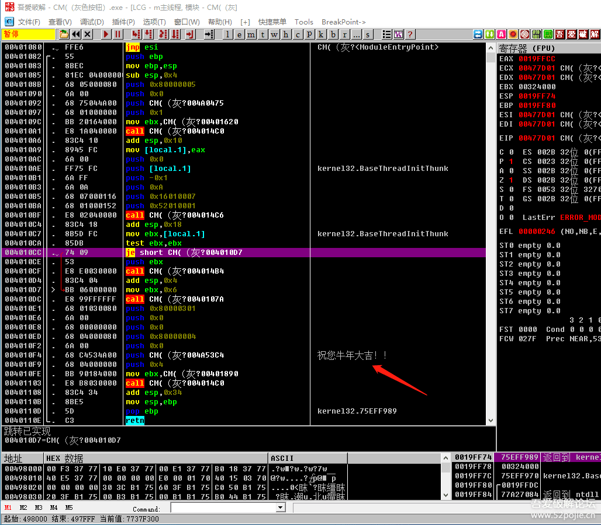
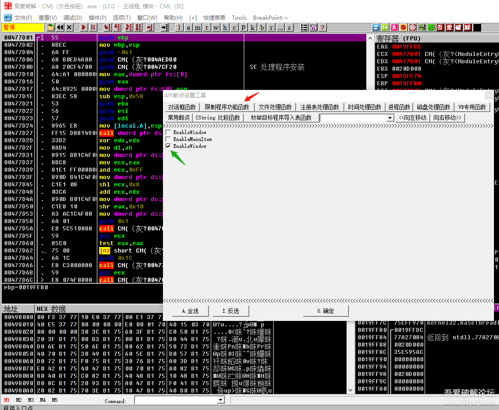
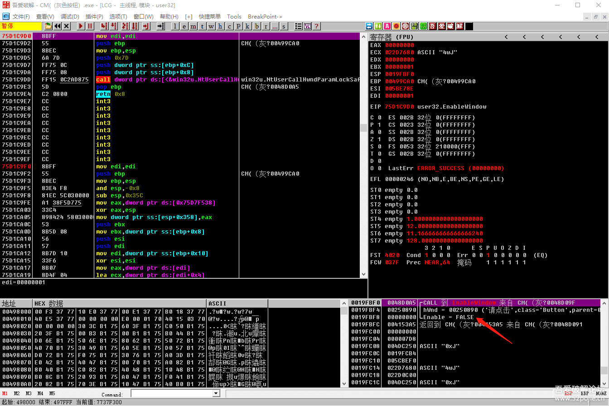
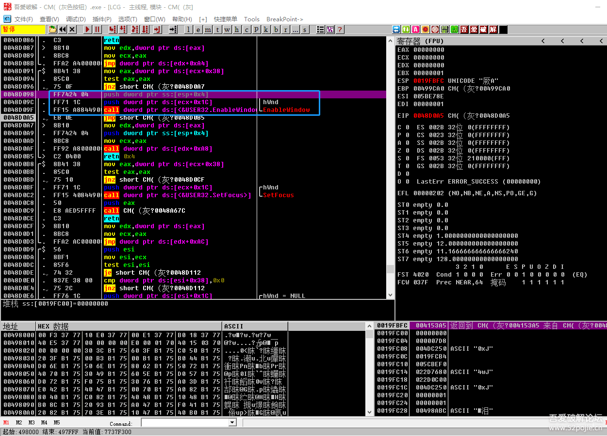
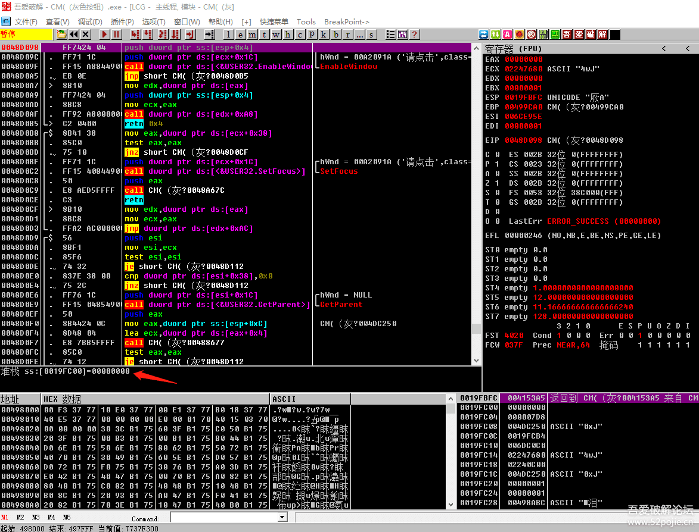
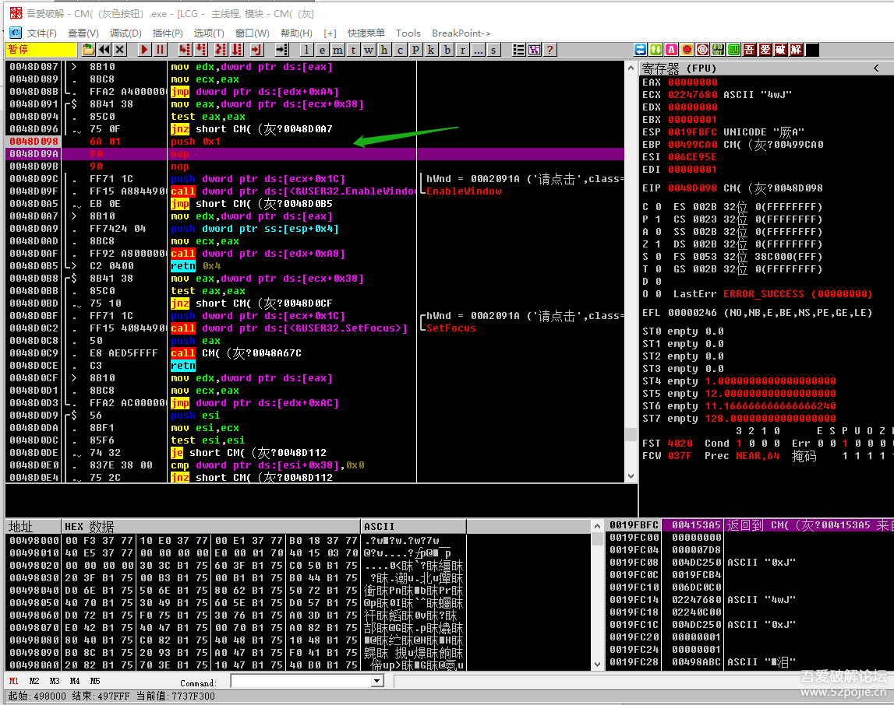

# course-16 关于“灰色按钮”的破解思路

> [>> 原文](https://www.52pojie.cn/thread-1363023-1-1.html)

------

我们这一集就讲讲破解“灰色按钮”这一种类型软件的基本思路。

首先我们要明白什么是“灰色按钮”，见下图：

这是一个这个软件 [course-16.exe](PEs/course-16.exe) 的登陆界面，你会发现“请点击”按钮是处于“灰色”的显示状态，无法点击。

此时你输入账号和密码，然后点登陆，如果你的账号和密码是正确的，“请点击”按钮不再是“灰色”，你可以正常点击，你点击后会出现下图：

这个软件就是我们今天要讲的“灰色按钮”类型的软件。

所谓“灰色按钮”就是指软件窗口上的某个按钮处于“灰色”状态，也就是鼠标不可击状态，这种“灰色按钮”的设计有什么作用呢？

假定某个软件的窗口上有一个功能按钮。

当用户的登录帐号和密码都是正确时，就让功能按钮可点击，然后你点击功能按钮可以执行新的功能，比如打开一个新的功能窗口。

反之，如果用户输入的登陆账号和密码不正确，那就让功能按钮不可点击，用户就被限制使用功能。

拿我们的这个CM（灰色按钮）为例，我们讲讲如何破解这一类型的软件。

我们的破解目标就是当我们输入不正确的账号和密码时，这个“请点击”的按钮也告别“灰色”状态，变成可点击状态，也就是把限制的功能解开。

朋友们，我们开始工作了。

我们先思考一下这个CM的验证流程。

流程为：软件启动后，窗口中的“请点击”按钮处于“灰色状态” → 用户输入账号和密码，点击登陆按钮 → 读取用户输入登陆账号和假码 → 调用算法CALL，计算出真码 → 调用验证CALL对真假码进行比较 → 比较结果为真，“请点击”按钮的状态变为可点击，点击后出现“小牛”图片和弹出“祝你牛年大吉”的信息框；比较结果为假，没有变化。

知道了验证流程后，我们该怎么做呢？

当然还是用我们的破解大法“两头找线索，中间来破解”。

我们首先看验证结果有没有线索？

有，如果成功会有三条结果可做为线索：

- 一是“请点击”按钮的状态改变为可点击；
- 二是出现了一个“小牛”图片；
- 三是出现一个“祝你牛年大吉”的信息框。

好，我们从最熟悉、最基本的方式来试试？

我们可以搜“祝你牛年大吉”这个字符串，也可以下弹出信息框的MessageBoxA函数断点。会来到下图：

接下来怎么办？

你在“祝你牛年大吉”的那一句下个F2断点？

还是在信息框弹出函数MessageBoxA下函数断点？

结果，都断不下来！

为什么？因为只有成功后代码才会走到这里。

晕了吧。

那怎么办呢？这条线索已经断了。

我们接着思考。

当我们从成功的结果去找线索和突破口的时候，会面临一个很重要的问题，就是我们找到的位置都是代码走不到的位置。

那么你怎么设定断点呢？所谓断点，就是必须要代码能够执行到下断的位置，程序才会停下来。

那我们就换个思路，从失败的结果去找线索，我们来看看有哪些线索可用？

当我们失败的时候，只有一个结果就是“请点击”按钮处于“灰色”不可点击的状态。

这条仅有的线索怎么使用呢？

我告诉你，操作系统为按钮的状态显示有一个专门的函数可以调用，函数名字叫做EnableWindow，中文意思就是窗口或者里面的控件（按钮、菜单、输入框等）能否被允许响应鼠标和键盘的输入。

如果允许，按钮就可点击；如果不允许，按钮就不可点击。

好了，我们知道了这个函数，我们思考一下，我们现在的CM是不是必须要调用这个函数？在程序执行的什么位置调用的？

我们再来回顾一下这个CM的验证流程。

刚启动的时候，“请点击”按钮的状态为不可点击。

我们点登陆后，程序根据真假码的比较对“请点击”按钮的状态做出不同的选择。

在整个过程中，是不是总共有两次会调用这个EnableWindow函数的可能。

一个是程序启动后的最初状态，一个是用户点击登陆按钮后的选择状态。

最初状态是我们的代码必然要经过的，后面的选择状态代码有可能经过也有可能不经过（可能是成功时才经过，失败时不经过）。

好，既然我们已经分析清楚了，我们就在最初状态下函数断点。

我们开始动手，把软件拖进OD后，先不运行，我们先下好EnableWindow断点。

用我们以前说的最暴力的下断点的方式就可以。我们打开OD的插件里提供的API常用断点工具，见下图：

选择红色箭头指的“限制程序功能函数”，在绿色箭头指的最下面的“EnableWindow”前打钩，然后按确定，就下好了断点。

我试了一下，第一个也是EnableWindow，但是在第一个上面打钩后，你到断点窗口看下的断点是禁止状态，大家可以试试，如果不是我的问题，就是这个OD有BUG。

然后F9直接运行，就到了下图：

此时，你看右下角的堆栈窗口中红色箭头指的位置，写着FALSE，中文意思就是假。

这个就是表示按钮的状态，假就不可点击，真就可点击。

我们F8返回到上一层CALL。来到下图：

蓝色方框内就是调用EnableWindow函数的位置，这个函数有两个参数，就是CALL上面的两个PUSH后面的数值。

最上面一个数值就是按钮的状态，如果是1表示按钮可以被点击，如果是0表示按钮不可以被点击。

好，我们就在第一个PUSH语句上直接下F2断点，然后重新运行程序，发现断在了我们第一个PUSH语句上，见下图：

我们在信息窗口中红色箭头指的地方看到了0，就是说我们目前断下的PUSH语句后面的数值是0。

刚才说过0就是表示不可点击，1才是可点击。

那么我们现在就把PUSH 后面的值改成1，然后F9运行。

呵呵，我们已经成功了，“请点击”按钮已经不再是“灰色”了。

------

> [>> 回到目录](README.md)
