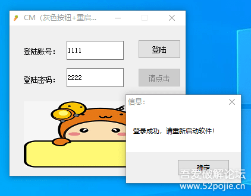
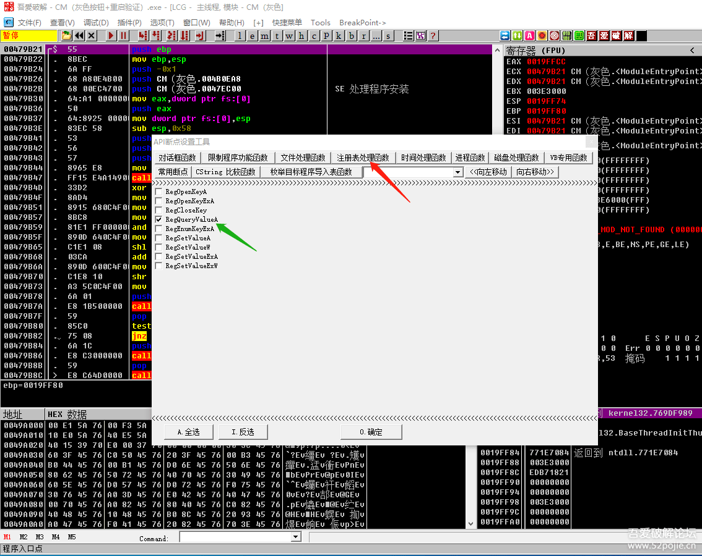
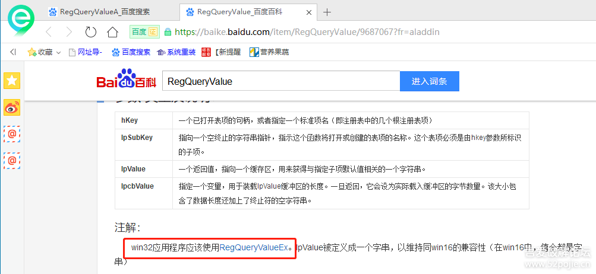
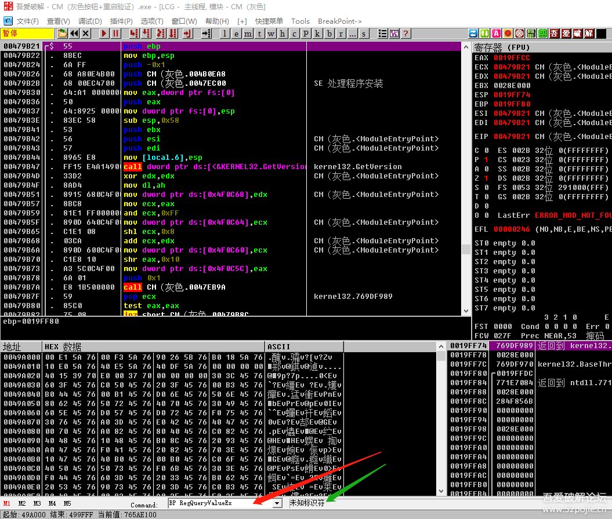
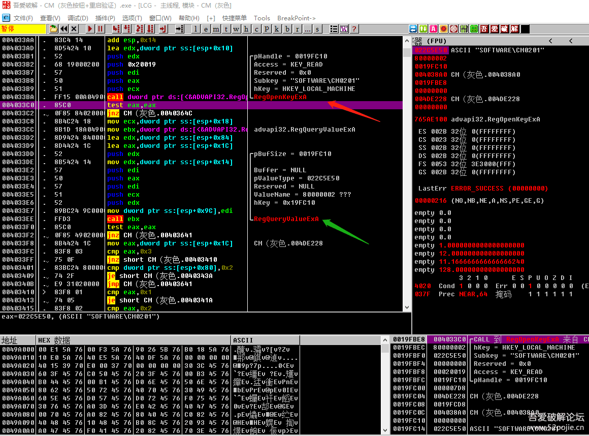
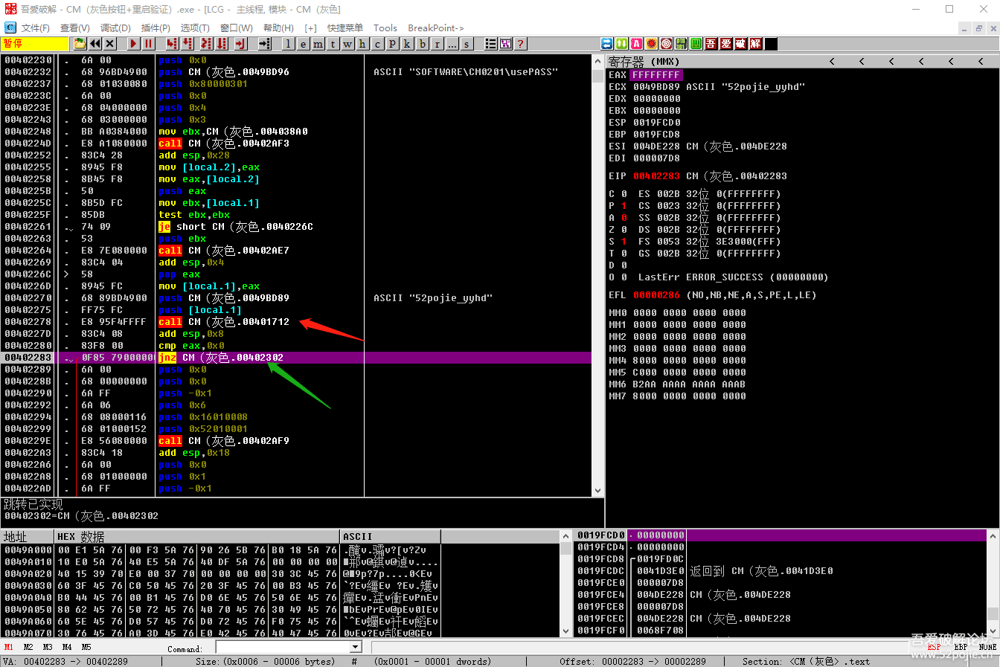
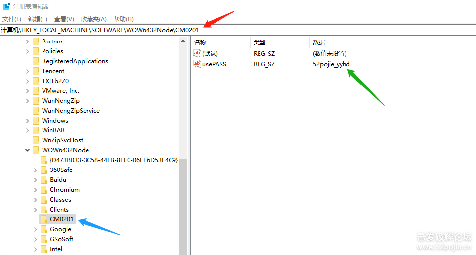

# course-17 深入“灰色按钮”，增加“重启验证”

> [>> 原文](https://www.52pojie.cn/thread-1363767-1-1.html)

------

上一集和大家一起分析了“灰色按钮”的一般破解思路和流程。

当然，除了这种方法以外，还有一些现成的工具可以使用。如下图这个软件：

但是，我们这个课程的目的是让新人们玩玩破解，在玩破解的过程中逐步了解破解的思路和方法，顺便学到一些汇编知识和常用的API函数等计算机知识。

所以，我们的目标不是为了破解一个具体的软件，我们所有的收获都来自于破解的过程。

当然，有一些好的工具在具体的破解中当然可以使用，能用就用，干嘛不用，不过那是以后的事情。

我们目前处于学习破解的起步阶段，所以我们要通过自己对代码的分析来破解，而不是直接用别人写好的工具，否则你还是无法入门。

我们这节课，继续探讨“灰色按钮”，这一节课用的CM软件和上一节课的CM软件有些区别。

区别就在于增加了“重启验证”。

通过本节课的讲解，你会进一步增加对“灰色按钮”和“重启验证”的认识。

还有一点重要的是，本节课所讲的软件类型更接近于现在的一些商业软件的验证机制。

这个软件当你输入登录账号和密码，点登录后。会有下图的提示：

然后你重新打开软件，发现“请点击”按钮还是“灰色”的。

而当你破解成功后，再重新打开软件，你会发现“请点击”按钮是正常状态。

上一课的CM（灰色按钮），你如果有正确的用户名和密码，每次启动时都需要重新输入一遍，而本课的CM（灰色按钮+重启验证）则不需要。

我们思考一下，为什么本节课的CM不需要重新输入账号和密码呢？

答案就是一个，因为这个CM是重启验证类型。

它会在把你第一次输入的账号和密码的相关信息记录在计算机的某个位置，等你再打开CM时，软件会自动读取这个信息，然后判断是不是正确的注册信息，如果是，“请点击”按钮为正常显示，如果不是，“请点击”按钮为“灰色”显示。

我们这个CM的重启验证机制是：如果你的账号和密码不正确时，不进行记录，只有账号和密码正确时，才记录到注册表。

如果是32位的操作系统，在注册表的“HKEY_LOCAL_MACHINE\SOFTWARE”目录下会新增一个CM0201项，如果是64位，在注册表`HKEY_LOCAL_MACHINE\SOFTWARE\WOW6432Node` 下会新增一个CM0201项。

这个储存路径的不同是64位操作系统对32位的程序进行重定向导致，你不用去管。你知道会在注册表里面新增一个注册项就可以了。

好了，知道了以上这些，我们怎么进行破解呢？我们的破解方法和上一集的CM（灰色按钮）相比有什么区别呢？

我们再思考一下，这次的CM不过是在上次的CM之上又增加了一个验证环节，就是会在程序启动后先去读取一下注册表进行判断。

明白了这一点，我们的破解方法就有了。

第一种方法不变，还是用上次在EnableWindow这个可以改变按钮的显示状态的函数下断点，具体操作还是上一集的内容，在此略过。

第二种方法是什么呢？

因为我们知道这次的CM会在启动时读取注册表，那么我们就可以对专门读取注册表的API函数进行下断。

把CM拖进OD，先不运行，然后我们打开吾爱专版OD自带的“API断点设置工具”，见下图：

选择红色箭头指的“注册表处理函数”里面的绿色箭头指的“RegQueryValueA”,这个是读取注册表的一个常用函数。

结果很遗憾，你发现断不下来。晕了！怎么可能？

别急，破解就是如此，一种方法不行就换一种。

我们的思路肯定是没有错的，这个软件一定会读取注册表。莫非是读取注册表时没有用这个函数？

好，那我们换一个，我们就在第一个“RegOpenKeyA”下断。

结果，还是不行？这次你会真晕了吧！

好吧，我们只好求助百度，你会发现下图所示：

看看红色方框里的解释，明白了吧，我们的CM是WIN32程序，应该用RegQueryValueEx这个函数（更正一下百度里写的RegQueryValueEx函数必须换成RegQueryValueExA,否则OD不识别）。

可惜，吾爱专版OD里“API断点设置工具”没有这个函数。

现在有两种解决办法。

一种是你在OD最下方的命令行输入BP RegQueryValueExA下断（这种方法在这个CM是无效的，后面有说明）。

一种是你在“API断点设置工具”里选择“RegOpenKeyA”下面的““RegOpenKeyExA””。

然后F9直接运行，F8返回到上一层，见下图：

你会发现，这两个函数是挨在一起的。

程序先调用RegOpenKeyExA函数打开注册表里的一个项（右下角的堆栈窗口写着这个项的路径），再调用RegQueryValueExA函数读取这个项里面的键值。

你F8一下，你看到下面的JNZ是实现的，跳过了下面的调用RegQueryValueExA函数的语句，所以说BP RegQueryValueExA下断的方法是无效的。

原因是什么呢？因为这个CM的验证机制是没有破解成功时是不会在注册表内创建注册项。

所以当调用RegOpenKeyExA函数打开注册表后发现没有这个项，当然就不会再调用RegQueryValueExA函数了。

我们继续F8,返回了三层，你会来到下图：

此刻你会发现在代码的上面出现了字符串“SOFTWARE\CM0201\usePASS”，这就是我们程序要读取的注册表项，说明我们现在停留的代码位置是正确的。

然后继续F8，慢慢的。你会发现还有一个敏感的字符串“52pojie_yyhd”，呵呵，这个就是成功的标志，如果usePASS的键值等于52pojie_yyhd，我们就成功了。

红色箭头指的CALL就是关键CALL，关键CALL下面的绿色箭头值的JNZ跳转就是关键跳转，此刻是跳的状态，我们把它改成NOP就成功了。

我们同时也知道了52pojie_yyhd是注册成功的关键标志。

如果我们不改代码，还有一种方法就是我们手工在注册表里增加一个注册项“HKEY_LOCAL_MACHINE\SOFTWARE\CM0201\usePASS”，键值填上52pojie_yyhd就可以了。见下图：

红色箭头是路径，我的是WIN10，64位系统，路径可能不一样，上面已经解释过。

当然，还有更简单的方法，就是搜字符串。

比如SOFTWARE这样的关于注册表路径的关键字。

我们这个CM设计的时候主要是想演示重启验证的功能，所以没有对所有敏感的字符串进行加密，因此，你搜字符串能看到所有想得到的一切。

今天的CM只是注册表类型的重启验证，另外一种就是文件类型的，破解时，只是运用的API不同，思路和方法都一样。

提示一点：重启验证软件在注册表里的键值未必就是真码！你可以试试，我们这个CM的真码就不是52pojie_yyhd，什么意思呢？

就是说，重启验证软件写到注册表的键值可以完全和真码无关，编程人员可以把它设定为任意值，可以是1，可以是0，可以是YES，可以是NO，也可以是看不懂的一串无意义数字。

记住，注册表里的键值只是成功的一个标识而已。

今天的课程就到这里，本集的CM我放到附件里，大家试试，尤其是在破解过程中跟上次的CM对比一下。

最后说明一点，这次我们的CM看似增加了重启验证，显得比上次的CM牛X，但是却给我们破解者增加了新的破解线索。

所以说，软件攻防对抗的成败关键是线索多不多，好不好找？

对于软件编程人员而言，你每增加一种功能，可能就会调用一个新的API函数，无疑会给破解者多增加了一条破解线索。

另外，也建议吾爱破解官方大佬们把API常用断点工具里的函数再整理一下，有些不能用的删掉，经常用的增加，避免给新人一些误导。当然可能是我的知识太有限，我的理解是错误的，那么就当我没有说，并请见谅。

## 练习软件

- [course-17.exe](PEs/course-17.exe)

------

> [>> 回到目录](README.md)
