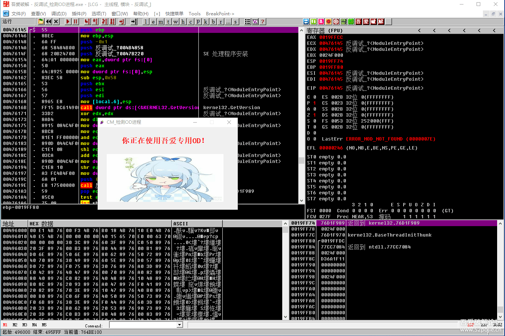
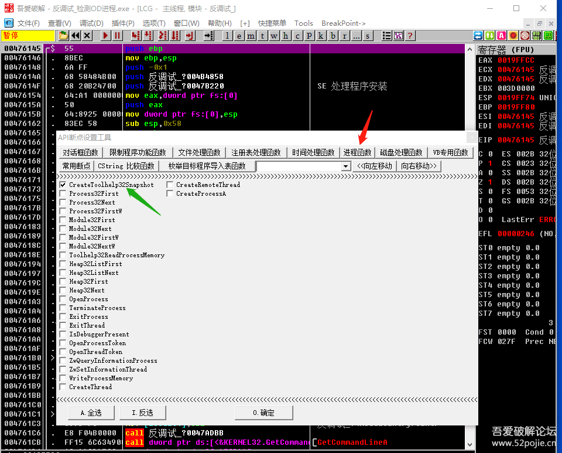

# course-18 与“反调试”的第一次亲密接触 

> [>> 原文](https://www.52pojie.cn/thread-1364373-1-1.html)

------

OD是我们破解者的主要武器，想想看，如果这个武器不能使用了，我们就成了赤手空拳。

当然你还可以用其他工具，比如静态分析工具IDA，x64dbg、DTdebug等等。

因为OD是你常用的工具，别的未必如此趁手。

我们今天主要和大家一起来分析这个 [course-18.exe](PEs/course-18.exe) 软件。

首先看看这个软件有什么特点？

先运行一下这个软件，看看软件的样子和大致流程。见下图：

呵呵，小姑娘真可爱！

上面还有一行红字是“你没有用OD调戏我，真好！”。没有需要登录的按钮和输入框。

软件很简单，我们关闭。

然后打开OD，把这个CM拖到吾爱专版OD里看看，这个OD是吾爱论坛上提供的，逆向资源区和爱盘里都可以找到。

F9运行一下。出现了下图：

我擦！被软件发现了我正在使用OD。

这就是在破解领域经常说的有些软件具有“反调试”功能。

所谓反调试，就是当你用调试工具打开要破解的软件，运行和分析的时候，软件会发现它正在被“不良企图者”调试，然后软件立刻会执行“报复”行为。

轻则让程序自动退出，或者用文字予以警告，重则会格盘、黑屏等等，让你欲哭无泪。

想想看，可怕吧！

所以，给大家一个建议，如果要真正想学破解，而且以后可能会尝试破解别人的软件，最好在电脑上再安装一个虚拟机。

虚拟机的好处就是即使格盘也不会对你的电脑有太多损害。

因为你是在虚拟机的环境下调试软件的，只需要重新安装一次虚拟机即可，网上有很多安装教程，20分钟左右就安装好了。

我们思考一下，为什么这个CM会发现我们使用了OD？

看看我这个CM的名字，写着CM（反调试_检测OD进程）。

是的，就是因为这个软件在编程中增加对OD的进程进行检测的代码。

简单的说，就是软件增加了可以发现OD是不是在运行状态的功能。

那么，这个功能是怎么实现的呢？

我们说过，作者编程时为了编程的高效，会非常频繁的调用系统提供的API函数。

大多数的情况是，软件每增加一种新功能，都会调用新的API函数，少部分的情况是，这个功能实现的代码完全是作者自编的，但是会非常费时费力。

就像我们到饭店吃饭，你不用现成的大厨，偏要自己到厨房炒菜，当然即使你去亲自炒菜，饭店现成的灶具、铲子、调味品你也可能要用。

所以说，大概率的情况是软件新增加功能就会调用新的API函数。

新调用的API函数就是我们破解的线索和突破口。

那么，检测OD是否在运行的API函数是什么呢？

这个函数的名字叫做CreateToolhelp32Snapshot。

简单说就是程序调用这个函数和其他函数一起配合，就能把当前你的电脑上所有处于运行状态的程序（简称进程）找出来。

那么，如果OD是在运行状态，当然也会被发现，明白了吗？

知道了这个函数的名字和作用，下面我们怎么进行破解呢？

我们把CM拖进OD后，先不运行，直接对这个函数下断点。方法见下图：

我们选择吾爱专版OD自带的“API断点设置工具”里红色箭头指的“进程函数”里的绿色箭头指的第一个函数CreateToolhelp32Snapshot，然后点确定就下好断点了。

然后F9运行程序，当程序暂停下来后，F8一直单步走，直到走到下图所示：

看到很多敏感的字符串了吧，这就是我们的关键代码位置了。

红色方框内就是关键CALL，蓝色箭头指的位置就是关键跳转，我们把JE改成JMP，让程序必须跳过“你正在使用吾爱专用OD”这行字符串。

你试试吧，成功了，说明你已经成功的过掉了这个软件对OD的检测。

为了能够让大家容易看清代码的位置，我没有对敏感字符串进行加密，所以你搜字符串也可以直接到这个关键代码位置。

但是，我不建议这么做。

因为如果我把字符串进行了加密，你搜不到这些字符串，你怎么办呢？

还是要学会我们刚才所讲的对进程API函数下断点的这种方法。

当然，目前有一些OD里增加了一些可以防检测的插件，以至于你在实际的软件破解中根本没有遇到被检测的情况，你也就没有发现别人的软件里其实是有检测功能的。

你的问题其实是工具帮助你解决的。

但是，做为新人学习破解，还是要了解这些基础知识的。

这种检测是最最普通的一种检测，现在的软件会有更高明的检测方法。

万丈高楼平地起，我们不必着急，我们学破解就是为了玩，不需要这么急功近利。

------

> [>> 回到目录](README.md)
