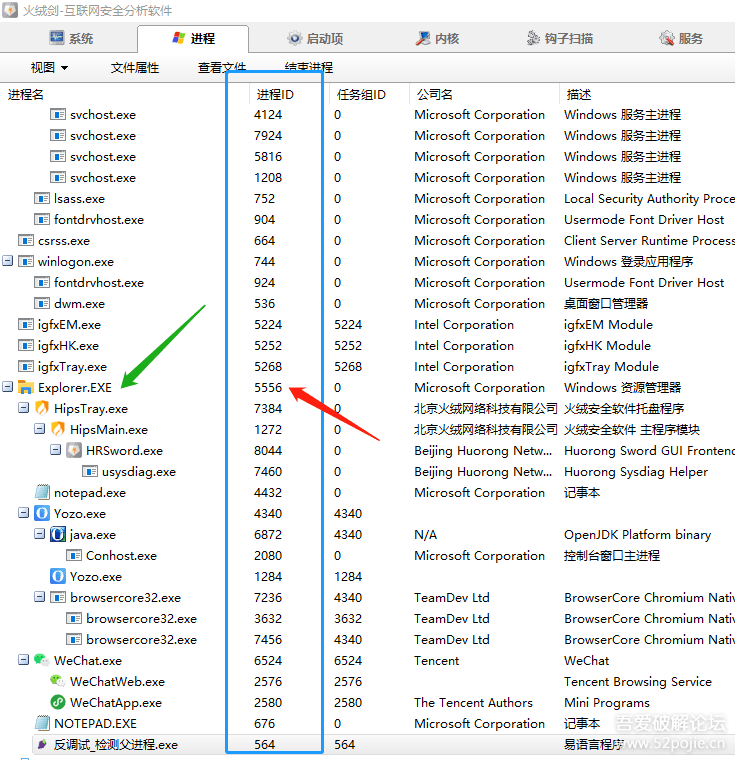
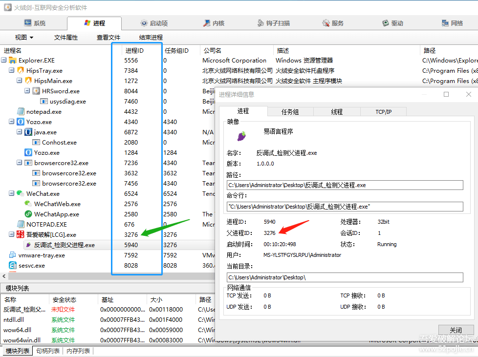

# course-19 与“反调试”的第二次亲密接触

> [>> 原文](https://www.52pojie.cn/thread-1365114-1-1.html)

------

通过上一集的学习和练习，你对软件的“反调试”应该有了一个基本的了解。

首先要明白的是，我们破解者和软件的开发者之间是一个相互斗争的关系。

我们的目的是破解，软件开发者的目的是保护。

这一攻一守，一破一护就成了一个在计算机安全领域永恒的存在。

双方虽说是敌人，但又是相互依存，共同成长，缺一不可。

没有对方的存在，技术如何快速创新。

没有对方的存在，0和1的世界又是多么的寂寞！

呵呵，讲课前先卖弄一点哲学思考。

本节课，我们继续亲密接触一下“反调试”。

这次的CM和上一集有些不同： [course-19-01.exe](PEs/course-19-01.exe)（反调试：检测父进程）

不知道朋友们注意到没有，上一集的CM是属于“粗放型”的性格。

你只要是打开了吾爱专版的OD，哪怕你还没有调试它，它也会提示“你正在使用吾爱专版的OD”。

说实在的，这样的软件设计就非常不人性化了。

我只是打开OD，又没有动你，你就提示我纯属于“咸吃萝卜淡操心”。

现在都提倡要“精准施策”，所以我们也要把上集的CM进行改造，让它能够更精准。

本集的CM的特点就是只要OD不调试自己，它就全当看不见。

只有当OD调试自己的时候，才会进行警告。

怎么做到的呢？

我们回顾一下上集的CM，那个CM是通过遍历所有正在运行的进程，当发现有吾爱专版OD的时候，就会报警。

我为什么要在OD前加了吾爱专版，完全没有其他不良的动机，只是因为上集的CM只是针对吾爱专版的OD来设计的，对其他版本的OD没有什么作用。

之所以选择吾爱专版OD，是因为这里的新人绝大多数都是用的这个版本的OD，所以不得已而为之。

上集的CM为什么只能对吾爱的OD才有效呢？

因为我是通过在进程中找是否有吾爱OD的窗口标题来进行判断的，不同版本的OD的窗口标题不同，所以对其他版本无效。

那么，这次的CM和上次的验证机制是完全不同的。

不同点有两个。

一是对所有的OD都有效，除非你的OD带有防调试的插件。

二是实施精准打击，就是只有当软件被OD调试才会报警，不会乱报。

我们先思考一下：

正常打开CM和在OD里运行CM，两者会有什么区别？

我告诉你，正常打开CM，它的父进程是Explorer.EXE，当然父进程ID就是Explorer.EXE的进程ID。

如果在OD里打开CM，它的父进程就是OD，当然父进程ID就是OD的进程ID。

至于什么是进程ID，你现在不用了解太多，否则会晕。

我们每个人是不是都有一个身份ID，就是我们身份证的号码。

同样，每个程序在运行时操作系统也会分配给它一个独有的身份号码，就叫进程ID。

操作系统就是通过这个进程ID来识别每个程序，进而可以管理每个程序。

我们可以通过火绒剑这个工具给大家看看两种情况下的CM父进程的区别。

第一种情况是CM正常启动，见下图：

红色箭头指的位置写着父进程ID：5556。这个5556是谁的进程ID呢？

再看下图：

上图中，蓝色方框内有很多进程ID，其中红色箭头指的数字是不是就是刚才的5556，再看绿色箭头指的Explorer.EXE。

说明，我们刚才说的是正确的，CM正常启动时，它的父进程是Explorer.EXE，父进程ID的值此时是5560。

第二种情况是我们通过OD来运行CM，我们再来看看父进程有没有变化？见下图所示：

上图的红色箭头指的父进程ID为3276，再看绿色箭头指的位置，显然3276就是吾爱破解OD的进程ID。

通过对比，大家就完全了解到，正常启动CM和通过OD加载CM这两种方式，CM的父进程是不同的。

知道了以上的不同。我们就可以通过判断CM运行时的父进程是否是Explorer.EXE来进行判断了。

如果是，就是正常运行；如果不是，说明被调试了，这就是本集CM的验证原理。

好了，我们明白了这个CM的反调试机制，怎么过检测呢？

如果你上节课通过字符串很容易的就找到了关键代码位置，那么这种方法对于本集这个CM就完全失效了，因为你搜索不到敏感字符串了，我给加密了。

那么怎么办？

你可以继续对CreateToolhelp32Snapshot这个函数下断点，因为和进程有关的判断基本上都要用到这个函数来找到进程的相关信息。

还有别的方法吗？

有。如果你坚持想用搜字符串的方法，我给你提供一个思路，就是你可以在内存里搜索Explorer.EXE。

这个是我故意留的一个可以搜索到的敏感字符串。

搜到后，你用我们以前讲过的在数据窗口下“内存访问断点”的方法断下来，然后一直F8，就可以到关键代码处。

还有方法吗？

当然有。这个方法特别简便，一下就可以直接到关键代码处，不过这节课暂时不讲，留在以后细细道来。

本节课的内容不少，而且有些知识点对于新人而言是非常陌生的，所以你会感觉有些难，这是非常正常的。

学习就是如此，从来都是从易到难。

新人朋友们学破解如同爬山。

刚开始爬的时候会很轻松，谈笑风生，越往上爬会觉得越吃力，然后就会有两种选择，也会有两种前途。

一种是放弃，一种是坚持。

选择放弃者就可能永远与破解无缘了，而选择坚持者，虽然会累些、苦些，但是终究会登上山顶，充分享受“一览众山小”的感觉。

当然，我们的初衷是玩破解，所以我们不必太勉强自己。

如果你觉得累了，就停下来歇一歇，有心情有体力有时间了就再继续。

但是我希望别轻易放弃。

因为在每个人的人生中，最容易做的就是放弃，而最令人后悔的都是曾经的放弃。

本集课件，我会放到附件里，大家可以下载玩玩。

------

另外，我又上传了一个软件 [course-19-02.exe](PEs/course-19-02.exe)（反调试：无法爆破），大家先玩玩看。

这个CM的第一个特点是非常简单，搜字符串就能看到所有的一切。

而另外一个特点才是重点，你按照下面的步骤来做：

1. 用OD先把CM运行起来。
2. 搜字符串，然后到关键代码处改跳转。

然后你会发现有“彩蛋”，暂时保密，大家玩玩吧，自己体会并思考。

如果你没有发现“彩蛋”，估计是你没有在OD里先运行CM，没有使用改关键跳进行爆破这种方法。

这个小“彩蛋”只是跟新人朋友们做一个演示，提供一种反调试的思路。

你要明白一点，反调试的方法有很多种，在攻防力量不相上下的时候，就要看谁更有创意。

我看下面的跟帖里有朋友已经找到了这个彩蛋，恭喜了！

但如果我把其他的关键代码也加了彩蛋，是不是难度就增加了。

就比如，我们以前说的易语言可以通过PUSH窗口的ID来绕过验证窗口，那么我在那里加一个彩蛋，是不是你就更换不了ID了呢？

如果我把这个彩蛋换成手榴弹。

就是当你修改关键代码的时候，我让你的OD窗口禁止点击或者干脆让你的OD窗口隐藏，你又能如何呢？

所以，做为我们破解的初学者而言，如果不了解一些反调试的知识和技术，你面前可能到处都是陷阱，就看别人想不想给你挖坑。

所以，大家悠着来，破解的路上好玩的地方很多，足够你玩！

------

> [>> 回到目录](README.md)
