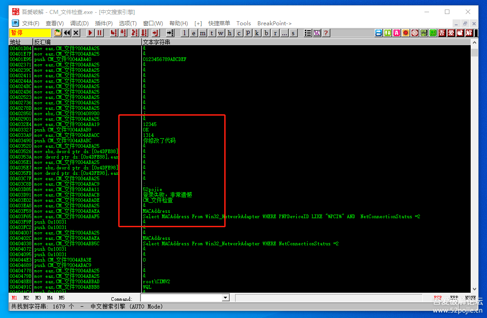

# course-20 “反调试”与“字符串加密”的联手

> [>> 原文](https://www.52pojie.cn/thread-1366037-1-1.html)

------

在本次课开始前，首先回顾一下上一集的内容，主要有两个：

1. 可以通过检测软件的父进程是否是Explorer.EXE来识别该软件是否被OD加载调试。
2. 上节课的彩蛋就是关键代码防修改。主要的原理就是当程序发现自己的关键代码被“不怀好意”的人修改了，就自动写回源代码。

下面我们开始本集课程。

首先我们来看一下今天的主角：[course-20.exe](PEs/course-20.exe)（文件检查）。

这个软件我加了UPX的壳。

我们可以通过 [UPX-Tool+](../../tools/04_unpacker/upxTool+) 这个脱壳工具进行脱壳。

见下图：

记得脱壳时要在红色箭头指的“解压缩”前打钩，然后点开始，就成功脱壳了。

然后用PEID检查一下看看，见下图：

我们可以看到，红色箭头指的位置表示我们已经成功脱壳。

那么，我们运行一下脱壳后的CM看看是否正常？

可以正常运行，但是输入密码，点击登录后，会提示错误，见下图：

这是什么原因？

很显然，我们只对这个CM做了脱壳这一件事。

那么，肯定是因为CM被脱壳导致出现这个错误提示。

我们思考一下，这个CM在脱壳前和脱壳后有什么变化？

我们知道了有什么变化，也就找到了原因。

我告诉你，有一个非常重要的变化就是：脱壳前的CM和脱壳后的CM的文件尺寸大小不同。

如何查看文件的大小呢？

你在CM的图标上点右键查看文件属性，就可以了。见下图对比：

左边是脱壳前的，看红色箭头指的大小为439KB。

右边是脱壳后的，看绿色箭头指的大小为0.98MB。

文件大小相比差距很大。脱壳后的CM比脱壳前的CM要大了一倍还多。

那么，如果作者在编写程序时增加了对软件尺寸大小检测的代码，是不是就可以实现当软件被脱壳后就会立刻被检测到呢。

是的，我们这个CM就是运用了这个检测原理。

本集CM的反调试机制为：

当CM脱壳后重新运行时，CM会计算当前文件大小，如果现在的文件尺寸大于CM的原始尺寸（脱壳前），就提示错误信息。

呵呵，明白了吗。

好，那么我们怎么绕过这个关于文件尺寸大小的检测呢？

我们先从最常用的方法入手，是不是有敏感字符串。

有，被检测到时会出现“你修改了代码”这个字符串。

那么，你就用OD的智能搜索查找，找到了，见下图：

你惊喜的发现，你不仅看到了“你修改了代码”，还看到了“登录失败，非常遗憾”。

你心中窃喜，太EASY了，这个软件太LOW。

然后，你在这两个敏感字符串的位置都下断点。

然后运行，点登录按钮，程序暂停在下图：

此时你看到了“你修改了代码”这个字符串。

在上面有一个跳转刚好可以跳过这个字符串，我们把JLE改成JMP就可以成功过掉对文件大小的检测。

别急，看一下JLE上面一句的代码：`CMP [arg.1],0X6E400`。

CMP是比较命令，其中6E400是十六进制，用计算器换算成十进制是451584，这个数字接近于脱壳前的CM文件尺寸。

JLE的意思是上一句比较的结果如果大于451584就不跳。

我们通过上面分析知道，CM脱壳后的文件尺寸会变大。

比较的结果是大于，那么JLE就不跳，于是就会执行下面的错误代码。

我们简单总结一下。

当我们脱壳后，如果软件运行出现错误，会有两种可能性。

一是脱壳没有脱好。

二是软件有对于脱壳后的程序有检测。

为了便于新人朋友们了解关于文件大小检测的流程，我特意添加了错误信息提示框和“你修改了代码”这个敏感字符串。

假定，没有错误信息提示框和这个敏感字符串，你怎么找到关键代码位置？

还记的我以前说过吧，软件作者每增加一种验证功能，很可能就会增加一个新的API函数的使用。

而这个API函数就会是我们破解的新的线索和突破口。

那么，计算文件尺寸的API函数是什么？

主要是两个，一个是filelength，一个是GetFileSize。

但是很遗憾，对这两个函数下断点都没有成功。

其中filelength函数没有找到，而GetFileSize函数找到了，下断后拦截不下来。

这下真晕了。只有一个情况就是这个CM没有使用这两个函数。

说实在话，我也晕了，虽然程序是我自己写的，但是我一直习惯性认为是调用了GetFileSize函数，结果就是断不下来。

继续研究，终于发现了原来是调用了另外一个函数，这个函数很多破解的教程中几乎没有提及，而我们这次碰上了。

这个函数的名字叫FindFirstFile，中文意思是查找文件，谁能想到它竟然还可以获取文件的尺寸大小。（题外话：如果不是因为找这函数，本集内容会早一个小时和大家见面）。

见下图：

通过调用FindFirstFile和FindClose这两个函数，在红色箭头指的位置把计算出的文件尺寸值存储到ECX里，绿色箭头指的ECX的值是FC000。

再往下分析就更清楚这个FC000了。

我们如果直接用搜字符串“你修改了代码”，然后到关键位置，还记得上面我们说的`CMP [arg.1],0X6E400`这句代码吗？

你在这句代码下一句代码上下断，运行程序，断下后看看：

看到红色箭头指的位置吗？是不是写着FC000，这个数值就是脱壳后CM的尺寸大小。

简单总结下：如果是比较文件大小的反调试程序，当你用GetFileSize函数断不了，可以用FindFirstFile函数下断点试试看。

不过说明一下，这个CM即使你下了FindFirstFile函数断点，但是还是比较难跟的。你断下后，然后跟到下图：

蓝色箭头指的就是把FC000这个数值储存到4DFE74这个地址里。将来比较的时候就从这里调用。

所以你必须跟踪这个地址什么时候被访问，然后你就下内存访问断点，然后运行后就到了下图：

红色箭头指的位置就是把4DFE74里的FC000放进堆栈，PUSH后面的是参数，下面的CALL就是验证的关键CALL。

你F7跟进去就到了我们敏感字符串的代码位置。

所以，当我们这个CM敏感字符串都被加密了，以上对FindFirstFile函数下断点也是能够破解成功的一种方法。

总结一下，我们可以看出，对API函数下断点是一个普遍的破解真理。

关键问题是你必须知道这个程序会使用哪个API函数，所以有时候你必须多测试几个API函数，看看能不能断下来。

我们通过以上的分析，已经可以成功的过掉“比较文件大小”的反调试验证。

下面就是破解这个软件的登陆验证。

你一定还记得搜索字符串时，看到过“登录失败，非常遗憾”这个敏感字符串，那就对字符串下断点试试吧。

结果，再次打击了你，断不下来。

当然，你可以用“你修改了代码”字符串和信息框来获得关键代码位置。

但是，我说过，如果我在程序里不提供这两个线索，你怎么办？

还有什么办法可以找到关键代码位置吗？

当然有，你可以使用“按钮事件”断点。

因为我这个程序是易语言编写的，你可以这么操作：

你先把程序运行起来，输入假码后，在点登录按钮之前，先在代码区点鼠标右键选择“二进制字串”，见下图：

然后到下图：

在红色箭头指的位置输入FF55FC5F5E,点确定后，会到下图。

在这个CALL的这一行下F2断点，你就下好了易语言程序的按钮事件断点。

然后运行程序，程序在CALL处断下，然后F7跟进，就会直接来到关键验证CALL的代码区。

这个方法是破解的利器，堪称核武器，因为它可以让破解者快速到达关键验证位置。

当然按钮事件断点在使用过程中还有一些技巧。

而且不同的编程语言有不同的对“按钮事件”下断点的方法。

我们要在以后专门来讲，才能真正讲清楚。

至于，为什么叫“按钮事件”？

你先简单这样理解，按钮事件断下来的位置就是点击按钮以后发生的事件代码的第一句代码位置，然后F8跟下去就是验证CALL的位置了。

本集内容不少了，需要新人朋友们好好消化一下。至于按钮事件断点，即使现在没学会也别急，以后会专门讲。

本集的字符串加密是对登录验证的敏感字符串进行了加密，所以你不能再用搜索字符串的方法来破解。

本集教学CM我放到附件里，大家可以玩玩，体会一下本节课所讲的知识点。

------

> [>> 回到目录](README.md)
