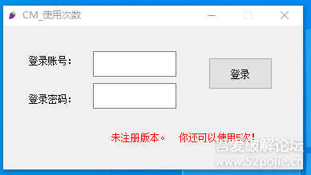
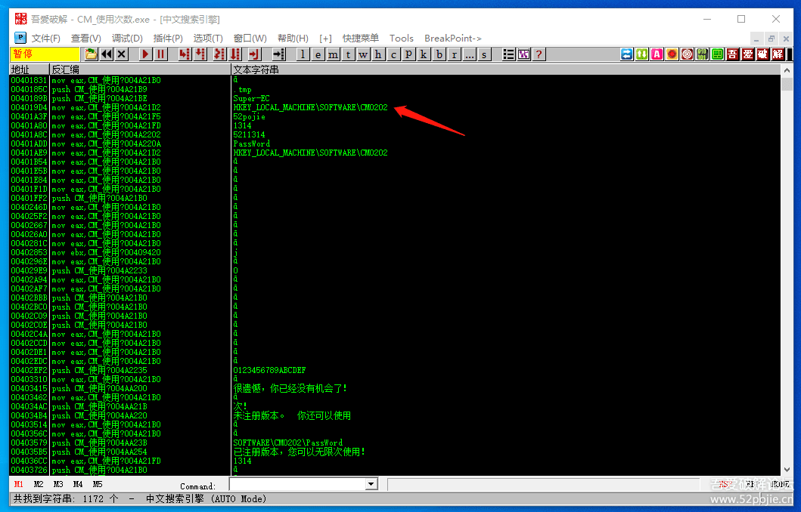
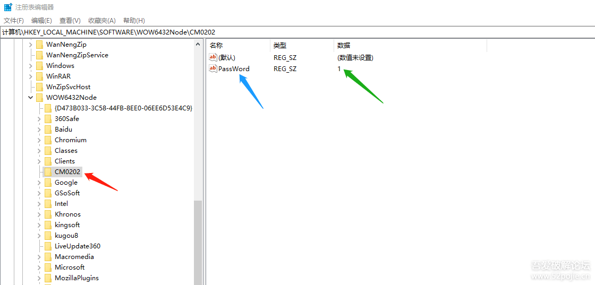
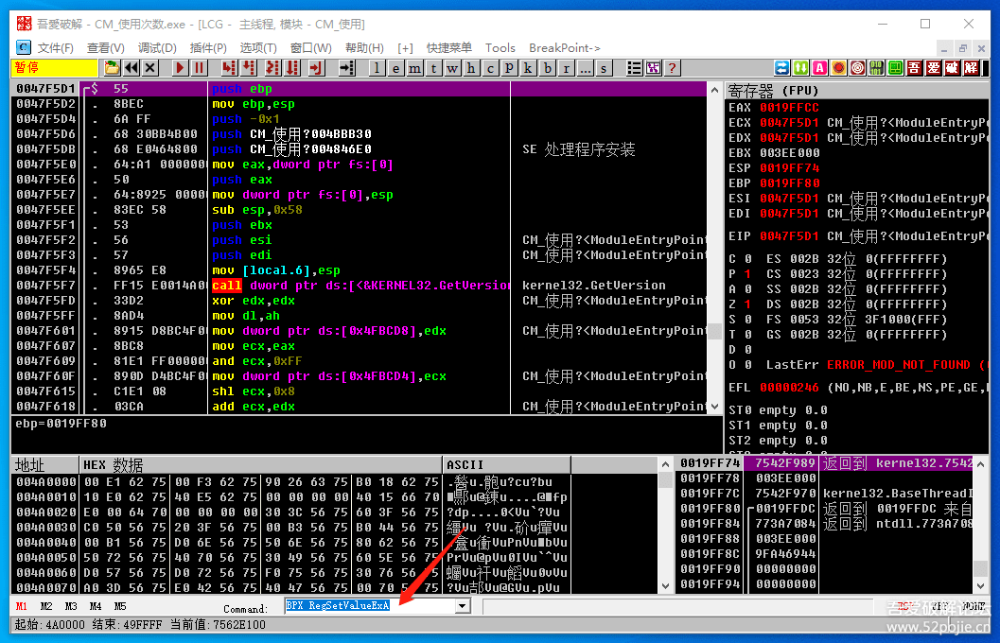
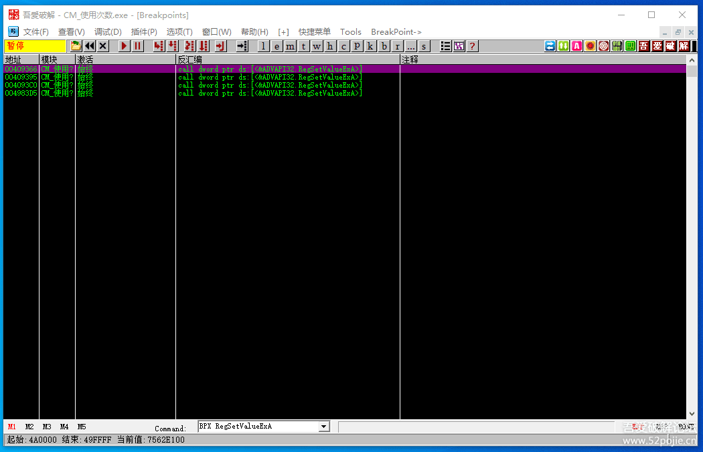

# course-21 破解软件使用次数

> [>> 原文](https://www.52pojie.cn/thread-1366869-1-1.html)

------

回顾一下上集的内容，主要讲了三个知识点：

1. 软件脱壳后，通常会有“文件大小”的校验。
2. 通过对函数GetFileSize、FindFirstFile下断点绕过反调试。
3. 初步介绍易语言的“按钮事件”断点的使用。

本集，我们再换个玩法。

首先，我们来看看本次软件 [course-21.exe](PEs/course-21.exe) 的特点：有使用次数的限制。

第一次运行提示如下：

看到吗？你只有5次机会。

每次重新打开这个CM，使用次数会减少1次。

如果当你达到5次以后，再打开CM，见下图：

旁边有一个“重新开始”按钮。

如果你还没有破解成功，或者还想用OD再分析，你就点一下这个按钮，你就可以重新获得5次机会。

呵呵，设计的够人性化吧。

我为什么要自己写课件CM？

因为能够真正符合讲课内容的需要。

真正符合新人朋友们多次进行练习的需要。

当你破解成功后，会出现下图：

而且你每次重新打开CM，都不需要再重新输入账号和密码了。

好了，这就是属于有“使用次数”限制的软件。

那么，我们怎么破解呢？

我们先思考一个问题：软件怎么会知道我们打开了几次呢？

显然应该有个“记录”，每打开一次CM就记录一次。

我们如果能够找到这个“记录”，修改一下记录的次数，是不是就可以破解成功了呢？

呵呵，思路完全正确！

我们继续思考。

这个“记录”会存放在哪里呢？

首先不可能存在程序本身，因为程序每次关掉后数据都会清空。

那一定在我们使用的电脑上的某个位置。

是的，这个位置可以是注册表，也可以是电脑里面的文件。

还可以在哪？

还可以在外部设备，比如U盘，或者是网络上的某个位置。

因为我们这个CM不考虑加密狗和网络验证，所以这个“记录”就存放在我们的电脑里。

明白了这种类型的软件必须要有一个“使用次数”的记录就可以了。

我们继续。

我们把CM拖到OD里，先进行字符串搜索。见下图：

为了让大家看的清楚，我没有对敏感字符串加密，所以你现在可以看到一切需要的东西。

看红色箭头指的地方，写着`HKEY_LOCAL_MACHINE\SOFTWARE\CM0202`。

这个就是我们这个CM的使用次数存放的位置，是在注册表里。

项名称是CM0202,键名称是PassWord。

我们可以打开注册表看看，见下图：

明白了这类软件如何实现对使用次数进行识别的原理了吧。

你可以在这里把1改成5，呵呵，那就还剩下5次。

或者干脆把它改成999次，你可以试试？

除了直接改注册表里面的数据以外，我们用OD如何破解呢？

第一种方法可以搜索字符串，你刚才看到了很多敏感的字符串，你可以自己尝试一下进行破解，在此略过。

第二种方法可以对读注册表的API函数下断点，这种方法在以前关于重启验证的课程中也专门讲过，在此也略过。

不过要注意的是这个CM所用的读写注册表的API函数和以前讲的注册表重启验证有些区别，你试试看吧。

我个人的经验是你要多试几个API，看看哪个能用？

最保险的方法是你把RegOpenKeyA、RegOpenKeyExA这两个都下上。

RegCreatKeyA和RegCreatKeyExA与上两个函数相比除了可以打开注册项外还可以创建项。

第三种方法可以下易语言“按钮事件”断点，这种方法在上集也讲过，在此也略过。

第四种方法可以对写注册表的API函数下断点。

我个人推荐如果要使用关于注册表的API函数的话，就用这种方法。

有两个写注册表的函数，名称是RegSetValueA和RegSetValueExA。

用RegSetValueA断不下来，要用RegSetValueExA。

我们想一下，什么时候程序会调用写注册项这个函数？

就是当没有破解成功的时候，每次打开CM后会执行调用这个函数的某句代码，往注册项里写已经使用的次数。

我们只要跳过这句代码就可以一直保持5次，不再减少次数。

再深入思考下，如果我们输入了正确的账号和密码，登录以后，这个程序是不是也要往注册表里写成功的标志？

否则我们再重新打开软件的时候它怎么判断我们是正版用户？

所以，有一个办法，你对RegSetValueExA函数下所有的参考断点。见下图：

下所有参考断点的方法是在命令行输入BPX RegSetValueExA ,然后按回车键，就好了。

然后你可以到断点窗口看一下。见下图：

然后你F9运行程序。

如果能断下来的就是程序判断为非正版用户后，要写次数的代码。

如果断不了的就是当你输入正确的账号和密码，登录后才能执行的语句。

当我们把能断的给跳过去，不能断的让它执行，是不是就可以了呢？

大家可以自己测试一下。

好了，今天的课程就到这里。

补充一点：

这个CM当你找到真码登录后，你会发现在注册表里的键值是一个特殊的数字。

这个数字就是标明软件是否是正版的标志。

相信大家通过尝试一定能够找到这个标志。

这个标志同样也代表了你在破解之路上的阶段性成功！

------

> [>> 回到目录](README.md)
