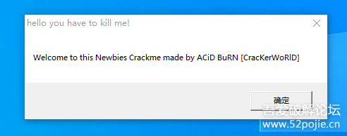
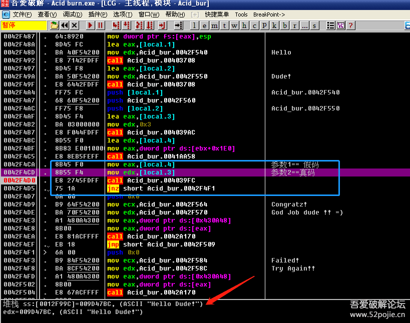
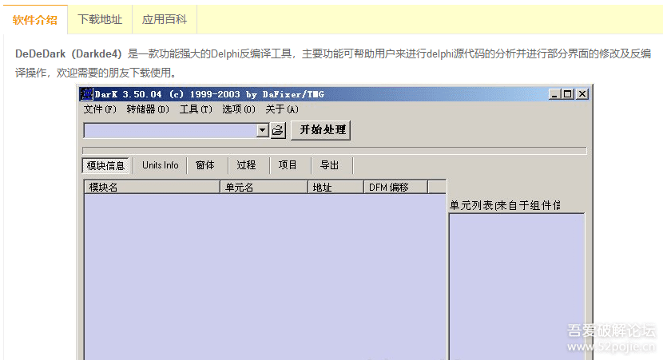

# course-22 西天取经 —— 第 1 难

> [>> 原文](https://www.52pojie.cn/thread-1368005-1-1.html)

------

从今天起，我们开始进入一些初级的实战演练，所用的课件不再是我自己写的，而是根据课程需要，从网上下载的，其中主要来自于160个CRACKME的练手软件。

网上已经有很多关于160个CRACKME的破解教程，为什么我还要拿来讲？不是“画蛇添足”吗？

更何况写这些教程的不乏破解大佬、大神，我还讲不是班门弄斧吗？

在此说明一下，我对各位前辈的教程和破解技术是相当的敬仰，如“滔滔江水连绵不绝”，不敢有丝毫不敬之意。

之所以如此，是基于我的教程是完全面对零基础的新人，我想尽可能用他们能够看的懂、学的会，知道为什么要这么做的基础上尝试分析一下。

第一个CM名称： [Acid-burn.exe](PEs/Acid-burn.exe) 建议在XP系统内调试。

这个软件有三关：

第一关：去除NAG窗口

打开后出现一个窗口：

上面写着要求我们去除这个窗口。这个窗口在破解中统称为NAG窗口，就是令人讨厌的窗口。

NAG窗口的设计原理是：软件作者故意设计，其目的就是当你是非注册用户时，在你使用这个软件的时候，软件会跳出NAG窗口干扰你。

如果你是正版用户，NAG窗口就不会出现。

好，我们先看看如何去除这个NAG窗口？

线索一：搜索NAG窗口上的敏感字符串。

线索二：对调用窗口的API函数ShowWindow下断。

你断下后会发现返回到MessageBoxA，说明这个NAG窗口是弹窗，不是作者写的新窗口。

通过以上两种线索，都可以成功过掉NAG窗口。

红色箭头指的00425627是关键跳，改成JMP就成功了。

简单总结：NAG窗口可以通过搜索窗口上的字符串或者对ShowWindow下断点。

第二关：破解输入账号和密码的验证

首先运行看看验证结果。

很显然：

失败的验证结果有两条线索。

一是字符串。

一是弹窗。

破解方法：搜字符串或者对MessageBoxA下断，F8到关键代码位置。

验证流程：

验证点1：用户名>=4。小于则弹出失败窗口。

验证点2：真假码比较。

蓝色方框内是关键CALL，上面是两个参数，分别是假码和真码。下面是关键跳。

红色箭头指的是真码。

第三关：破解输入密码的验证

先看运行后的失败结果。

线索有两个。一是字符串。一是弹窗。

和上面同样的破解方法。

总结：这个CM的主要让我们学到两点。

1、用字符串和对ShowWindow、MessageBoxA下断点过掉NAG窗口。

2、验证CALL通常会有两个参数，一个是假码，一个是真码，至少也会有假码一个参数。

还没有完!

通过用PEID查壳。我们发现无壳，是Delphi语言程序。

我们用Delphi程序专用的工具来快速破解。

DarkDe4，简称DD，这个软件是破解Delphi程序的核武器。

> DarkDe4 是 2004 年的产品，对于反编译 Delphi 7.0 开发的软件完全不适用，推荐使用 [IDR(Interactive Delphi Reconstructor)](https://github.com/crypto2011/IDR) 

DD使用方法：把CM拖入DD后，会提示转储成功，点是，接着又会出现两次对话框都点否，然后点“过程”。

你会看到每一个按钮的按钮事件，从而一步就到达关键代码处，比搜字符串和API函数更简单暴力。

总结：以后遇到Delphi程序，首先使用DD试试。

------

> [>> 回到目录](README.md)
