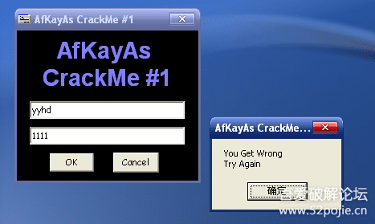
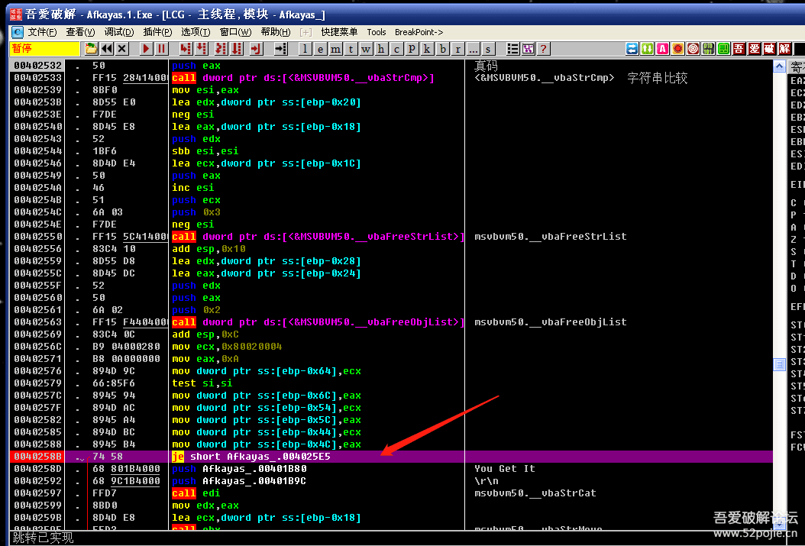
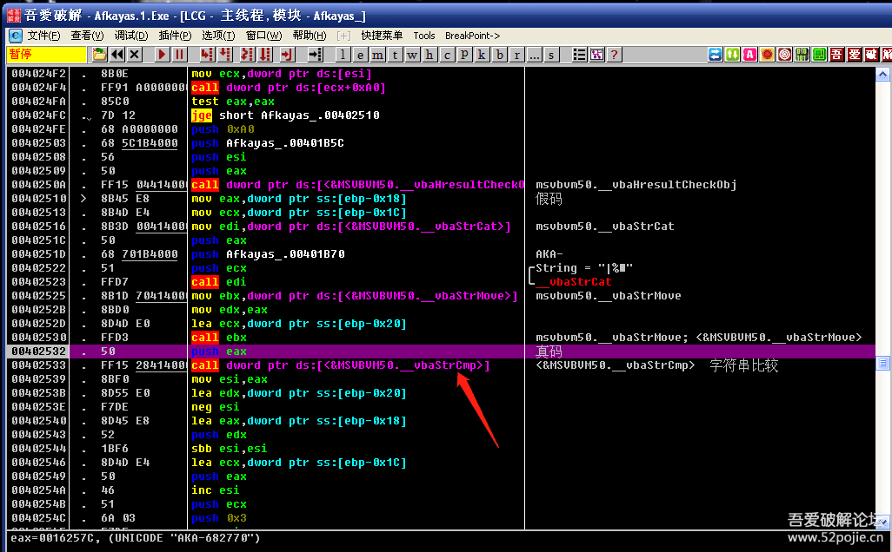
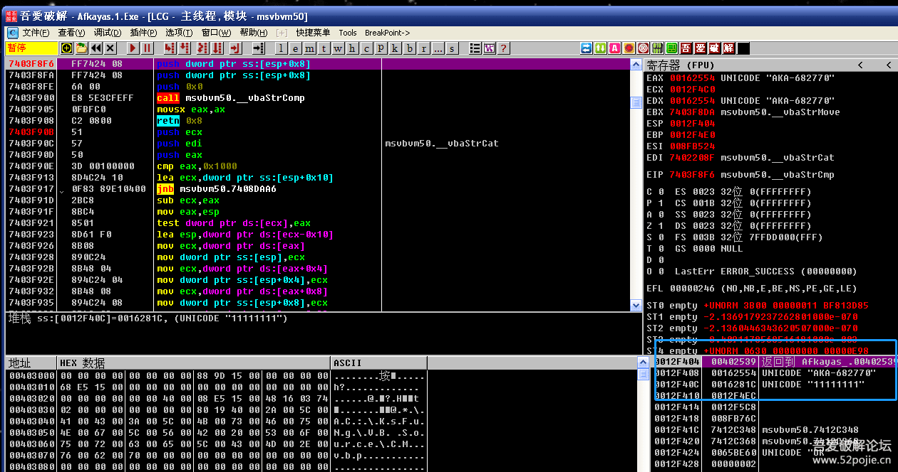
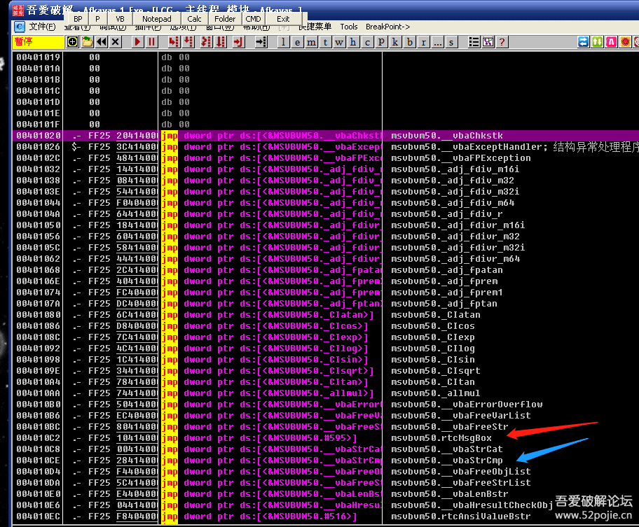
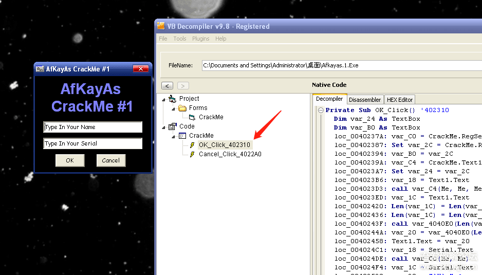
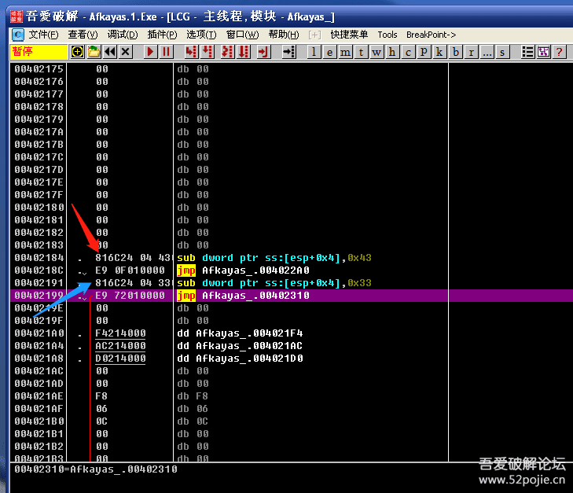

# course-23 西天取经 —— 第 2 难

> [>> 原文](https://www.52pojie.cn/thread-1368109-1-1.html)

------

新人朋友们好！今天我们要猎杀的对象是什么样的呢？

是VB程序编写的软件。

CM名称：[Afkayas.1.exe](PEs/Afkayas.1.exe)

首先运行一下，看看失败后的结果。

从结果分析，我们可以使用的线索有两个。

1、搜索字符串。

2、弹窗

我们先用搜索字符串。然后到这个位置：

红色箭头就是关键跳，把JE改成NOP就成功了。

我们再往上看看。看到红色箭头的00402532就是关键CALL。

注意一下这个函数的名称是_VbaStrCmp。这个函数是VB程序特有的，功能就是进行字符串比较。

在VB程序中真假码的比较通常会使用_VbaStrCmp函数，所以对这个函数下断点是捷径。

我们直接对_VbaStrCmp函数下断。见下图：

看到吗？蓝色方框内直接显示出真假码，分别是这个函数的两个参数。

阶段总结：VB编写的软件可以在_VbaStrCmp函数下断点，因为这个函数往往在真假码比较时使用。

还没有完！

还记得我们以前分析易语言时，可以用搜索二进制字串FF25找到易语言体，我们同样用这种方法在VB程序中试试看。见下图：

会看到一连串的JMP，这些JMP后面都是函数。是的，这些函数就是这个VB程序会调用到的API函数。

其中红色箭头指的是rtcMsgBox，这个是VB程序特有的调用弹窗的函数，替代了我们在其他语言编写的程序中经常用的MessageBoxA。

蓝色箭头指的就是字符串比较函数_VbaStrCmp。

阶段总结：在VB程序中，要对rtcMsgBox函数下断点才能断下弹窗。

还没完！

呵呵，我们习惯于没完没了，因为爱玩，所以要玩出花样。

对于VB程序，还有专门的破解神器。

这个神器的名字叫：VB Decompiler

这个软件可以对没有加壳的VB程序进行几乎是源代码级别的还原。

我们打开VB Decompiler，选择要破解的VB程序，见下图：

红色箭头指的位置就是“ok”按钮点击后的“按钮事件”的首地址，我们一步就来到了关键代码段。

总结：以后遇到VB程序，如果是没有加壳的，直接用VB Decompiler工具找到按钮事件位置，即可快速破解。

补充一点：如果不想用工具，还可以用搜索二进制字串816C24，见下图：

红色箭头和蓝色箭头指的就是816C24，分别在下面有一个JMP，这两个JMP后面的地址就是点击“OK”按钮和“cancel”按钮后的按钮事件的首地址。

你把这两个地址和上图用工具找的地址对比看一下，完全一样。

好了，本集主要是对VB程序进行了破解分析。

大家记住三点：

1. VB程序与其他语言编写的程序在API函数名称不同，要用专门的API函数才可以下断。
2. 破解VB程序有专门的核武器，就是VB Decompiler。
3. 可以通过查询二进制字串816C24快速找到按钮事件的首地址。

------

> [>> 回到目录](README.md)
