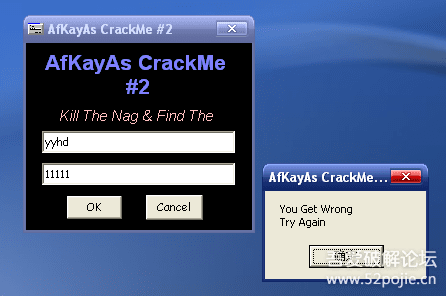
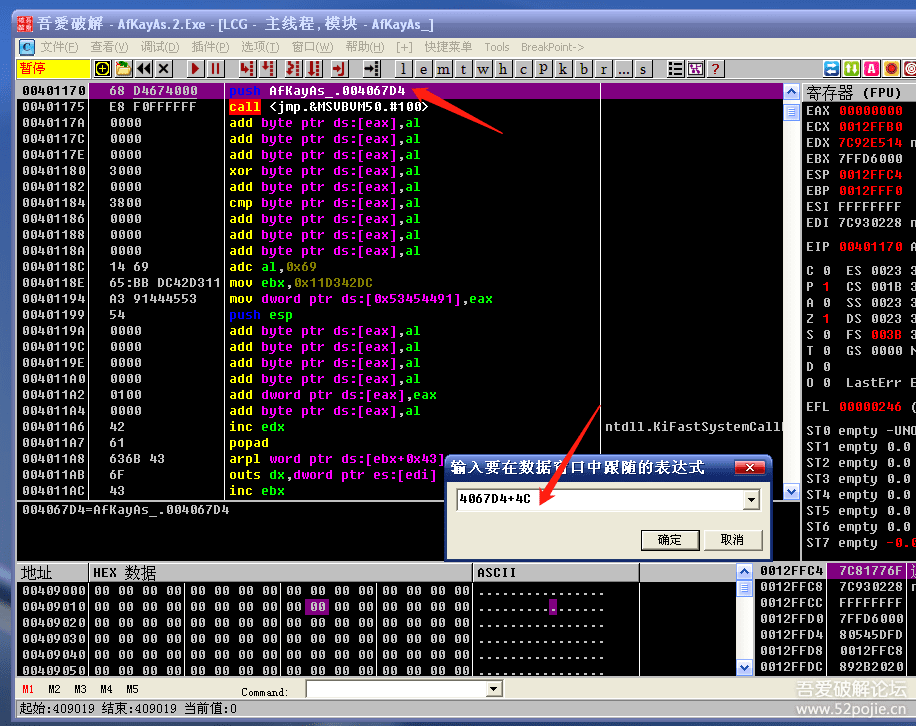
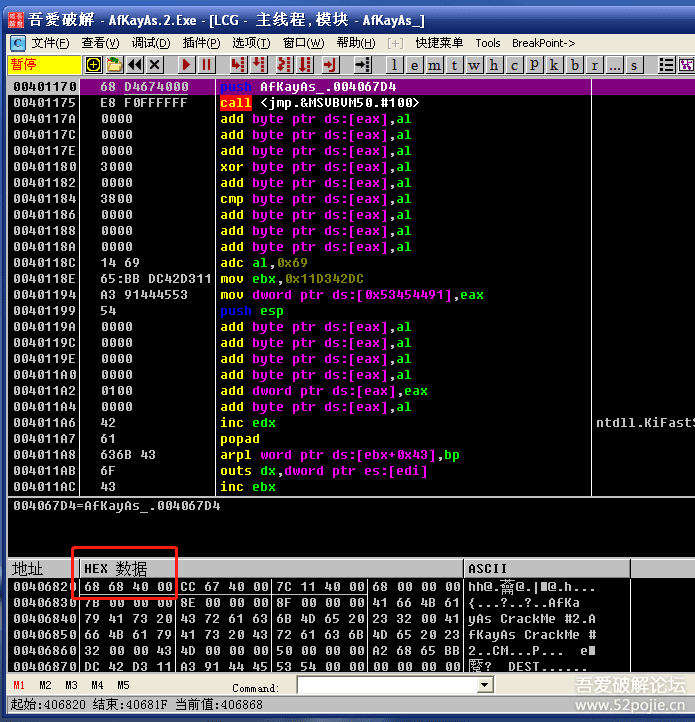
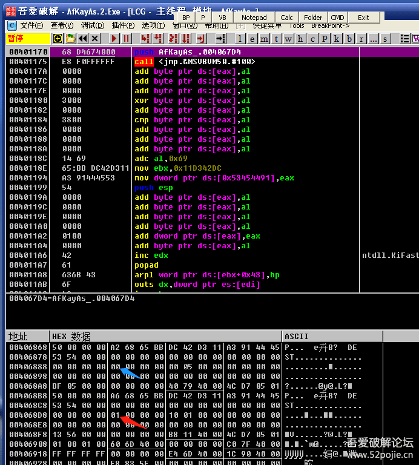
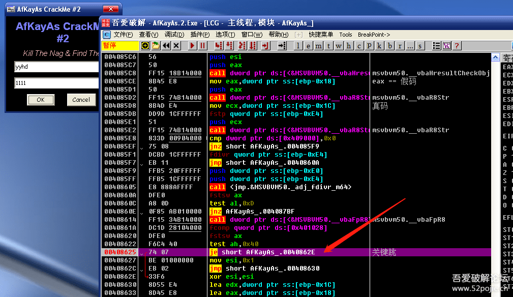
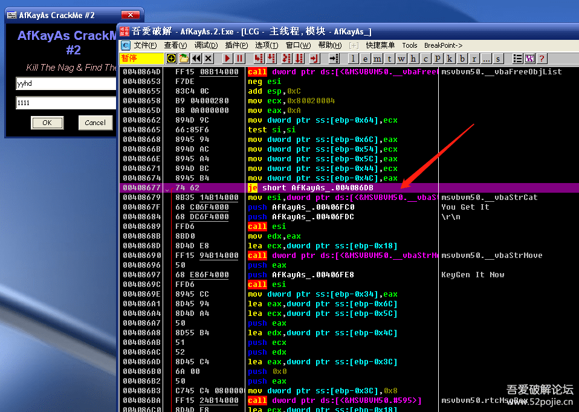

# course-24 西天取经 —— 第 3 难

> [>> 原文](https://www.52pojie.cn/thread-1368568-1-1.html)

------

本集继续和大家一起来破解VB程序。

CM名称： [AfKayAs.1.exe](PEs/AfKayAs.1.exe)

我们先运行，看看失败的结果。

首先弹出一个NAG窗口，过几秒钟后NAG窗口消失，出现下图的验证。

第一关：去除NAG窗口

按照我们的老方法。

先搜NAG窗口的字符串，没有用。

再对ShowWindow函数下断，可断下但F8跟不到关键代码。

晕了！

VB程序就是NB，常用的方法竟然都不奏效。

我们还记得易语言有个PUSH窗体大法吧。

就是把功能窗口ID替换到主窗口ID就可以实现跳过主窗口。

可惜VB不是易语言，没有这样的功能。

我们说过，每种语言都有不同的破解方法。

VB没有PUSH窗体大法，但是有4C大法。

方法如下：

把CM拖进OD,不运行，见下图：

在数据窗口按CTRL+G转到红色箭头指的PUSH 后的4067D4+4C处。

见下图：

然后记下地址00406820（就是刚才的4067D4+4C）里面数值406868。

然后在数据窗口继续转到406868地址处。见下图：

然后把蓝色箭头指的00改成01，红色箭头指的01改成00。

这样就成功跳过了NAG窗口。

蓝色箭头和红色箭头指的0和1就是两个窗口出现的次序。

这个是什么原理呢？我也不懂，是前辈们对VB程序的经验总结，记住就好了。

阶段性总结：VB程序有一个特殊的窗体顺序4C大法。

第二关：破解登录验证

通常办法可以搜字符串和对弹窗rtcMsgBox函数下断。见下图：

可以在红色箭头指的位置把JE改成NOP,成功爆破。

或者是在下图改：

红色箭头指的位置把JE改成NOP，也能成功爆破。

注意这个CM的真假码验证没有通过_VbaStrCmp这个文本比较函数，是进行的浮点运算，所以对_VbaStrCmp下断没有作用。

用按钮事件的特征码816C24可以。

用VB Decompiler工具也可以。

总结：

1. 我们通过这个VB程序破解主要是学习VB窗体的4C大法。
2. 真假码的比较可以采用多种方式，不是所有的VB程序对_VbaStrCmp下断点都有效。
3. 对VB程序搜字符串、弹窗rtcMsgBox函数下断、按钮事件特征码81642C、运用VB Decompiler工具更具有普遍意义。

------

> [>> 回到目录](README.md)
