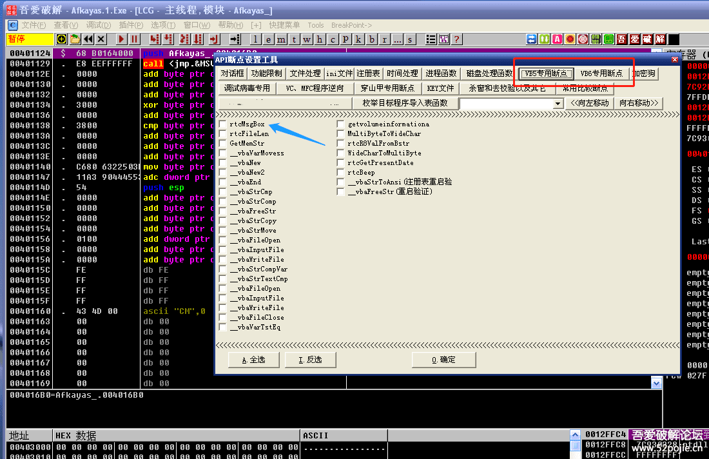

# course-25 西天取经 —— VB程序破解方法综述

> [>> 原文](https://www.52pojie.cn/thread-1370183-1-1.html)

------

本集对VB程序的破解进行通用性的概括。

以后大家遇到VB程序，可以有比较清晰的方法和思路。

本文依然使用 [AfKayAs.1.exe](PEs/AfKayAs.1.exe) 举例说明。

首先大家要知道的是，VB程序按照编译方式可分为两大类：

一类是NATIVE CODE，一类是P CODE。

其中P CODE方式编写的VB程序，破解难度大，不适合新人学习。

本集我们主要介绍NATIVE CODE方式编写的VB程序。

首先，我们如何区分一个VB程序是哪一类呢？

很简单，用DIE64工具就可以。我们对比一下：

上图红色箭头指的写着Native，说明是NATIVE CODE方式编写的。

上图红色箭头指的写着P CODE，说明是P CODE方式编写的。

对于NATIVE CODE的VB程序，我们如何破解呢？

通用方法：搜字符串和下API函数断点。

需要注意的是VB程序的API函数断点有特殊的名称。

比如弹窗API函数，VB里的名称是rtcMsgBox，在其他语言编写的程序里是MessageBox。

以上的两种方法大家应该都会了，在此略过。

重点是以下的特殊方法，这才是破解VB程序的捷径。

本节课使用的课件还是在第二十集用过的VB程序。

特殊方法：

1、用816C24特征码法，快速定位按钮事件。

在代码区搜索二进制字串816C24，找到的代码下面一行JMP后面的地址就是按钮事件的首地址，你在首地址下断点即可。

我们可以看到有两个按钮事件，一个是004022A0，一个是00402310。

在此提示一下，这里的按钮事件不仅是按钮点击后的事件，也包括窗口载入后的事件和时钟事件等。

2、用VB Decompiler工具，找按钮事件地址。

这个工具的使用方法如下：

先把工具打开，然后把要破解的程序拖进去。见下图：

然后点击红色箭头指的“OK”按钮。

点击一下左侧红色箭头指的CrakeMe，到达下图：

蓝色箭头和绿色箭头指的就是两个按钮事件的地址，是不是还是402310和4022A0。

3、用FF25大法，找按钮事件地址。

在代码区搜二进制字串FF25，见下图：

找到红色箭头指的vbaExceptHandler结构异常处理程序。看到这一行的地址是401026。

然后用鼠标右键查找所有命令 PUSH 401026。见下图：

然后在找到的所有命令下断。

你可以双击一下上图中第一个PUSH语句，就会来到代码区。见下图：

看到了吗，段首的地址是4022A0，和我们用其他方式找的按钮事件的地址是一样的。

这个方法是我偶然发现的，好像还没有在网上看到其他人写过。

如果有，说明别人早就发现了，只是这种方法很多教程都没有提过。

之所以在这里提出来，是想给大家说明一下。

就是FF25这个特征码不仅在易语言找启动窗口ID时使用，它还有很多作用，大家可以慢慢研究。

这节课我重点介绍了VB破解的特殊方法，还想告诉大家的是：

当你学会了利用按钮事件下断点，你就开始脱离破解小白的行列了。

可以这样理解，新人成长的三个层次：

第一层次：会搜字符串。

第二层次：会下API断点。

第三层次：会找按钮事件。

然后就不再是新人了，要突破的还有三个层次：

第四层次：会读算法。

第五层次：会脱加密壳。

第六层次：会破解网络验证封包。

再以后，那就要分研究方向了。

------

> [>> 回到目录](README.md)
