# course-26 易语言程序的快速破解 

> [>> 原文](https://www.52pojie.cn/thread-1373994-1-1.html)

------

一些朋友之所以对破解感兴趣，源自于想破解别人的外挂。

可以这么说，目前市面上的外挂大部分都是易语言程序编写的。

所以，学会对易语言程序的破解，你可以尝试去破解外挂。

为什么这些外挂用易语言编写的呢？

因为易语言容易学，是全中文编程。

花半天时间学学，就可以上手编写小程序了。

所以，建议没有编程基础的朋友可以学易语言。

起码可以了解程序执行的流程。

一、如何判断软件是否是易语言编写的？

最便捷的方法就是在OD里按CTRL+G转到401000处，见下图：

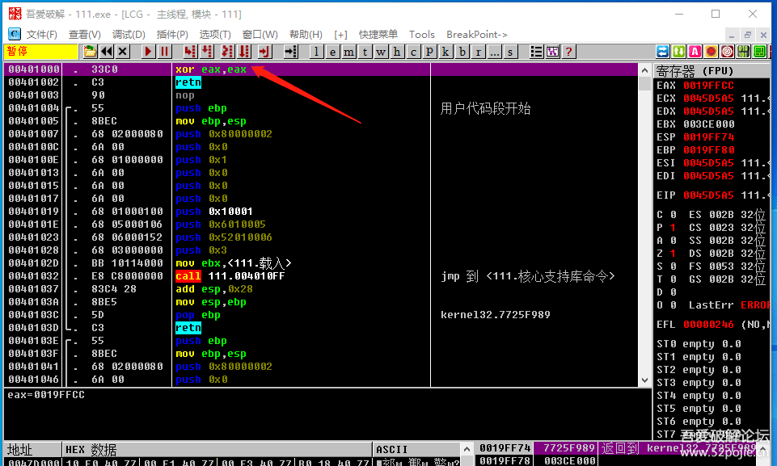

看红色箭头指的401000处的汇编代码，如果是xor eax,eax就说明是易语言编写的程序。

注意一点，如果程序加壳了，你必须在OD里按F9运行程序后，然后再转到401000处看。

二、易语言程序快速破解的方法

当你发现软件是易语言编写的，你应该感到兴奋。

因为易语言程序的破解有非常便捷的方法和工具。

我们思考一下，当我们面对一个易语言编写的程序，

我们该如何下手呢？

方法一：采用“两头找线索”的通用办法


看看在验证后的结果中有没有敏感字符串、弹窗等等。

或者是对验证前获取注册表、文件、输入文本的API下断点。

下面介绍的是更快捷的方法：

方法二：对按钮事件下断点

> [易语言破解下断点脚本](../../tools/03_disassembler/EPL/易语言破解下断点脚本.osc)

这个方法以前介绍过，就是通过搜索二进制字串FF55FC5F5E直接断到按钮事件。见下图：

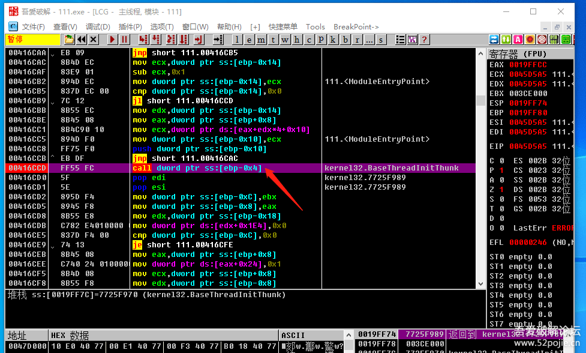

红色箭头指的CALL 就是按钮事件的子程序。

这个CALL里面的代码就是你点击按钮后会执行的代码。

还记得我们说的程序的验证流程吗？

点击按钮 → 读取假码 → 算法CALL → 验证CALL → 验证结果

我们也可以这样理解，

当我们点击登录按钮后，会进入一个验证的流程，也叫登录子程序。

这个子程序就是我们红色箭头指的CALL。

这个CALL里面就包含了从读取假码到最后的验证结果整个代码段。

这下明白按钮事件CALL的重要意义和作用了吧。

你可能会问，那为什么搜二进制FF55FC5F5E就能找到这个CALL呢？

这个是以前的破解大神通过分析易语言程序的调用流程后，

找到的按钮事件特征码。

可以这么说，只要是易语言程序，

它的按钮事件CALL的汇编代码就是FF55FC5F5E。

当然，其他编程语言编写的程序也有按钮事件的特征码，

只是语言不同，特征码不同而已。

比如，上一集我们说的VB程序的按钮事件的特征码是816C24。

你如果找到了按钮事件CALL，

你通过F8就可以清楚的看到验证的整个流程，

所以我们破解易语言程序，首选就是这个方法。

三、PUSH窗体大法


这个方法我以前也介绍过，通过搜索二进制字串FF25，

找到软件第一个弹出的窗口，然后用其他的窗口ID进行替换。

简单来说，这个方法就是三步：

第一步：搜二进制字串FF25，找到第一个弹出窗口的窗口ID

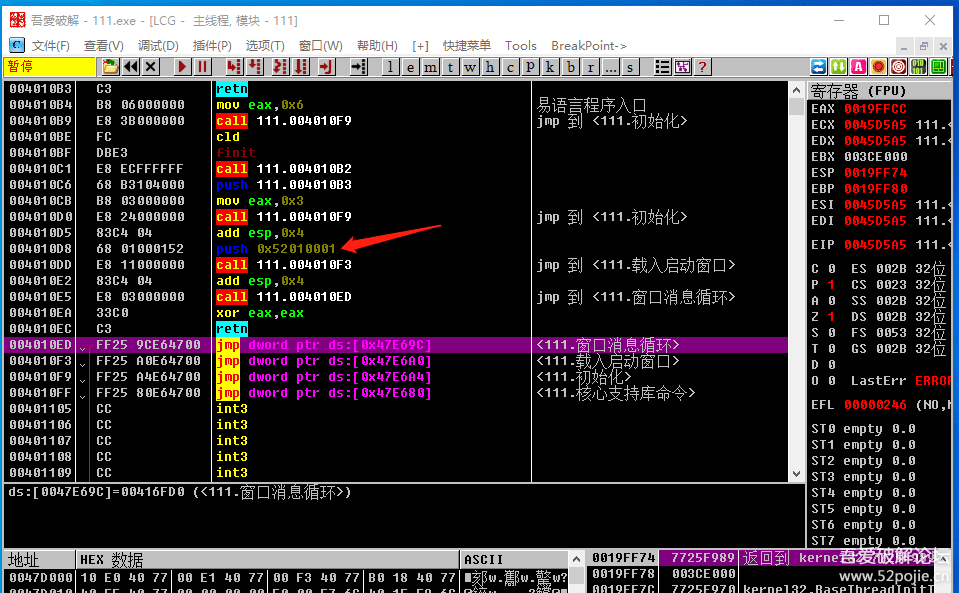

红色箭头指的就是第一个窗口的窗口ID，`PUSH 520*****`。

第二步：搜所有命令PUSH 10001，找到其他窗口的窗口ID。

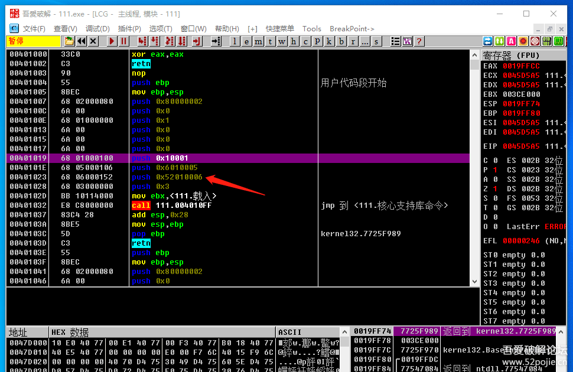

红色箭头指的就是一个窗口的ID，是52010006。

第三步：替换窗口ID

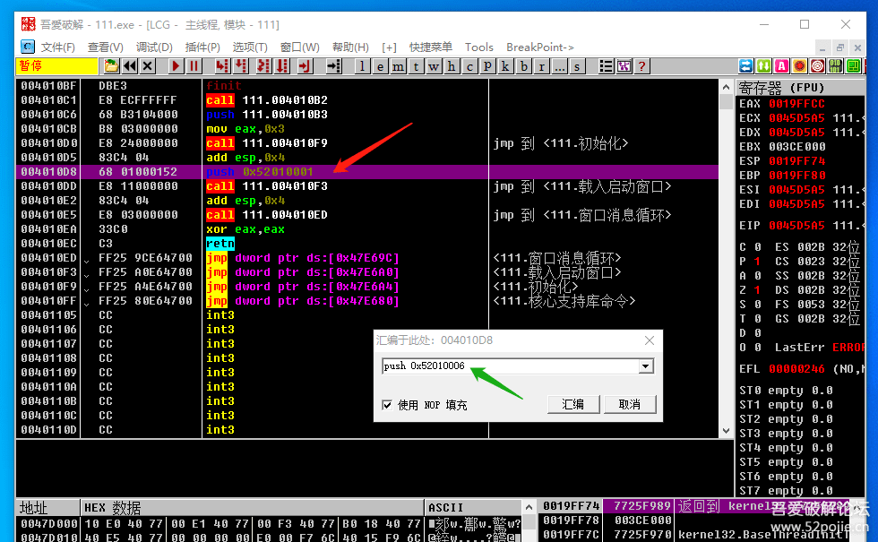

双击红色箭头指的第一个窗口的代码处，修改为PUSH 52010006即可。


我们替换窗口ID的目的是什么呢？


比如外挂程序，你打开后会有一个登陆界面，比如：

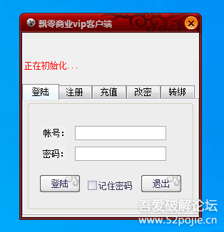

你输入正确的账号和密码，登陆后才会出现外挂功能窗口。

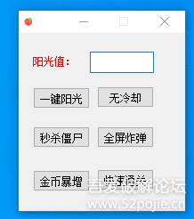

我们实际需要的是外挂功能窗口，不是这个登陆窗口。

假设这个登陆窗口的窗口ID是52010001。

外挂功能窗口的窗口ID是52010006。

那么易语言编写的程序，就可以用窗口ID替换这个方法，

直接显示出外挂功能窗口。

这个方法在破解外挂方面是最常用的。

但是一些外挂在程序里写了一些“恶意代码”，称为“暗桩”。

你直接替换窗口ID，它可能会进行检测，然后对你进行报复。

四、文本比较大法

我们都知道，程序验证的最核心代码的位置就是真假码的比较。

于是，我们就向上帝祷告：

希望上天给我一双慧眼，能够直接看到真假码的比较。

呵呵，上帝对破解易语言的人是特别疼爱的。

他告诉你，你只需要记住一个口诀就可以了。

这个口诀就是一个命令，这个命令叫做test edx,3

操作方法如下：

OD加载程序后，转到401000处。

然后搜索命令 `test edx,3`，见下图：

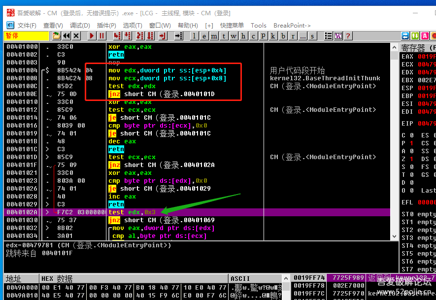

绿色箭头指的就是我们搜的命令test edx,3

特别注意红色方框里的代码特征：

```
mov edx,dword ptr ss:[esp+0x4]
mov ecx,dword ptr ss:[esp+0x8]
test edx,edx
Jnz *******
```

有这样的特征的代码区就是真假码比较的关键代码位置。

我们在`test edx,edx` 这一行下断点，然后输入假码，点登陆。

见证奇迹的时刻到来了，见下图：

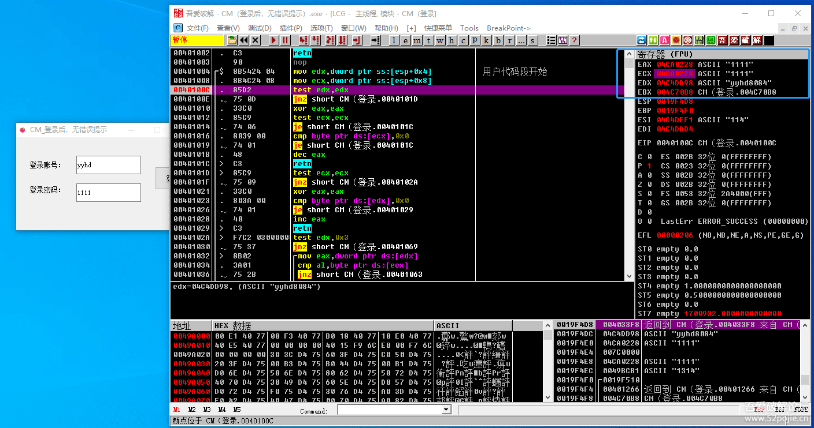

看右上角的寄存器窗口，真假码进行了比较，

其中EDX的值就是真码。

注意：可能要断几次才能到，每次断下你注意观察寄存器窗口。

以上给大家介绍了三种易语言快速破解大法，

大家可以拿以前的课件试试。

为了方便大家使用以上的三种方法，

省去输入这些特征码。

我在附件里给大家提供一个自动化脚本。

这个脚本的名字就叫做易语言破解。

怎么使用呢？

你在OD里建立一个新文件夹，取名叫脚本。

然后把这个工具文件放到里面就可以了。见下图：

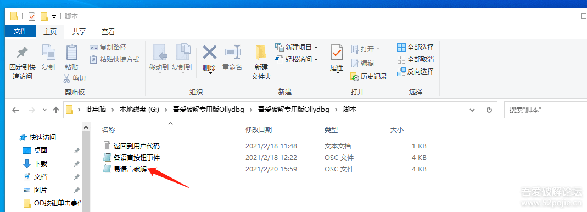

然后打开OD加载要破解的软件

在代码区鼠标右键选择“运行脚本”，点打开。

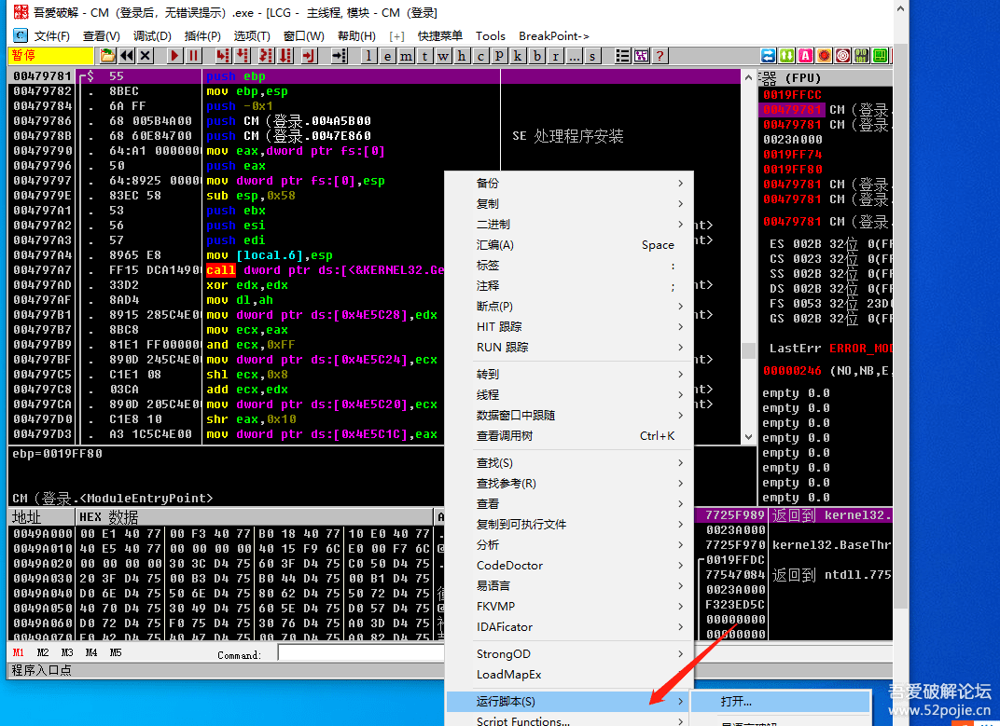

然后选择我们刚才新复制的“易语言破解”文件即可。

然后会出现下图：

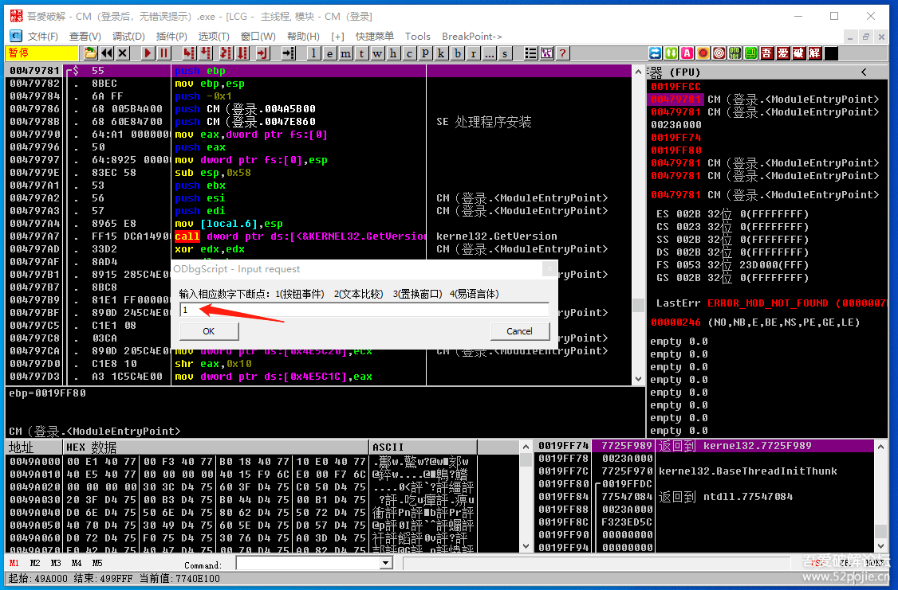

在新出现的窗口里填上你想要的数字，然后点OK就可以了。

注意，如果是加壳程序，要先把程序运行起来，

然后点OD的暂停键，再运行脚本。

今天内容不少了，先到这里吧。

以后有时间的话，再给大家介绍易语言逆向分析好用的工具。

------

> [>> 回到目录](README.md)
