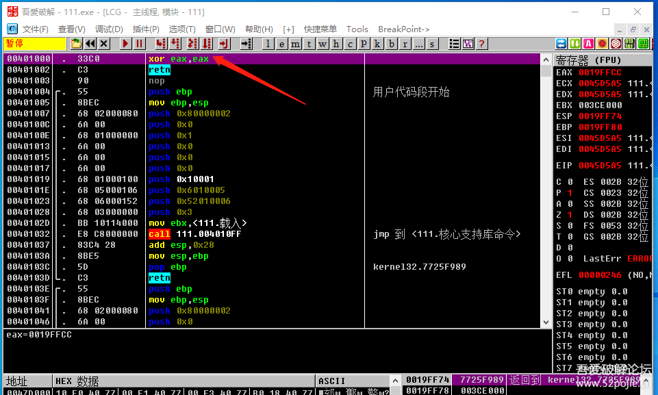
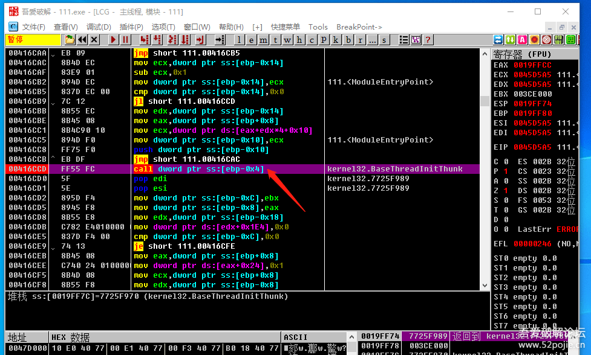
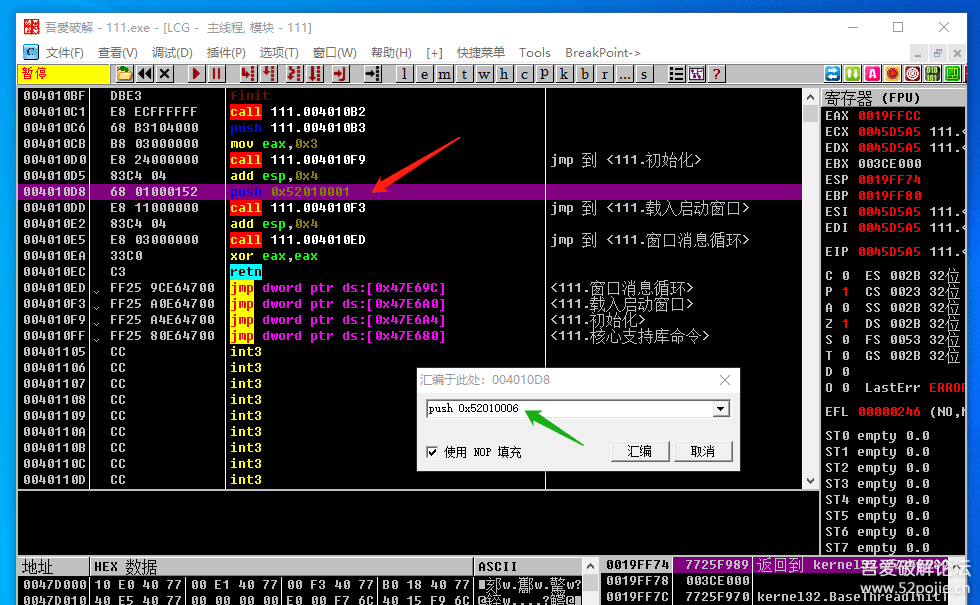
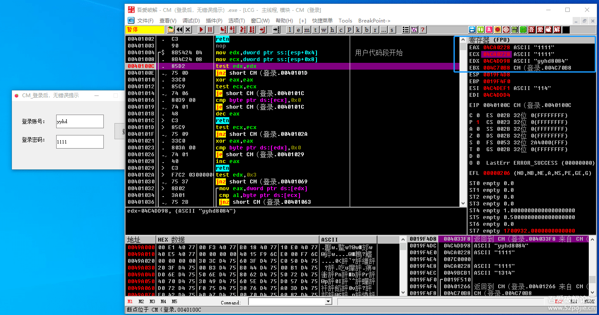

# course-27 破解的坑和思路

> [>> 原文](https://www.52pojie.cn/thread-1380805-1-1.html)

------

按照原来的计划，这一集应该是谈谈关于VC程序的破解方法。

后来考虑了一下，对于新人而言，在认识层面解决一些框架问题可能对后续的学习和进步更重要。

打个比喻来说吧。

新兵到战场打仗，我们通常的做法就是教他如何打枪，如何隐蔽，如何和队友配合，然后就不断的让他们冲锋、冲锋、再冲锋。

结果呢？战士的单兵技能越来越娴熟。

但是呢？他的眼里只有面前的一个敌人。

如果我们这个时候，不让他冲锋了，把他带上直升飞机上。

让他俯视整个战场。

那么，他会对战斗有新的认识，对攻防有新的体会。

所以，这集课程不是具体讲破解某个软件的方法。

而是，希望带着新人们上升一个高度，俯瞰破解。

一、我们的破解对象是谁？

简单来说，有两个。

一是破解软件的注册验证。
二是破解软件的反调试功能。

（一）软件的注册验证。

总体分为本地验证和网络验证。

本地验证又分为重启验证和非重启验证。

重启验证包括：注册表验证、加密狗验证、文件验证（文件验证里有一个INI文件验证比较特殊，因为读取这个文件有特殊的函数）

非重启验证包括：账号密码验证、机器码验证等。

（二）反调试功能

所谓反调试，就是对用户使用调试器（对OD、IDA等调试工具）进行反击。

反调试的手段目前主要有两种：检测处理和干扰处理。

一、按照检测的时间和方式不同，粗略分为三类：

1、调试前：对用户是否正在使用调试器进行静态判断。

可以通过检测操作系统的进程列表、软件的父进程、软件使用中的环境信息来判断是不是打开了OD或者IDA等调试工具。

通俗说就是你是不是打开了调试器？

2、调试中：对用户正在使用调试器的行为进行动态识别。

主要有F2断点检测、硬件断点检测、CRC数据完整性校验、时钟检测等方式。

通俗说就是你是不是正在用调试器对软件进行调试和修改？

3、调试后：对用户修改后的软件的完整性进行检测。

通俗说就是软件是否被修改过？文件的大小、相关数据、执行流程等有无变化等。

二、干扰处理

加壳、加花、虚拟化代码。

目前大家破解中最头疼的就是VM壳，这个壳的特点就是让软件的代码在OD里无法正常识别和跟踪。

加花是对代码加了花指令，增加了一些无意义的代码，让OD识别有误。

从目前反调试的趋势来看，对代码的干扰是主流，就是让你在调试器里打开后看不懂。

从以上分析我们可以看出。

我们破解者原来的对象是破解软件的注册验证。

现在摆在我们面前实际有两个对象了。

破解软件的注册验证和反反调试。

呵呵，不再是一对一，成了三角恋了，够爽！

所以，现在如果再问我们学破解，到底是学的什么？

主要就是学两项技术——破解注册和反反调试，明白了吧。

二、为什么我们依然是小白？

因为我们很多破解新人的现实状态是：

破解注册还没有学熟练。

反反调试更是白纸一张。

这就是我们很多人学会了OD的使用，但是还是无法破解软件的原因。

我举个例子说明一下：

假定有一个易语言编写的程序，当你验证通过后会弹出功能窗口。

如上图所示，你输入正确的密码888,点击按钮后就会弹出新窗口。

你一看，这不容易吗？用易语言的PUSH窗体大法。

这里我用了一个工具 [易语言逆向分析助手3.0.exe](../../tools/03_disassembler/EPL/易语言逆向分析助手3.0.exe) ，可以更方便的找到代码地址和窗口ID。

这个工具是我在大佬的软件基础上修改的，主要是为了让新人们在分析软件时更方便操作。

但是你会发现你置换了窗口ID后，你发现打不开软件了。

你已经学的PUSH窗体大法是没有任何问题的。

问题是我加了一个反调试。

加了什么样的反调试呢？看下图：

左边的是我写的易语言源码。注意看红色箭头指的位置。

我编程的逻辑是：如果你输入了888，那么首先要给一个名字叫做验证的全局变量赋值为5211314，然后载入功能窗口。

对比看右边绿色箭头指的位置 `mov dword ptr ds:[0x4a6630],0x4F84B2`。

这个4F84B2换算成十进制就是5211314，这一句就是给全局变量 `[4a6630]` 赋值。

再看下图：

我在功能窗口（窗口1）显示之前写了一个循环。

如果验证这个全局变量不等于5211314，那么窗口1启动时就会陷入一个死循环。

好了，我们了解这个软件的编程逻辑了，我们再来看它为什么不能使用PUSH大法。

> 练习 CM 软件： [course-27.exe](PEs/course-27.exe) （PUSH窗体失效了）

因为如果你直接置换了窗口ID，那么程序就会先执行窗口1创建完毕的代码。

因为验证是一个全局变量，默认的初始值是0，所以就会陷入死循环。

这下明白了吗？

我举这个简单的小例子就是想告诉新人们一个事实，

你现在学到的破解的基本操作方法是对的，

你之所以还不能破解一些软件，

是因为软件的作者加了一些反调试技术。

所以，我们就明白了新人们学习的路径，

就是先学习OD的使用和软件的破解基本技术，

然后就是学习反调试的知识。

你必须具备这两方面的知识，你才能脱离新人的行列。

下面，我把修改的这个工具的使用方法进行简要说明。

这个工具主要是针对易语言程序的。

它不依赖于OD。

第一步：先把要破解的软件打开，再打开这个逆向分析助手工具。

第二步：在红色箭头指的位置选择要破解的软件的进程。

第三步：用鼠标选择右侧的功能菜单，鼠标单击即可。

其中：

1、综合分析列出作者写的子程序地址等信息。

2、动态调试可以实时得到操作的地址。

你先点击动态调试，然后点登录按钮就会出现下图：

3、结果突破主要是针对验证结果有信息框或者有新窗口的软件。

4、置换窗体就是快速找出所有窗口的载入地址和窗口ID。

5、按钮事件就是找出按钮事件子程序的地址。

我对按钮事件断点也写了相关的说明，它不仅是按钮被单击才断下。

6、可用断点是列出了常用的API地址和两个重要的读取控件地址。

这样一来，新人们就不必到OD里去找函数下断点了，省时省力。

读取和设置控件属性的断点非常重要，

读假码、在窗口标题上出现未注册都会用到，大家可以慢慢体会。

------

> [>> 回到目录](README.md)
