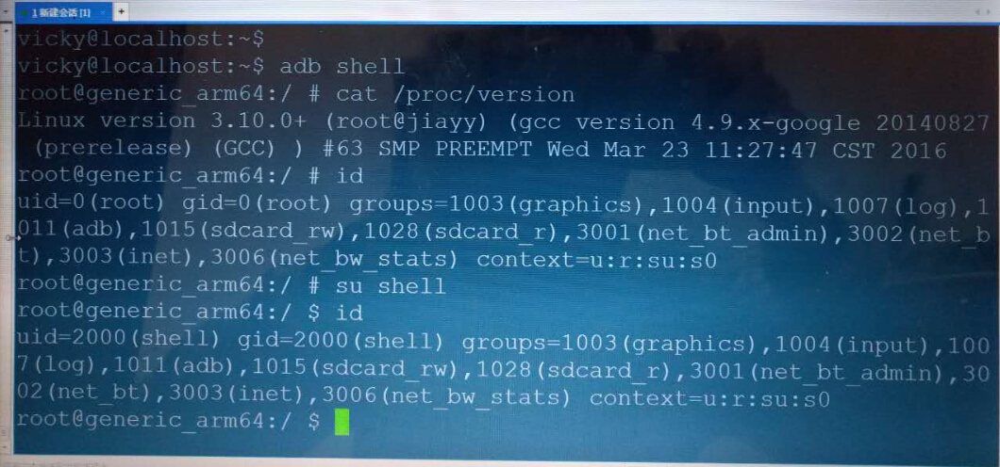

# 吾爱破解 2016 安全挑战赛

------

## [第一题 Windows CrackMe](https://www.52pojie.cn/thread-480746-1-1.html)

<details>
<summary>展开查看</summary>

本题是 Windows x86 CrackMe，注册成功与否都会有明显提示。

**要求：**

1. 攻击者请给出程序破解简要分析和提供2组用户名以及对应的key，才会判定攻击有效，攻击方必须按照指定攻破方式才会得分，否则为0分。
2. 只有提供2组用户名以及对应的key或KeyGen制作才算攻击成功，key和KeyGen的得分是相同的。
3. 根据答题时间评分，第一名攻击成功获得全部分值100分，第二名 90分，第三名 80分，第四名70分，第五名60分，第六名50分，之后名额均为40分。
4. 单纯爆破不算攻击成功，但可以获得10分攻击分，爆破需要提交最后修改好的文件，爆破后依然可以继续回帖提交key或者keygen的攻击方案，但得分只取最高分不叠加。


**关于爆破：**

- 单纯的修改提示字符串为成功字符串不算有效爆破。
- 爆破成功时应和成功注册时效果相同。
- 测试时，输入任意或指定的姓名和序列号，出现成功提示，就算通过。

**提示：**

因 3小时内未被攻破，题目组提供一了组可用key（禁止使用我们提供的key作为答题key，答题提交的两组key禁止相同）：

```
Name：360
Serial：32303130333021303214521036741034587634103478
```

**题目下载：**

- [01-WindowsCrackMe.rar](attachments/01-WindowsCrackMe.rar)
- MD5: D4ECBD4F4632ABCAE17D064F9D5AE6D5
- 解压密码：D66F78C044047C81C96A12666505C128

</details>


## [第二题 Windows 驱动题](https://www.52pojie.cn/thread-480754-1-1.html)

<details>
<summary>展开查看</summary>

本题是编写一个适用于Windows XP及更高版本系统的驱动，要求对于所有A目录下形如A\B\C.exe的程序在运行时，每1秒钟正确输出一次其包括程序名在内的进程完整路径。

其中A代表一或多级的根目录，B代表一级子目录，C.exe为程序完整文件名。

**测试步骤及结果：**

1. 首先手动启动 `A\B\C.exe`，正确输出进程的完整路径。
2. 保持进程运行，然后手动将程序名 `C.exe` 修改为任意 `D.exe` 后，可正确输出改名后的进程完整路径 `A\B\D.exe`。
3. 手动结束进程，并尽快手动将程序所在的目录名B修改为任意E后再启动该进程，可正确输出改名后的进程完整路径 `A\E\D.exe`。

要求以上步骤中驱动均使用同一种方法获取进程路径信息，且除监控A目录下的进程启动外，驱动不可动态监控以上步骤中的任何手动操作或系统行为。

**提交内容：**

驱动源代码和驱动文件

**评分标准：**

- 能正确完成步骤1，最高得30分。
- 能正确完成步骤2，最高得70分。
- 能正确完成步骤3，最高得100分。
- 本题答题时间不参与直接评分。


</details>


## [第三题 Android 溢出题](https://www.52pojie.cn/thread-480759-1-1.html)

<details>
<summary>展开查看</summary>

**题目描述:**

goldfish 镜像 “Image” 包含一个2015年公开的漏洞（CVE-2015-3636），请实现 exploit 对运行该内核的android模拟器进行提权。
考虑到部分参赛者无法下载谷歌官方资源，主办方提前给出漏洞利用基础环境 android-problem-env.7z 供下载，密码和下载地址见本帖下方。

参赛者得到密码后，在64位linux系统（推荐ubuntu-14.04）解压得到目录 android-problem-env，执行目录下的“startEmulator”脚本（可能需要用chmod修改下文件的权限）, 可以启动一个android模拟器。

该模拟器的内核为包含漏洞的 “Image”，参赛者在这个环境里实现exploit。

用startEmulator启动模拟器后，在另一个窗口用adb shell命令进入虚拟机，然后用 su shell 切换到 shell 权限，在这个shell下运行exp 。



**提交内容：**

1. exploit源码
2. 二进制文件
3. 解题思路

**评分说明:**

1. 评审的时候用startEmulator启动相同的环境，adb shell 进入环境后用 su shell 切换到shell权限（切换后用id命令查看uid为2000），用shell权限运行参赛者提交的二进制文件，提权到root为成功（执行后用id命令查看uid为0），得到基础分 50分。
2. 根据 exploit 实现的质量给分。
3. 根据提交答案时间，第一名提交正确答案者得分值的100%，第二名90%，第三名80%，第四名70%，第五名60%，第六名50%，之后名额均为40%。

**关于exploit质量：**

1. 绕过PXN的比没过PXN的分数高（+10-20）
2. ROP通用性高的比ROP通用性低的分数高（+10-20）
3. 关闭selinux或者加载新的selinux policy 比不处理selinux分数高（+10-20）
4. 可以多次运行提权的比只可以运行一次提权的分数高（+10-20）
5. 采用新颖的利用技巧比使用常见技巧分数高(如不需要搜索ROP也可以绕过PXN，或不需要修改本进程addr_limit也可以绕过PXN)（+30-40）
6. 其他能体现exploit水平的技巧（+20-30）

评审人员会根据上述标准综合评分。

**题目下载：**

- [android-problem-env.7z](http://down.52pojie.cn/Challenge/2016_Security_Challenge/android-problem-env.7z)
- MD5: C7178F89B1EC47E484ACD12BAB4DC4B6
- 63BBC624A1238F6434B37EEAA4535D6C

</details>


## [第四题 Windows 驱动题](https://www.52pojie.cn/thread-480786-1-1.html)

<details>
<summary>展开查看</summary>

本题是编写一个Windows驱动，要求在64位的Windows 10 Build 10586及以上版本中，同时实现对32位和64位IE浏览器的注入。

**实现要求：**

1. 在IE相关进程启动时，通过APC的方式，将一段Shellcode注入其进程中运行。
2. 该Shellcode需要分别针对64位及32位进程，实现对64位DLL(路径为:`C:\Test\Test_x64.DLL`) 及32位DLL(路径为:`C:\Test\Test_x86.DLL`)的加载。 DLL中简单输出如下调试信息即可： "进程 XXX注入成功"，其中XXX为进程PID。
3. 步骤2中的DLL自己实现即可，答题时不强制要求附上DLL的实现。

要求整个过程不能破坏进程的正常执行，如不能引发进程崩溃、退出等异常情况。

**提交内容：**

驱动源代码和驱动文件

**评分标准：**

1. 能实现对64位IE注入并正常运行的，最高得30分。
2. 能实现对32位IE注入并正常运行的，最高得70分。
3. 能实现所有要求的，最高得100分。

</details>


## [第五题 Android 溢出题](https://www.52pojie.cn/thread-480792-1-1.html)

<details>
<summary>展开查看</summary>

**环境要求：**

此题目采用 [VirtualBox (VMware) + Ubuntu 14.04.4 LTS 32bit桌面版](http://www.ubuntu.com/download/desktop)，参赛者须自己搭建，安装完成后请不要升级内核；

**题目描述：**

此题提供一份驱动源码，参赛者按照INSTALL步骤自己编译、加载驱动设备到ubuntu，利用驱动中一个漏洞（利用其它内核漏洞没分）实现从shell到root的提权；

**提交文件：**

1. exp二进制文件
2. exp源码
3. 解题思路

**评分标准：**

根据提交答案时间，第一名提交正确答案者得分值的100%，第二名90%，第三名80%，第四名70%，第五名60%，第六名50%，之后名额均为40%。

1. 绕过smep提权100分；
2. 不能绕过smep提权50分；

**题目下载：**

- [05-AndroidOverflow.rar](attachments/05-AndroidOverflow.rar)
- MD5: 366AF80FC1790EB4EC9593AEBD6EA8C3
- 解压密码：5752E602E526D45630611227488E5F19

</details>


## [第六题 Windows CrackMe](https://www.52pojie.cn/thread-480802-1-1.html)

<details>
<summary>展开查看</summary>

本题 是Windows x86 CrackMe，注册成功与否都会有明显提示。

**要求：**

1. 攻击者请给出程序破解简要分析和提供2组用户名以及对应的key，才会判定攻击有效，攻击方必须按照指定攻破方式才会得分，否则为0分。
2. 只有提供2组用户名以及对应的key或KeyGen制作才算攻击成功，key和KeyGen的得分是相同的。
3. 根据答题时间评分，第一名攻击成功获得全部分值100分，第二名 90分，第三名 80分，第四名70分，第五名60分，第六名50分，之后名额均为40分。
4. 本题不支持爆破，爆破不算分，请勿提交。

**提示：**

因 3小时内未被攻破，题目组提供一了组可用key（禁止使用我们提供的key作为答题key，答题提交的两组key禁止相同）：

```
Name：360
Serial：ZLIRqJpxgGYAqRIRqR39rJjbkUZRqADAZf6ImUZIHo2xHU4RHU2CHo2RHo2CHo2RHU4xHU4RHo2CHo2RHU4xHU2RHU4CHo2RHU2CHo2RHU2CHo2RHo2CHU4RHo2CHo2RHU4xHU2RHU4xHo2RqU/ZqJZI6dHarUj/qJj8mfjLufkhrfvIHpIRqJp1XlxLqRIRqR6Brf6Brf6Brf6Brf6Brf6amfxaqPPn
```

**题目下载：**

- [06-WindowsCrackMe.rar](attachments/06-WindowsCrackMe.rar)
- MD5: BE5B698F14591572CADAB7C1A0480147
- 解压密码：43A09A33897F0AE379C1BFF846B19C1B

</details>


## [第七题 Android CrackMe](https://www.52pojie.cn/thread-480805-1-1.html)

<details>
<summary>展开查看</summary>

环境要求：32位或64位Android手机

**题目描述：**

此题提供32位和64位crackme程序（任意选用一个），运行程序，当输入正确的name和key则提示"Registration successful!"，错误则提示"Serial Number connot be Activated!"。参赛者须分析此程序加密机制，并提供两组可以注册成功的name和key。

**提交文件：**

1. 解题分析
2. 两组name和key

**评分标准：**

- 100分：keygen+分析；
- 80分： 提供两组key和分析；
- 50分： 完成算法分析并还原了解密算法(参看分析文章)；
- 30分： 完成算法分析但在规定时间内未还原加密算法(参看分析文章)；
- 20分： 部分完成算法分析；

本题不支持爆破，爆破不算分，请勿提交。

第一名攻击成功获得评分分值的100%，第二名获得评分分值 90%，第三名获得评分分值 80%，第四名获得评分分值70%，第五名获得评分分值60%，第六名获得评分分值50%，之后名额获得评分分值40%。

**提示：**

因 3小时内未被攻破，题目组提供一了组可用key（禁止使用我们提供的key作为答题key，答题提交的两组key禁止相同）：

```
Name：360
Key：=6@LdGUI1qEN
```

**题目下载：**

- [07-AndroidCrackMe.rar](attachments/07-AndroidCrackMe.rar)
- MD5: BE5B698F14591572CADAB7C1A0480147
- 解压密码：F008A7A0B63AC8D276A253EBA166567D

</details>