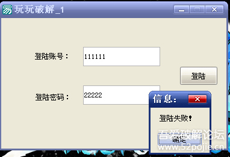

## 玩玩破解教程

原文目录导航：

- [course-01 ~ 03](https://www.52pojie.cn/thread-1358649-1-1.html)
- [course-04](https://www.52pojie.cn/thread-1358819-1-1.html)

------

## 前言

想学破解，花了很多时间还是没有多少进步？网上很多教程，看来看去，到头来还是一头雾水？其实，很正常，不是你的问题，是没有遇到能教会你的人！我也是刚刚入门，在学习中遇到过和你同样的问题。所以，“别抱怨自己”！始终用“玩破解”的心态来面对就可以了。毕竟，我们不靠破解来生存，只是兴趣而已。既然是兴趣，那就要开心快乐才行。我用大家最容易理解的思维和语言来和大家一起玩玩破解，相信对于刚刚步入破解门槛的小白会有“大”帮助。

## course-01 破解到底破什么？

我们既然学破解，首先就要清楚我们的目标在哪？敌人是谁？可以这么说，破解的对象是软件的使用验证。什么是软件的使用验证？比如你花了一个月写了一个软件，你想让其他人花钱才可以用，你怎么办？当然，你要给你写好的软件再增加一个使用验证，就像你租房，你当然要先上锁，谁花钱租房，你就给他钥匙。锁就是房子使用的验证。现在明白了吧，我们破解破的不是可用的软件，而是限制使用软件的那把锁。所以，找到锁的位置和锁的构造才是破解的关键！锁的位置我们可以称为关键验证位置，锁的构造称为验证机制。因此，我们学习破解就学两步，第一步是学习如何找到关键位置，第二步是能够分析出验证机制。

## course-02 怎么破解？

要破解当然需要工具。还拿开锁的例子，你是不是要准备好手电、开锁的各种工具才可以。破解软件最基本的工具就是别人写好的专门用于破解分析的软件，这样的软件很多，最基本的是三个。老大叫PEID，老二叫DIE64，老三叫OD。遇到要破解的软件，兄弟依次上阵。老大先上，作用是查一下这个软件有没有加壳，是什么壳？壳就是软件的防弹衣，这个防弹衣是用专门的程序编写的，这个防弹衣是在软件有了使用验证以后又增加的一层保护。其目的就是对付我们使用的破解工具，让我们不好下手。我们的老大查了以后，知道这个防弹衣的型号就可以用对应的脱防弹衣的工具来对付它了。接着，老二再上，作用是识别这个软件是什么语言编写的，通常来说有C、VC、VB、DELPHI、易语言等，因为不同的语言有特殊的破解方法。知道有没有壳？是什么语言编写的？然后老三就闪亮登场了。OD的作用就是分析软件。分析什么？就是要找出验证的关键位置，分析验证机制。清楚了吧，只要有这三兄弟，我们就可以玩破解了。

## course-03 如何找到验证的关键位置

首先我们换位思考下，如果是我们要对自己的软件增加使用验证，我们最简单的做法就是在我们的软件窗口打开之前，增加一个窗口，这个窗口我们叫做验证登陆窗口，必须输入正确的密码后登陆窗口消失、软件使用窗口打开。这个验证登陆窗口怎么实现验证的呢？就是当我们输入密码以后，然后点击登陆按钮，会产生两种结果，成功的结果和失败的结果。假定：如果密码正确，就提示正确信息，比如“恭喜你！”，如果密码错误，就提示错误信息，比如“密码不正确！”。我们破解的目的当然是要获得成功的结果。我们先看一下这个验证流程。获取我们输入的假码——真假码比较——结果。换句话说验证流程可分为三步：验证前、验证中、验证后。这三步，关键位置当然是验证中，这个位置是真假码的比较。如果能直接到达第二步当然是最好，可惜很难直接找到，因为一个程序里面有很多不同的判断。我们要找关键位置是不是必须依靠线索。最直接的线索就是验证后的不同结果。所以我们搞破解，最常用的办法就是通过验证后的结果来反查到关键位置。一种结果是有提示的字符串，比如“成功”“失败”等，我们的破解思路就在程序代码中先定位到这些字符串，然后往前找关键比较代码。如何定位这些字符串呢？OD里面有一个“中文搜索引擎”工具，可以用于查找定位。一种结果是弹出正确或者错误的对话框。你可以搜索对话框里面的字符串，你还可以在程序中定位弹出对话框的代码，然后再反查到关键位置。如何定位弹出对话框呢？编程中弹出对话框要用到一个命令，叫做MessageBox，你在这个函数上下断点，让程序暂停，然后再反查即可。通过结果来反查是我们最主要的做法，对于不同的结果，要用不同的办法。比如有提示字符串，有错误对话框，有窗口，让程序退出等等。最怕的是没有错误结果，那我们就需要从验证前的线索入手了。

## course-04 可以实战一下了

本节我们来破解一个小软件 [course-04.exe](PEs/course-04.exe)，用前三课的知识就足够了。换句话说，就是本节课看完了，你就不再是“破盲了”。

第一步：我们先准备好破解工具。

还记得吧，破解三兄弟。老大是PEID，老二是DIE64，老三是OD。你在吾爱破解发布的破解工具包自己下载吧。首先老大先上，查一下是否有壳？

我们就看红色箭头指的地方，是VC编写的，实际上是易语言编写的，无壳。我们就不用考虑脱壳的事情了。而且我们还知道是VC编写的，那么老二就不需要上阵了。那么什么时候需要老二呢？就是当老大查出有壳，PEID只显示壳名称，不能显示出是什么语言编写的，就必须老二出场了。我把刚才的软件加个壳，你们来对比一下。老大出场，查一下。

看到红色箭头指的地方了吧，原来是VC，现在变成了UPX，UPX是一种壳的名字，你现在无法知道这个软件是什么语言编写的了吧。怎么办？

老二必须上场了。

红色箭头指出来这个软件是VC编写的，绿色箭头指出壳的名字。呵呵，老二挺能干，把老大的活都抢了。不过还是建议先用PEID来查壳，毕竟是专门查壳的工具，有它的优势，另外也别让老大失业。现在该老三OD上场了。直接把程序拖到OD里就可以了。然后，我们干什么呢？当然是去找关键验证代码的位置。我们前三课说了，最常用的方法是根据验证后的结果找线索。今天我们要破解的这个软件，当账号和密码不正确时有失败提示，正确时有成功提示，这就是线索，也是我们破解的下手之处。

我们现在要做的就是用OD定位到程序中输出失败或者成功的字符串代码那里。怎么做呢？当然用OD里面的“中文搜索引擎”就可以查找到对应的位置。见下图：

红色箭头指的是我们要找的字符串，黄色箭头对应的那一行就是关键代码所在的地址编号。我们在登陆成功这一行双击鼠标左键，就到了关键程序代码处。

我们现在已经找到了关键代码的位置，接下来我们该干什么呢？我们要清楚，我们现在找到的关键代码的位置是验证后的结果的位置，我们的目标是找到验证中的关键代码位置，肯定是先验证才有结果，所以我们必须要往上找。问题是往上多少行才是验证中的位置呢？神仙也不知道，但是我们知道一点就是，验证就是真假码的比较，比较后如果正确就会执行提示成功的那段代码，如果不正确就会提示失败的那段代码。（没有编程基础的朋友注意下，每个程序中的代码的执行不是完全一行一行按顺序执行的，也就是说OD里你看到的程序代码不是从最上面一行一行执行的，在代码中会有很多跳转指令，导致程序代码是跳来跳去执行的。你可以这样理解，编好的程序就像一个有思维的人一样，他会根据一些条件来选择执行不同的代码）。

那么，我们就可以根据跳转指令来反查到验证的关键位置。简单来说，我们就在刚才找到的“登陆成功”字符串代码上面找跳转，看看有没有能够跳过去的指令，在上面很近的位置就找到了。

到这一步，你就已经基本破解成功了。JE是一个条件跳转指令，我们把这条指令修改为NOP，NOP是空指令，就是当代码执行到这里的时候无论如何都不会跳走，都会继续往下执行登陆成功这段代码。

然后在修改的代码处鼠标右键，选择红色箭头指的“复制到可执行文件”，把修改后的程序保存即可。

总结一下：

1. 破解软件的第一步就是要找出突破口，验证后的结果是最常用的。拿到一个软件后要先试着登陆一下，看看登陆验证后出现什么结果，是出现了字符串，还是信息框，还是其他，这些就是突破口。
2. 通过突破口找到验证后结果的代码位置后，找位置上面的跳转，然后修改跳转，目标就是“无论如何跳向成功，无论如何跳过失败”。
3. 关键跳转上面不远处就是验证中的关键代码位置，如果你要分析验证机制或者要找正确的账号密码就在那里。

## course-05

